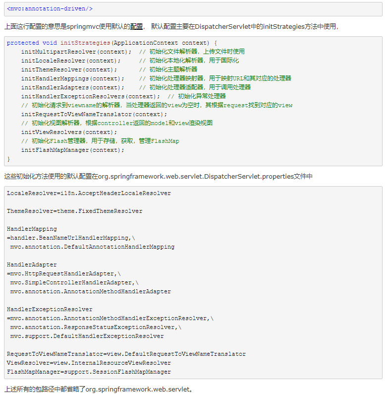
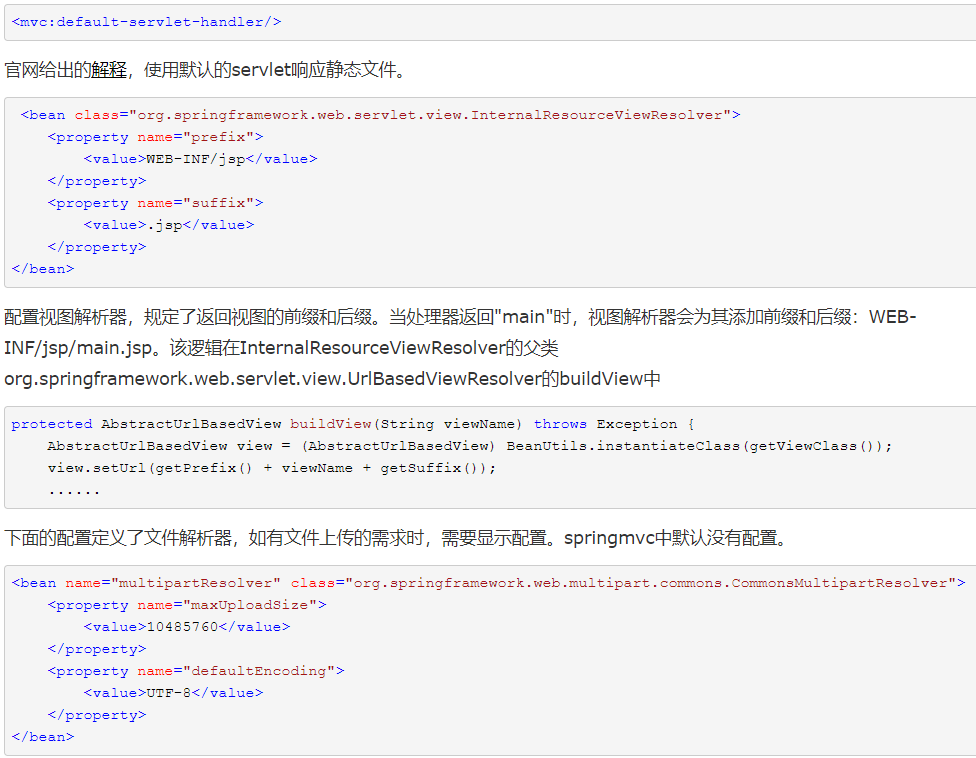

# 基础概念

- [`spring`配置文件、`springmvc`配置文件，区别](<https://www.cnblogs.com/rainbow70626/p/9784938.html>)
- 上面的扩展：[springmvc-config.xml与springmvc-servlet.xml有什么区别？](<https://www.zhihu.com/question/284478273/answer/439065979>)
- [spring配置文件beans的xmlns](https://www.cnblogs.com/fengxin-blog/p/4651049.html)
- [一个`springmvc-config.xml`模板](<https://blog.csdn.net/mai799582228/article/details/78714996>)
- [Spring的测试方法](https://www.ibm.com/developerworks/cn/java/j-lo-springunitest/index.html)
- 为了保证Spring可以扫描到控制器，需要做哪两点操作？
- `<mvc:default-servlet-handler/>`是怎么处理静态资源访问**404**问题的？
- 如何使用`@RequestMapping`注解映射
- `RequestMapping`的作用
- `SpringMVC`中实现异常处理的两种方式
- 一些摘要

```shell
# 设计模式
简单工厂、工厂方法、抽象工厂
​```https://www.cnblogs.com/xiaowangzi1987/p/9665604.html
# Spring && SpringMVC
Spring是IOC和AOP的容器框架。Spring可以说是一个管理bean的容器，也可以说是包括很多开源项目的总称，spring mvc是其中一个开源项目。Spring可以说是一个管理bean的容器，tomcat就是spring管理bean的一个池子（bean容器）。
SpringMVC是基于Spring功能之上添加的Web框架，想用SpringMVC必须先依赖Spring。
# IOC和AOP的定义：
​```https://blog.csdn.net/qq_38735934/article/details/81074852
​```https://blog.csdn.net/h_xiao_x/article/details/72774496   (这个棒)
​```注：举例中采用的AspectJ切面注解解析,见下		    
# AspectJ 切面(不太懂···冰川一角)
​```https://blog.csdn.net/u010502101/article/details/78823056
​```https://www.cnblogs.com/jiaweit/p/9986390.html
​```安装（成功）：https://www.iteye.com/blog/bioubiou-1807273
# aop（execution()表达式）
​```https://www.cnblogs.com/tplovejava/p/7200956.html
# 动态代理（dynamic proxy）
           利用Java的反射技术(Java Reflection)，在运行时创建一个实现某些给定接口的新类（也称“动态代理类”）及其实例（对象）,代理的是接口(Interfaces)，不是类(Class)，也不是抽象类。在运行时才知道具体的实现，```spring aop就是此原理。
​```https://blog.csdn.net/h_xiao_x/article/details/72552819
​```https://blog.csdn.net/u012326462/article/details/81293186
# Spring 摘要
Spring是一个解决了许多在J2EE开发中常见的问题的强大框架。 Spring提供了管理业务对象的一致方法并且鼓励了注入对接口编程而不是对类编程的良好习惯。Spring的架构基础是基于使用JavaBean属性的Inversion of Control（控制反转）容器。然而，这仅仅是完整图景中的一部分：Spring在使用IOC容器作为构建完关注所有架构层的完整解决方案方面是独一无二的。 Spring提供了唯一的数据访问抽象，包括简单和有效率的JDBC框架，极大的改进了效率并且减少了可能的错误。Spring的数据访问架构还集成了Hibernate和其他O/R mapping解决方案。Spring还提供了唯一的事务管理抽象，它能够在各种底层事务管理技术，例如JTA或者JDBC事务提供一个一致的编程模型。Spring提供了一个用标准Java语言编写的AOP框架，它给POJOs提供了声明式的事务管理和其他企业事务–如果你需要–还能实现你自己的aspects。这个框架足够强大，使得应用程序能够抛开EJB的复杂性，同时享受着和传统EJB相关的关键服务。Spring还提供了可以和IoC容器集成的强大而灵活的MVC Web框架。		  
# spring配置文件beans的xmlns都有什么含义？
spring2.0以前的版本是基于dtd的配置方式，而之后版本是schema的配置。即要引入相关的schema，分别是aop tx context的引入。没错，头部这么一大串其实就是引入要使用的schema配置文件。
因为xml文档都有格式，为了spring的配置文件增加的节点能满足要求、合法，所以引入校验该xml的格式文件。
xmlns是xml命名空间的意思，而xmlns:xsi是指xml所遵守的标签规范。
1.xmlns：关于初始化bean的格式文件地址
2.xmlns:xsi：辅助初始化bean
3.xsi:context：关于spring上下文，包括加载资源文件
4.xsi:schemaLocation：用于声明了目标名称空间的模式文档
​``` 注意 写 xsi:schemaLocation  后面还有个 ">"
```

- 默认配置和默认`servlet`



这里可详见`Spring+MyBatis企业应用实战（第二版）P20`




# 开发流程

### 0x00 @Controller注解

- 在`SpringMVC`的配置文件的头文件中引入`spring-context`
- 使用`<content:component-scan/>`元素，该元素启动扫描包的功能，以便注册带有注解的类成为`Spring`的`Bean`。可以再添加`base-oackage`属性指定需要扫描的类包
- 在指定的类包下创建`Controller`类

- `Controller`类内指定返回的`jsp界面`，界面可通过`${requestScope.message}`显示`model`的`Attribute`


## 0x01 Spring中使用AOP[注解方式]

- 创建`User`类

- 创建增强类`MyUser`（@Aspect）

- 配置文件`application.xml`

  ```shell
  xmlns:aop="http://www.springframework.org/schema/aop"
  ...
  xsi:schemaLocation="
  ...
  http://www.springframework.org/schema/aop
  http://www.springframework.org/schema/aop/spring-aop.xsd">
  
  <!-- 注解方式使用AOP -->
  <!-- 开启AOP代理 -->
  <aop:aspectj-autoproxy></aop:aspectj-autoproxy>
  
  ​```aop报错解决经验
  ​```https://blog.csdn.net/u010004317/article/details/47700447
  ```

- 创建测试类

  ```shell
  import org.junit.Test;
  ...
  ApplicationContext context = new ClassPathXmlApplicationContext("/org/skw/controller/springmvc-config.xml");
  ...
  
  #运行JUint Test
  ​```ClassPathXmlApplicationContext报错
  ​```https://blog.csdn.net/tiananma0607/article/details/76595187
  ```

## 0x02 Spring中使用Aop[xml方式]

- 创建业务逻辑接口`User`

- 创建具体实现类`MyUser`

- 创建切面类`LoggingAspect`

- 详细的`xml`配置信息，首先将业务逻辑类和切面类加入`IOC`中

  ```html
  <!-- 配置bean -->
  	<bean id="MyUser" class="org.skw.xmlAop.MyUser"></bean>
  	<!-- 配置切面 -->
  	<bean id="aspect" class="org.skw.xmlAop.LoggingAspect"></bean>
  
  	<!--配置AOP  -->
  	<aop:config proxy-target-class="true" >
  		<!-- 配置切点表达式 -->
  		<aop:pointcut id="pointcut" expression="execution(* org.skw.xmlAop.User.*(..))"></aop:pointcut>
  		<!-- 配置切面和通知 -->
  		<aop:aspect ref="aspect" order="1">
  			<aop:before method="beforeMethod" pointcut-ref="pointcut"/>
  			<aop:after method="afterMethod" pointcut-ref="pointcut"/>
  			<aop:after-returning method="afterReturning" pointcut-ref="pointcut" returning="result"/>
  			<aop:after-throwing method="afterThrowing" pointcut-ref="pointcut" throwing="e"/>
  <!-- 			<aop:around method="around" pointcut-ref="pointcut"/> -->
  		</aop:aspect>
  	</aop:config>
  ```

- 创建测试类测试

  ```shell
  报错解决：```https://blog.csdn.net/qq_22078107/article/details/85873724
  ```

  

注：关于`Spring`中使用`AOP`更多请见[此](<https://www.cnblogs.com/jiaweit/p/9986390.html>)，共三种实现方式。

# TODO

挖了挺多知识，需要**试验**

- `AspectJ` 切面													 【ok】
- `aop`（`execution()`表达式）                                                                           【ok】
- 静态动态代理（`dynamic proxy`）                                                                【ok】
- `Aop / Ioc` 模拟                                                                                                 【ok】
- `DIspatcherServlet`源码


代码实现借鉴文中出现的参考博客，稍后整理至[我的Github](<https://github.com/Cooper111>)