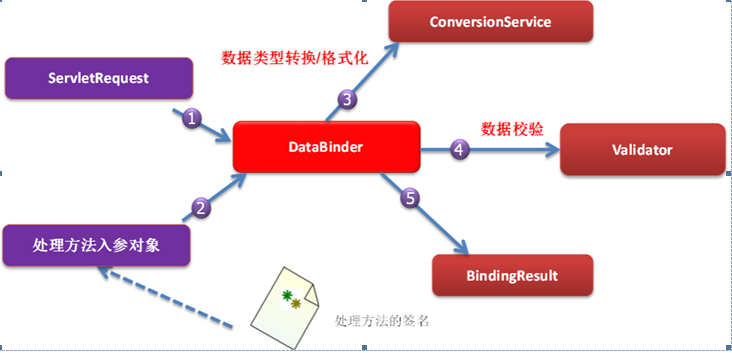

# `SpringMVC`的数据转换、格式化和数据校验

- [Spring-Context之七:使用p-namesapce和c-namespace简化bean的定义](https://www.cnblogs.com/huang0925/p/3624526.html)

- [@Repository的作用？](<https://blog.csdn.net/qq_40943786/article/details/80966170>)

- [【报错】java.lang.NoClassDefFoundError: javax/el/ELManager](<https://www.cnblogs.com/zhujiqian/p/11679897.html>)

  ```
  我吧tomcat7.0改成tomcat8.0解决了
  ```

- `@Autowired` 注释，它可以对类成员变量、方法及构造函数进行标注，完成自动装配的工作

- `Qualifier`的意思是合格者，通过这个标示，表明了哪个实现类才是我们所需要的，添加`@Qualifier`注解，需要注意的是`@Qualifier`的参数名称为我们之前定义`@Service / @@Repository`  注解的名称之一

  ```java
  	/**
  	在UserCOntroller类里
  	注入userValidator对象
  	@Autowired 注释，它可以对类成员变量、方法及构造函数进行标注，完成自动装配的工作
  	*/
  	@Autowired
  	@Qualifier("userValidator")
  	private UserValidator userValidator;
  ```

- 记得在将`Validator`所在的包在`xml`里配置扫描

- `Controller`内记得`model.addAttribute()`语句在`return`语句之前，不然`jsp`页面调取`ModelAttribute`会报错：

  ```shell
  Neither BindingResult nor plain target object for bean name 'jsr303user' available as request attribute
  ```

- ### 数据绑定流程  

  ```powershell
  ①   Spring MVC 主框架将 ServletRequest  对象及目标方法的入参实例传递给 WebDataBinderFactory 实例，以创建 DataBinder 实例对象
  ②   DataBinder 调用装配在 Spring MVC 上下文中的 ConversionService 组件进行数据类型转换、数据格式化工作。将 Servlet 中的请求信息填充到入参对象中
  ③   调用 Validator 组件对已经绑定了请求消息的入参对象进行数据合法性校验，并最终生成数据绑定结果 BindingData 对象
  ④   Spring MVC 抽取 BindingResult 中的入参对象和校验错误对象，将它们赋给处理方法的响应入参
  Spring MVC 通过反射机制对目标处理方法进行解析，将请求消息绑定到处理方法的入参中。数据绑定的核心部件是 DataBinder，运行机制如下：
  ```

  

  这是[网上的介绍](<https://www.cnblogs.com/softidea/p/10079869.html>)

- ### 数据转换

  - `java.beans`包提供了一个`ProperyEditor`接口来进行数据转换，将字符串对象转换为一个`Java`对象。

  - `Spring`从**3.0**开始，添加了个通用的类型转换模块，位于`org.springframework.core.convert`包中。`Spring`希望用这个类型转换体系替换`Java`标准的`ProperyEditor`接口。

    [学习链接](<https://blog.csdn.net/zhonglin_li/article/details/51571093>)，有空再学学

  - 如果希望再全局范围内使用自定义的编辑器，可以通过实现`WebBindingInitializer`接口并在该实现类中注册自定义编辑器完成

  课上的是`JavaBeans`的`PropertyEditor`和控制器中的`@InitBinder`实现生日数据转换；

  - 多种转换器的优先顺序

    ```powershell
    (1) 查询通过@InitBindingInitializer装配的自定义编辑器
    (2) 查询通过ConversionService装配的自定义转换器
    (3) 查询通过WebBindingInitializer接口装配的全局自定义编辑器
    ```

- ### 数据格式化

  #### ①`Converter`和`Formmatter`的对比

  - `Spring`中`Converter`转换是Object到Object的转换，`Formmatter`是`String`到`Object`的转换
  - `Formmatter`接口功能和`ProoertyEditor`功能类似
  - `Converter`只负责转换可能会有不同的显示格式，而`Formmatter`可以固定格式

  #### ②实现Formatter接口或在xml中配置Formatter接口的实现类

  - 实现`Formatter`接口：

    ```java
    //手动实现
    public class DateFormatter implements Formatter<Date>
    //提供的时间对象的
    org.springframework.format.datetime.DateFormatter
    //提供的数子对象的
    org.springframework.format.number.CurrencyStyleFormatter;	//用于货币对象的格式化
    org.springframework.format.number.NumberStyleFormatter;		//用于数字对象的格式化
    org.springframework.format.number.PercentStyleFormatter;	//用于百分数字对象的格式化
    ```

  - 使用`FormatterRegistrar`注册`Formatter`

    ```java
    public class MyFormatterRegistrar implements FormatterRegistrar{
    	private DateFormatter dateFormatter;	
    	public MyFormatterRegistrar(DateFormatter dateFormatter) {
    		this.dateFormatter = dateFormatter;
    	}
    	public DateFormatter getDateFormatter() {
    		return dateFormatter;
    	}
    	public void setDateFormatter(DateFormatter dateFormatter) {
    		this.dateFormatter = dateFormatter;
    	}
    	@Override
    	public void registerFormatters(FormatterRegistry registry) {
    		registry.addFormatter(dateFormatter);
    	}
    }
    ```

  - 在`xml`文件中配置：

    ```xml
    <bean id="conversionService" class="org.springframework.format.support.FormattingConversionServiceFactoryBean">
     <property name="converters">
        
     ......    
         
     </property>
     </bean>
    ```

    注：`FormattingConversionServiceFactoryBean`有两个属性，一个属性`converters`，可以用它来注册`Converter`；一个属性`famatters`，可以用它来注册`Formatter`。

  #### ③ 使用`AnnotationFormatterFactory<A extends Annotation>`格式化数据

  ​	手工代码实现`Formatter`和`xml`配置文件中对`Spring`提供的`Formatter`接口的实现类进行对象数据输入输出的格式化，但这种硬编码的方式已经过时。现在采用注解驱动的属性对象格式化功能：在`Bean`属性中设置，`SpringMVC`处理方法参数绑定数据，模型数据输出时自动通过注解应用格式化功能。

  ​	在`org.springframework.format.annotation`包下面定义了两个格式化的注解类型

  ```powershell
  1. 	DateTimeFormat
  2.	NumberFormat
  ```

- ### 数据校验

  不是前段的数据校验，是服务端校验，主要通过在应用中编程实现。Spring提供了两种方法可以验证输入：

  - `Spring`自带的`Validation`框架

    ```powershell
    有supports和validate两个方法
    ```

  - `JSR303`（`Java`验证规范）

    有挺多的，好累不写了，举个例子~

    ```java
    @DateTimeFormat(pattern = "yyyy-MM-dd")
    @Past(message = "生日必须是一个过去的时间")
    private Date birthday;
    
    @NotBlank(message = "不能为空")
    @Email(message = "必须是一个合法的邮箱")
    private String email;
    
    @Range(min = 16,max = 30,message = "年龄在16-30之间")
    private int age;
    
    @Pattern(regexp = "[1][2,6][3,6,9][0-9]{8}")
    private String phone;
    ```

    

# 开发流程

## 0x00 `conversionService`转换数据

- 照旧定义`jsp界面`、`User类`和`UserController类`

  - `registerForm3.jsp`

    ```jsp
    <%@ taglib prefix="form" uri="http://www.springframework.org/tags/form"%>
    ...
    <form:form modelAttribute="user" methood="post" action="register1">
    	<table>
            <tr>
    			<td>姓名:</td>
    			<td><form:input path="username" /></td>
    		</tr>
    ...
            <tr>
    			<td><label><spring:message code="birthday" /></label></td>
    			<td><input type="text" id="birthday" name="birthday"></td>
    		</tr>
    ...               
        </table>
    </form:form> 
    ```

  - `User`类

    ```java
    public class User implements Serializable {
        private String username;
        private Date birthday;
        //get set...
    }
    ```

  - `UserController`类

    ```java
    	@PostMapping(value="/register1")
    	public String register1(
    				@ModelAttribute User user,
    				Model model) {
    		System.out.println(user);
    		model.addAttribute("message","This is register");
    		model.addAttribute("user",user);
    		return "success2";
    	}
    	
    	@GetMapping(value = "/registerForm1")
    	public String RegisterForm1(Model model) {
    		User user = new User();
    		model.addAttribute("user",user);
    		return "registerForm3";
    	}
    ```

- 开发**自定义**转换器，将传递的字符串转换为`Date`类型

  ```java
  public class StringToDateConverter implements Converter<String, Date>{
  	//日期类型模板：入 yyyy-MM-dd
  	private String datePattern;
  	public String getDatePattern() {
  		return datePattern;
  	}
  	public void setDatePattern(String datePattern) {
  		this.datePattern = datePattern;
  	}
  	// Converter<S,T>接口的类型转化方法
  	@Override
  	public Date convert(String date) {
  		try {
  			SimpleDateFormat dateFormat = new SimpleDateFormat(this.datePattern);
  			//为啥是null。。。怎么会前缀 "p" 未绑定
  			System.out.println(this.getDatePattern());
  			//SimpleDateFormat dateFormat = new SimpleDateFormat("yyyy-MM-dd");
  			//将日期字符串转化成Date类型返回
  			return dateFormat.parse(date);
  		} catch (Exception e) {
  			e.printStackTrace();
  			System.out.println("日期转换失败！");
  			return null;
  		}
  	}
  }
  ```

- 在`spring-mvc.xml`中加入自定义转换器

  ```xml
  <!-- 自定义类型转换器 -->
  	<bean id="conversionService" class="org.springframework.format.support.FormattingConversionServiceFactoryBean">    
          <property name="converters">
  			<list>
  				<bean class="org.fkit.converter.StringToDateConverter" 
                  p:datePattern="yyyy-MM-dd"></bean>
  			</list>
  		</property>   
      </bean>
  	<!-- 装配自定义的类型转换器 -->
  	<mvc:annotation-driven conversion-service="conversionService"/>
  ```

- 最后用于显示的`success2.jsp`

  ```html
  <h3><spring:message code="welcome" arguments="${requestScope.user.username }" /></h3>
  <br>
  生日：<fmt:formatDate value="${requestScope.user.birthday }"
  	pattern="yyyy年MM月dd日" /><br>
  ```


## 0x01 @InitBinder注解和PropertyEditor转换数据

- 自定义属性编辑器

  ```java
  package org.fkit.converter;
  
  import java.beans.PropertyEditorSupport;
  import java.text.SimpleDateFormat;
  import java.util.Date;
  
  import com.sun.org.apache.xerces.internal.impl.xpath.regex.ParseException;
  
  //自定义属性编辑器
  public class DateEditor extends PropertyEditorSupport{
  	//将传入的字符串数据转换成Date类型
  	@Override
  	public void setAsText(String text) throws IllegalArgumentException {
  		SimpleDateFormat dateFormat = new SimpleDateFormat("yyyy-MM-dd");
  		try {
  			Date date = dateFormat.parse(text);
  			setValue(date);
  		} catch (ParseException e) {
  			e.printStackTrace();
  		} catch (java.text.ParseException e) {
  			e.printStackTrace();
  		}
  	}
  }
  
  ```

- `Controller`方法中增加一个`initBinder()`方法，并使用`@initBinder`注解

  ```java
  	//在控制器里初始化注册属性编辑器,，优先级是最高，但注释掉xml里conversionService配置测试也可
  	@InitBinder
  	public void InitBinder(WebDataBinder binder) {
  		System.out.println("调用@InitBinder！");
  		binder.registerCustomEditor(Date.class, new DateEditor());
  	}
  ```


### 0x02 `Formatter`格式化-自实现

- 创建`Datematter`类实现`org.springframework.format.datetime.DateFormatter`接口

  ```java
  public class DateFormatter implements Formatter<Date>{	
  	//日期格式化对象
  	private SimpleDateFormat dateFormat;
  	//构造器，通过依赖注入的日期类型创建日期格式化
  	public DateFormatter(String datePattern) {
  		//为啥是null。。。怎么会前缀 "c" 未绑定
  		//this.dateFormat = new SimpleDateFormat(datePattern);
  		this.dateFormat = new SimpleDateFormat("yyyy-MM-dd");
  	}
  	//显示Formatter<T>的T类型对象
  	@Override
  	public String print(Date date, Locale locale) {
  		return dateFormat.format(date);
  	}
  	//解析文本字符串，返回一个Formatter<T>的T类型对象
  	@Override
  	public Date parse(String source, Locale locale) throws ParseException {
  		try {
  			return dateFormat.parse(source);
  		} catch (Exception e) {
  			throw new IllegalArgumentException();
  		}
  	}
  }
  ```

- 然后`xml`内配置`conversionService`

  ```xml
  <!-- 自定义类型转换器2 -->
  	<bean id="conversionService" class="org.springframework.format.support.FormattingConversionServiceFactoryBean">    
          <property name="formatters">
  			<list>
  				<bean class="org.fkit.formatter.DateFormatter"
  				 c:_0="yyyy-MM-dd"></bean>
  			</list>
  		</property>   
      </bean>
  	<!-- 装配自定义的类型转换器 -->
  	<mvc:annotation-driven conversion-service="conversionService"/>
  ```

### 0x03 `Formatter`格式化-预实现

- 直接在`xml`内配置，和上步骤内类似，但`<list>`内`<bean>`为

  ```xml
  <bean class="org.springframework.format.datetime.DateFormatter"></bean>
  ```

### 0x04 `Formatter`格式化-`formatterRegistrar`注册

- 实现`FormatterRegistrar`

  ```java
  public class MyFormatterRegistrar implements FormatterRegistrar{
  	private DateFormatter dateFormatter;
  	public DateFormatter getDateFormatterRegistrar() {
  		return dateFormatter;
  	}
  	public void setDateFormatterRegistrar(DateFormatter dateFormatter) {
  		this.dateFormatter = dateFormatter;
  	}
  	@Override
  	public void registerFormatters(FormatterRegistry registry) {
  		registry.addFormatter(dateFormatter);
  	}
  }
  ```

- `xml`内配置

  ```xml
  <!-- 自定义类型转换器3:formatterRegistrars -->
  	<bean id="dateFormatter" class="org.fkit.formatter.DateFormatter" c:_0="yyyy-MM-dd"></bean>
  	<bean id="conversionService" class="org.springframework.format.support.FormattingConversionServiceFactoryBean">    
          <property name="formatterRegistrars">
  			<set>
  				<bean class="org.fkit.formatter.MyFormatterRegistrar"
  				p:dateFormatter-ref="dateFormatter"></bean>
  			</set>
  		</property>   
      </bean>
  	<!-- 装配自定义的类型转换器 -->
  	<mvc:annotation-driven conversion-service="conversionService"/> 
  ```


### 0x05 Validator数据校验

- 编写`Validator`接口的实现类，有`supports`和`validate`两个方法

  ```java
  //Spring的Validator的接口
  @Repository("userValidator")
  public class UserValidator implements Validator{
  	//能够对clazz类型的对象进行校验
  	@Override
  	public boolean supports(Class<?> clazz) {
  		// User是指定的 Class 参数所表示的类或接口是否相同，或是否是其他超类或超接口
  		return User.class.isAssignableFrom(clazz);
  	}
  	//对目标target进行校验，并将校验错误记录在errors中
  	@Override
  	public void validate(Object target, Errors errors) {
  		/**
  		 * 使用ValidationUtils中的一个静态方法rejectIfEmpty()来对username属性进行校验，
  		 * 若username属性是null或者空字符串，就拒绝验证通过
  		 */
  		ValidationUtils.rejectIfEmpty(errors, "username", null, "用户名不能为空");
  		ValidationUtils.rejectIfEmpty(errors, "password", null, "密码不能为空");
  		User user = (User)target;
  		if(user.getUsername().length() > 10) {
  			// 使用Errors的rejectValue方法验证
  			errors.rejectValue("username", null, "用户名不能超过10个字符");
  		}
  		if(user.getPassword() != null
  				&& !user.getPassword().equals("")
  				&& user.getPassword().length() < 6) {
  			errors.rejectValue("password", null, "密码不能小于6位");
  		}
  	}
  }
  ```

- 在`xml`中配置

  ```xml
  <context:component-scan base-package="org.fkit.validator"/> 
  ```

- 在`controller`中添加

  ```java
  //注入userValidator对象
  	//@Autowired 注释，它可以对类成员变量、方法及构造函数进行标注，完成自动装配的工作
  	@Autowired
  	@Qualifier("userValidator")
  	private UserValidator userValidator;
  	
  	@GetMapping(value="/loginForm2")
  	public String loginForm2(Model model) {
  		User user = new User();
  		model.addAttribute("user", user);
  		return "loginForm";
  	}
  	
  	@PostMapping(value="/login2")
  	public String login2(
  			@ModelAttribute User user,
  			Model model,
  			Errors errors) {
  		System.out.println(user);
  		model.addAttribute("user",user);
  		//调用userValidator的验证方法
  		userValidator.validate(user, errors);
  		//如果不通过验证，跳转到loginForm2视图
  		if(errors.hasErrors()) {
  			return "loginForm";
  		}
  		return "success2";
  	}
  ```

### 0x06 JSR303校验

- `User`类校验注解

  ```java
  public class User implements Serializable{
  	@DateTimeFormat(pattern = "yyyy-MM-dd")
  	@Past(message = "生日必须是一个过去的时间")
  	private Date birthday;
  	
  	@NotBlank(message = "不能为空")
  	@Email(message = "必须是一个合法的邮箱")
  	private String email;
  	
  	@Range(min = 16,max = 30,message = "年龄在16-30之间")
  	private int age;
  	
  	@Pattern(regexp = "[1][2,6][3,6,9][0-9]{8}")
  	private String phone;
      //Get和Set省略
  ```

- `Controller`内

  ```java
  	@GetMapping(value="/registerFrom3")
  	public String registerFrom3(Model model) {
  		JSR303User jsr303User = new JSR303User();
  		model.addAttribute("jsr303user", jsr303User);
  		return "registerForm4";
  	}
  	@PostMapping(value="/login3")
  	public String login3(
  			@Valid @ModelAttribute JSR303User jsr303User,
  			Errors errors,
  			Model model) {
  		System.out.println(jsr303User);
  		model.addAttribute("jsr303user", jsr303User);
  		if(errors.hasErrors()) {
  			return "registerForm4";
  		}
  		return "success3";
  	}
  ```

  