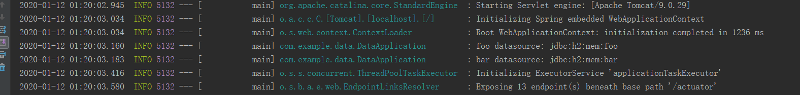
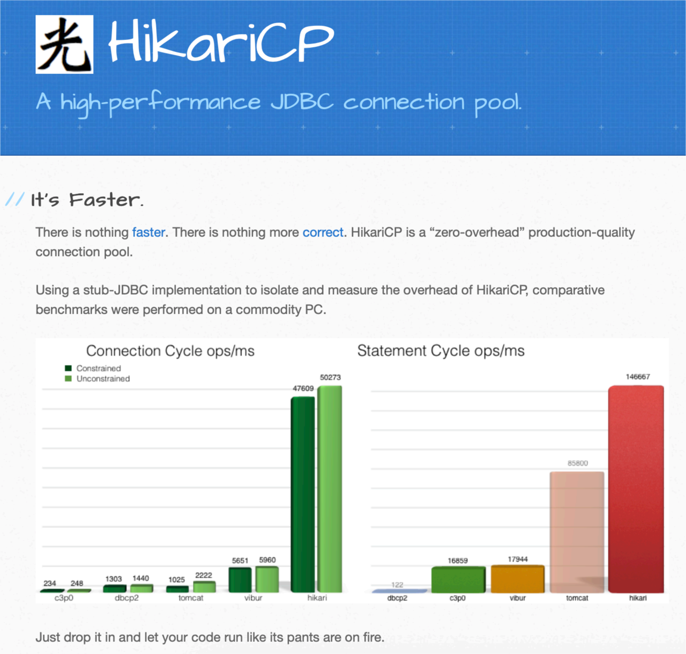
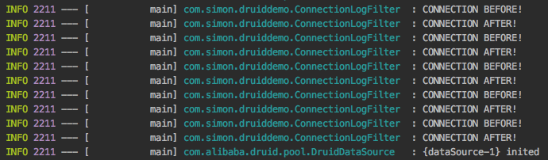
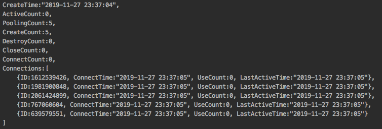
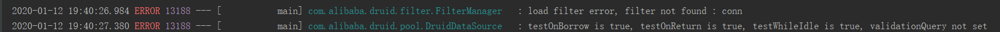
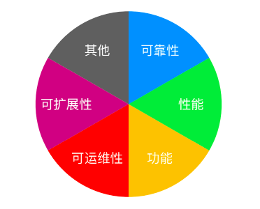
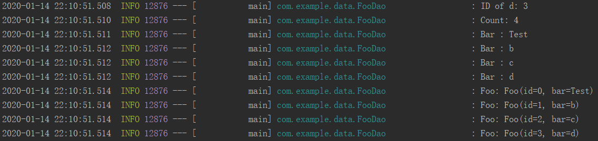
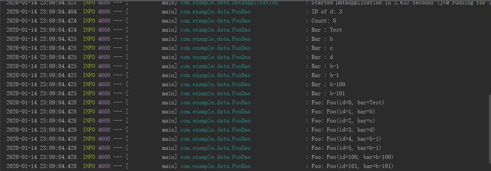

# 0x01 配置单数据源

- 课程`Dependencies`

  ```
  - 访问   		https://start.spring.io/
  - 添加依赖	   Actuator、H2、JDBC、Lombok、Web
  ```

- 查看应用程序上下文配置的Bean

  ```
  - 配置Actuator依赖
  - 访问http://localhost:8080/actuator/beans，即可查看
  ```

- `SpringBoot`会默认加载了类路径下的`schema.sql`和`data.sql`脚本

  ```shell
  - 在src/main/resources/application.properties中添加：
  			spring.datasource.initialization-mode=always
    即可默认加载了类路径下的schema.sql和data.sql脚本
  - 具体源码看DataSourceAutoConfiguration和DataSourceInitializer这两个类
  - 如何正确配置（？）：https://blog.csdn.net/zhengzizhi/article/details/81505900
  ```

- 打印单数据源的连接信息，和执行操作

  ```java
  package geektime.spring.data.datasourcedemo;
  
  import lombok.extern.slf4j.Slf4j;
  import org.springframework.beans.factory.annotation.Autowired;
  import org.springframework.boot.CommandLineRunner;
  import org.springframework.boot.SpringApplication;
  import org.springframework.boot.autoconfigure.SpringBootApplication;
  import org.springframework.jdbc.core.JdbcTemplate;
  
  import javax.sql.DataSource;
  import java.sql.Connection;
  import java.sql.SQLException;
  
  @SpringBootApplication
  @Slf4j
  public class DataSourceDemoApplication implements CommandLineRunner {
  	@Autowired
  	private DataSource dataSource;
  
  	@Autowired
  	private JdbcTemplate jdbcTemplate;
  
  	public static void main(String[] args) {
  		SpringApplication.run(DataSourceDemoApplication.class, args);
  	}
  
  	@Override
  	public void run(String... args) throws Exception {
  		showConnection();
  		showData();
  	}
  
  	private void showConnection() throws SQLException {
  		log.info(dataSource.toString());
  		Connection conn = dataSource.getConnection();
  		log.info(conn.toString());
  		conn.close();
  	}
  
  	private void showData() {
  		jdbcTemplate.queryForList("SELECT * FROM FOO")
  				.forEach(row -> log.info(row.toString()));
  	}
  }
  ```

  - 注①：`@Slf4j`需要`lombok`依赖，[教程](<https://www.cnblogs.com/wwwcf1982603555/p/10070732.html>)，**log**变量需要安装`lombok`插件

  - 注②：[springboot启动时执行任务CommandLineRunner](https://www.cnblogs.com/myblogs-miller/p/9046425.html)

    ```
    1.实现在项目启动后执行的功能
    2.如果有多个类实现CommandLineRunner接口，如何保证顺序
    > SpringBoot在项目启动后会遍历所有实现CommandLineRunner的实体类并执行run方法，如果需要按照一定的顺序去执行，那么就需要在实体类上使用一个@Order注解（或者实现Order接口）来表明顺序
    ```

- **SpringBoot**配置数据源`DataSource`

  - SpringBoot如何快速配置数据源?有如下两种方式:

    ```
    1.通过spring-boot-starter-jdbc快速配置数据源(目前采用的)
    2.自定义数据源DataSource
    ```

  - DataSource**作用**

    ```shell
    1.通过DataSource可以获取数据库连接Connection
    2.通过DataSource创建JdbcTemplate操作数据库
    ```

  - 具体见[此](<https://blog.csdn.net/qq_20916555/article/details/80852144>)

- **SpringBoot**之`Spring JDBC Template`常用方法

  ```shell
  - SpringBoot之Spring JDBC Template常用方法#https://blog.csdn.net/qinaye/article/details/81909589
  - 传入Jdbc API与Spring jdbcTemplate比较
  #https://www.jianshu.com/p/6b8a124d613e
  - 谈jdbcTemplate与mybatis   (jdbcTemplate和ORM框架差距还是蛮大滴~)
  #【good】https://www.cnblogs.com/ChenD/p/7080934.html
  - Spring Boot - 整合JdbcTemplate、MyBatis
  #https://segmentfault.com/a/1190000009732344
  ```

- 课程中**Spring Boot**做了哪些配置？

  ```
  DataSourceAutoConfiguration
  	- 配置DataSource
  DataSourceTransactionManagerAutoConfiguration
  	- 配置DataSourceTransactionManager，即DataSource的事务管理
  jdbcTemplateAutoConfiguration
  	- 配置 jdbcTemplate
  符合条件才进行配置
  ```

- 数据源相关配置属性

  - 通用

    ```
    - spring.datasource.url=jdbc:mysql://localhost/test
    - spring.datasource.username=dbuser
    - spring.datasource.password=dbpass
    - spring.datasource.driver-class-name=com.mysql.jdbc.Driver（可选）
    ```

  - 初始化内嵌数据库（H2）

    ```
    - spring.datasource.initialization-mode=embedded|always|never
    - spring.datasource.schema与spring.datasource.data确定初始化SQL文件
    - spring.datasource.platform=hsqldb | h2 | oracle | mysql | postgresql (与前者对应)
    ```


# 0x02 配置多数据源

### 多数据源的配置注意事项

- 注意事项
  - 不同数据源的配置要分开 

  - 关注每次使⽤的数据源 

    - 有多个`DataSource`时系统如何判断，需要及时判断当前数据库操作使用的是哪个数据源
    - 对应的设施（事务、ORM等）如何选择`DataSource` ，当前事务、设施（`mybatis`、h2)等使用哪个数据源，需要格外小心

- 解决措施

- ⼿⼯配置两组 `DataSource` 及相关内容，（两组`datasource`只能两者选其一）
- 与`Spring Boot`协同⼯作
  - 配置`@Primary`类型的`Bean` (其中某个数据源为主要的数据源)
  - 排除`Spring Boot`的⾃动配置(多个数据源同样重要，不希望有主次之分)
    - `DataSourceAutoConfiguration` 
    - `DataSourceTransactionManagerAutoConfiguration` 
    - `JdbcTemplateAutoConfiguration` 

### 参考示例

- `application.properties`

```yml
management.endpoints.web.exposure.include=*
spring.output.ansi.enabled=ALWAYS

foo.datasource.url=jdbc:h2:mem:foo
foo.datasource.username=sa
foo.datasource.password=

bar.datasource.url=jdbc:h2:mem:bar
bar.datasource.username=sa
bar.datasource.password=
```
- 主启动类

  将单数据源的时候我们使用的是如下的三个**Auto**的`Configuration`类，所以单数据源时没有出现`DataSourceProperties`，而是自动装配了个`DataSource`

```java
@SpringBootApplication(exclude = {
      DataSourceAutoConfiguration.class,
      DataSourceTransactionManagerAutoConfiguration.class,
      JdbcTemplateAutoConfiguration.class
})
@Slf4j
public class MultiDatasourceDemoApplication {

  public static void main(String[] args) {
      SpringApplication.run(MultiDatasourceDemoApplication.class, args);
  }

  @Bean
  @ConfigurationProperties("foo.datasource")
  public DataSourceProperties fooDataSourceProperties(){
      return new DataSourceProperties();
  }

  @Bean
  public DataSource fooDataSource(){
      DataSourceProperties dataSourceProperties= fooDataSourceProperties();
      log.info("foo datasource:{}",dataSourceProperties.getUrl());
      return dataSourceProperties.initializeDataSourceBuilder().build();
  }

  @Bean
  public PlatformTransactionManager fooTxManager(DataSource fooDataSource){

      return new DataSourceTransactionManager(fooDataSource);
  }

  @Bean
  @ConfigurationProperties("bar.datasource")
  public DataSourceProperties barDataSourceProperties(){
      return new DataSourceProperties();
  }

  @Bean
  public DataSource barDataSource(){
      DataSourceProperties dataSourceProperties=barDataSourceProperties();
      log.info("bar datasource:{}",dataSourceProperties.getUrl());
      return dataSourceProperties.initializeDataSourceBuilder().build();
  }

  @Bean
  public PlatformTransactionManager barTxManager(DataSource barDataSource){
      return new DataSourceTransactionManager(barDataSource);
  }

}

```

注：

- `@ConfigurationProperties`注解

  ```
  @ConfigurationProperties能够批量注入配置文件的属性
  @ConfigurationProperties支持松散绑定。@ConfigurationProperties(prefix = "person")，只需要指定一个前缀，就能绑定有这个前缀的所有属性值。
  详细请看：
  https://www.cnblogs.com/dinghua001/p/9642947.html
  ```

- `DataSourceProperties` 

  使用请看[此](<https://blog.csdn.net/hubo_88/article/details/80431733>)

  ```java
  //调用dataSourceProperties.initializeDataSourceBuilder().build()生成dataSource
      @Bean
      @ConfigurationProperties("foo.datasource")
      public DataSourceProperties fooDataSourceProperties() {
          return new DataSourceProperties();
      }
  
      @Bean
      public DataSource fooDataSource() {
          DataSourceProperties dataSourceProperties = fooDataSourceProperties();
          log.info("foo datasource: {}", dataSourceProperties.getUrl());
          return dataSourceProperties.initializeDataSourceBuilder().build();
      }
  ```

- `DataSourceTransactionManager`

  ```java
      //创建对应事务管理器
  	@Bean
      @Resource
      public PlatformTransactionManager fooTxManager(DataSource fooDataSource) {
          return new DataSourceTransactionManager(fooDataSource);
      }
  ```

- `@Resource`

  ```java
  类似于@Autowired（按照Type自动装配），但是是按名字进行自动装配Bean
  
  我的理解：例子里，@Autowired的话把DataSource自动装配进来；@Resource把fooDataSource自动装配进来
  
  详情：https://blog.csdn.net/weixin_40423597/article/details/80643990
  ```

- 运行结果

  

  两个数据源，两个不同的`Bean`使用了两个不同的`Url`

# 0x03 有哪些好用的数据源

- ### HikariCP

  - 首页

    
  - HikariCP 为什么快 

    1. 字节码级别优化（很多⽅法通过 JavaAssist ⽣成） 
    2. ⼤量⼩改进 
        - ⽤ FastStatementList 代替 ArrayList 
        - ⽆锁集合 ConcurrentBag 
        - 代理类的优化（⽐如，⽤ invokestatic 代替了 invokevirtual） 
  - 在 Spring Boot 中的配置 
    - Spring Boot 2.x 
      - 默认使⽤ HikariCP 
      - 配置 spring.datasource.hikari.* 配置 
    - Spring Boot 1.x 
      - 默认使⽤ Tomcat 连接池，需要移除 tomcat-jdbc 依赖 
      - spring.datasource.type=com.zaxxer.hikari.HikariDataSource 

- 常⽤ `HikariCP` 配置参数 
  - 常⽤配置 
    - `spring.datasource.hikari.maximumPoolSize=10` 
    - `spring.datasource.hikari.minimumIdle=10` 
    - `spring.datasource.hikari.idleTimeout=600000` 
    - `spring.datasource.hikari.connectionTimeout=30000` 
    - `spring.datasource.hikari.maxLifetime=1800000` 
  - 其他配置详⻅ `HikariCP` 官⽹ 
    - https://github.com/brettwooldridge/HikariCP 

- ### Alibaba Druid

  - Alibaba Druid 官⽅介绍 
    - “Druid连接池是阿⾥巴巴开源的数据库连接池项⽬。Druid连接池为监控⽽⽣，内置强⼤的监控功能，监控特性不影响性能。功能强⼤，能防SQL注⼊，内置 Logging能诊断Hack应⽤⾏为。” 

  - Druid 
    - 经过阿⾥巴巴各⼤系统的考验，值得信赖 实⽤的功能 
    - 详细的监控（真的是全⾯） 
      - ExceptionSorter，针对主流数据库的返回码都有⽀持 
      - SQL 防注⼊ 
      - 内置加密配置 
      - 众多扩展点，⽅便进⾏定制 

  - 数据源配置 (配合方式)
    - 直接配置 `DruidDataSource` 
    - 通过 `druid-spring-boot-starter` 
      - `spring.datasource.druid.*` 
    - 不引入starter依赖的方式,见[此](<https://blog.csdn.net/fengye1992/article/details/97629242>)


  - 数据源配置常用配置
    - Filter 配置 
      - spring.datasource.druid.filters=stat,config,wall,log4j  （全部使⽤默认值） 
    - 密码加密 
      - spring.datasource.password=<加密密码> 
      - spring.datasource.druid.filter.config.enabled=true 
      - spring.datasource.druid.connection-properties=config.decrypt=true;config.decrypt.key=<public-key> 
    - SQL 防注⼊ 
      - spring.datasource.druid.filter.wall.enabled=true 
      - spring.datasource.druid.filter.wall.db-type=h2 
      - spring.datasource.druid.filter.wall.config.delete-allow=false 
      - spring.datasource.druid.filter.wall.config.drop-table-allow=false 

  - Druid Filter 
    - ⽤于定制连接池操作的各种环节 

    - 可以继承 FilterEventAdapter 以便⽅便地实现 Filter 

    - 修改 META-INF/druid-filter.properties 增加 Filter 配置 

    - 可看源码：`com/alibaba/druid/pool/DruidDataSource.java`看运作方式

      - 比如取连接操作，如果有filter，会调用`filter`的方法去取到连接。

      - `FilterChainImpl.dataSource_connect`，当前是不是最后一个，不是的话取出下一个`Filter`再调用它的`dataSource_connect`，直到我是最后一个时才去获取真正的`DataSource`，这是责任链的设计模式。

- ##### `慢SQL日志`

  - 系统属性配置

    - druid.stat.logSlowSql=true

     - druid.stat.slowSqlMillis=3000
  - Spring Boot
    - spring.datasource.druid.filter.stat.enabled=true
    - spring.datasource.druid.filter.stat.log-slow-sql=true
    - spring.datasource.druid.filter.stat.slow-sql-millis=3000

- #### 一些注意事项

  - 监控一般以**日志**为准
  - 没特殊情况，不要在生产环境打开监控的`Servlet`
  - 没有连接泄露可能的情况下，**不要开启removeAbandoned**
  - `testXxx` 的使用注意 (取、放可不校验，可只开`Whileidel`一段时间不用再检查)
    - 这里可以**看源码**：`com/alibaba/druid/pool/DruidDataSource.java`内` public DruidPooledConnection getConnectionDirect`方法
  - 务必配置合理的超时时间
---
  - 下面是使用`druid-spring-boot-starter` 的示例
    - `application.properties`

  ```yml
  spring.output.ansi.enabled=ALWAYS
  
  spring.datasource.url=jdbc:h2:mem:foo
  spring.datasource.username=sa
  spring.datasource.password=n/z7PyA5cvcXvs8px8FVmBVpaRyNsvJb3X7YfS38DJrIg25EbZaZGvH4aHcnc97Om0islpCAPc3MqsGvsrxVJw==
  
  spring.datasource.druid.initial-size=5
  spring.datasource.druid.max-active=5
  spring.datasource.druid.min-idle=5
  spring.datasource.druid.filters=conn,config,stat,slf4j
  
  spring.datasource.druid.connection-properties=config.decrypt=true;config.decrypt.key=${public-key}
  spring.datasource.druid.filter.config.enabled=true
  
  spring.datasource.druid.test-on-borrow=true
  spring.datasource.druid.test-on-return=true
  spring.datasource.druid.test-while-idle=true
  
  public-key=MFwwDQYJKoZIhvcNAQEBBQADSwAwSAJBALS8ng1XvgHrdOgm4pxrnUdt3sXtu/E8My9KzX8sXlz+mXRZQCop7NVQLne25pXHtZoDYuMh3bzoGj6v5HvvAQ8CAwEAAQ==
  
  ```

- - `druid-filter.properties`

  ```yml
  druid.filters.conn=com.simon.druiddemo.ConnectionLogFilter
  ```

   - - `ConnectionDemoFilter.java`

  ```java
  @Slf4j
  public class ConnectionLogFilter extends FilterEventAdapter {
  
    @Override
    public void connection_connectBefore(FilterChain chain, Properties info) {
        super.connection_connectBefore(chain, info);
        log.info("CONNECTION BEFORE!");
    }
  
    @Override
    public void connection_connectAfter(ConnectionProxy connection) {
        super.connection_connectAfter(connection);
        log.info("CONNECTION AFTER!");
    }
  }
  
  ```

  - 运行结果

    

    

- 报错

  - 

    `resources/META_INF`里还有个`druid-filter.properties`要写，我也不知道为啥要只能在这写，其他地方`not found`

- 数据库密码如何得到密文公钥啥的

  - 请见`Druid`的`WIKI`

- 严重: `testWhileIdle is true, validationQuery not set` 使用`Druid`连接池报错处理（`springBoot`）

  - 请参考[这里](<https://blog.csdn.net/HXNLYW/article/details/86672024>)的配置

  - 这里给出我参考课程做的

    ```yml
    # 指明是否在从池中取出连接前进行检验,如果检验失败, 则从池中去除连接并尝试取出另一个，
    # 注意: 设置为true后如果要生效,validationQuery参数必须设置为非空字符串
    spring.datasource.druid.test-on-borrow=true
    # 指明是否在归还到池中前进行检验，注意: 设置为true后如果要生效,
    #validationQuery参数必须设置为非空字符串
    spring.datasource.druid.test-on-return=true
    # 指明连接是否被空闲连接回收器(如果有)进行检验.如果检测失败,则连接将被从池中去除.
    #注意: 设置为true后如果要生效,validationQuery参数必须设置为非空字符串
    spring.datasource.druid.test-while-idle=true
    # SQL查询,用来验证从连接池取出的连接,在将连接返回给调用者之前.
    #如果指定,则查询必须是一个SQL SELECT并且必须返回至少一行记录
    spring.datasource.druid.validation-query: select 1
    ```

    

---

### 连接池选择时的考量点 



# 0x04 通过 Spring JDBC 访问数据库 

- Spring 的 JDBC 操作类 
  - `spring-jdbc` 有四部分组成
    - core，JdbcTemplate 等相关核⼼接⼝和类 
    - datasource，数据源相关的辅助类 
    - object，将基本的 JDBC 操作封装成对象 
    - support，错误码等其他辅助⼯具 
- 常⽤的 Bean 注解 
  - 通过注解定义 Bean 
    - `@Component` 通用的bean
    - `@Repository` 数据库相关的bean放在数据库仓库中
    - `@Service` 业务服务层的相关的bean
    - `@Controller` springMVC使用
    - `@RestController` springMVC使用
- #### 简单的 JDBC 操作 

  - `JdbcTemplate` 
    - query 
    - queryForObject 
    - queryForList 
    - update 
    - execute 

---

- 代码示例

- Foo.java

  ```java
  @Data 			//会为类的所有属性自动生成setter/getter、equals、canEqual、hashCode、toString方法
  @Builder		
  public class Foo {
  
    private Long id;
  
    private String bar;
  }
  ```

  注：[记lombok@Data和@Builder一起用无法添加无参构造方法的坑](<https://blog.csdn.net/w605283073/article/details/89221853>)

  ```
  @Builder和@Data一起使用时会将类的无参构造方法覆盖掉，会导致使用一些框架操作数据库时不能成功地将数据赋值给po类，例如myBatis
  
  //LOMBOK @BUILDER注解使用的例子、反编译之后的代码详解
  https://www.cnblogs.com/theRhyme/p/10181103.html
  ```

- [lombok介绍，使用总结](<https://www.cnblogs.com/heyonggang/p/8638374.html>)

- FooDao.java

  ```java
  
  @Slf4j
  @Repository
  public class FooDao {
    @Autowired
    private JdbcTemplate jdbcTemplate;
  
    @Autowired
    private SimpleJdbcInsert simpleJdbcInsert;
  
    public void insertData() {
        Arrays.asList("b", "c").forEach(bar -> {
            jdbcTemplate.update("INSERT INTO FOO (BAR) VALUES (?)", bar);
        });
  
        HashMap<String, Object> row = new HashMap<>();
        row.put("BAR", "d");
        Number id = simpleJdbcInsert.executeAndReturnKey(row);
        log.info("ID of d: {}", id.longValue());
    }
  
    public void listData() {
  
        log.info("Count : {}", jdbcTemplate.queryForObject("SELECT COUNT(*) FROM FOO", Long.class));
  
        /**
         * queryForList
         */
        List<String> list = jdbcTemplate.queryForList("SELECT BAR FROM FOO", String.class);
  
        list.forEach(s -> log.info("Bar: {}", s));
  
        /**
         * query
         */
        List<Foo> listFoo = jdbcTemplate.query("SELECT * FROM FOO", new RowMapper<Foo>() {
            @Override
            public Foo mapRow(ResultSet resultSet, int i) throws SQLException {
                return Foo.builder()
                        .id(resultSet.getLong(1))
                        .bar(resultSet.getString(2))
                        .build();
            }
        });
  
        listFoo.forEach(s -> log.info("Foo: {}", s));
  
    }
  }
  ```

- Application.java

  ```java
  @Slf4j
  @SpringBootApplication
  public class SimpleJdbcDemoApplication implements CommandLineRunner {
  
      @Autowired
      private FooDao fooDao;
  
      public static void main(String[] args) {
          SpringApplication.run(SimpleJdbcDemoApplication.class, args);
      }
  
      @Bean
      @Autowired
      public SimpleJdbcInsert SimpleJdbcInsert(JdbcTemplate jdbcTemplate) {
  
          return new SimpleJdbcInsert(jdbcTemplate)
                  .withTableName("FOO").usingGeneratedKeyColumns("ID");
      }
  
      @Override
      public void run(String... args) throws Exception {
  
          fooDao.insertData();
  
          fooDao.listData();
      }
  }
  ```

- 运行结果

  

- #### SQL 批处理 (两种实现方式)

  - 使用`JdbcTemplate` 
    - `batchUpdate` 
    - [BatchPreparedStatementSetter](<https://www.cnblogs.com/xing-cctv/p/6327365.html>) ,使用例子见[此](<https://blog.csdn.net/q343509740/article/details/79503604>)
  - 使用`NamedParameterJdbcTemplate` 
    - `batchUpdate` 
    - `SqlParameterSourceUtils.createBatch` 

  - 代码示例

  - BatchFooDao.java

    ```java
    @Slf4j
    @Repository
    public class BatchFooDao {
    
        @Autowired
        private JdbcTemplate jdbcTemplate;
    
        @Autowired
        private NamedParameterJdbcTemplate namedParameterJdbcTemplate;
    
        public void batchInsert() {
    
            /**
            * 方式一：batchUpdate(sql, BatchPreparedStatementSetter)
            */
            jdbcTemplate.batchUpdate("INSERT  INTO FOO(BAR) VALUES (?)",
                    new BatchPreparedStatementSetter() {
                        @Override
                        public void setValues(PreparedStatement preparedStatement, int i) throws SQLException {
                            preparedStatement.setString(1, "b-" + i);
                        }
    
                        @Override
                        public int getBatchSize() {
                            return 2;
                        }
                    });
    
            /**
            * 方式二：NamedParameterJdbcTemplate
            */
            ArrayList<Foo> foos = new ArrayList<>();
    
            foos.add(Foo.builder().id(100L).bar("b-100").build());
            foos.add(Foo.builder().id(101L).bar("b-101").build());
    
            namedParameterJdbcTemplate
                    .batchUpdate("INSERT  INTO FOO(ID,BAR) VALUES (:id,:bar)",
                            SqlParameterSourceUtils.createBatch(foos));
        }
    }
    ```

  - Application.java

    ```java
    @Slf4j
    @SpringBootApplication
    public class SimpleJdbcDemoApplication implements CommandLineRunner {
    
        @Autowired
        private FooDao fooDao;
    
        @Autowired
        private BatchFooDao batchFooDao;
    
        public static void main(String[] args) {
            SpringApplication.run(SimpleJdbcDemoApplication.class, args);
        }
    
        @Bean
        @Autowired
        public SimpleJdbcInsert SimpleJdbcInsert(JdbcTemplate jdbcTemplate) {
    
            return new SimpleJdbcInsert(jdbcTemplate)
                    .withTableName("FOO").usingGeneratedKeyColumns("ID");
        }
    
        @Override
        public void run(String... args) throws Exception {
    
            fooDao.insertData();
    
            batchFooDao.batchInsert();
    
            fooDao.listData();
        }
    }
    ```


- **1：**`java8`的新特性：`List`和`Map`的`foreach`

  ```java
  e.g.
  Arrays.asList("b", "c").forEach(bar -> {
              jdbcTemplate.update("INSERT INTO FOO (BAR) VALUES (?)", bar);
          });
  ```

- **2：**`jdbcTemplate.query`一些用法

  ```java
  1.参数： ①sql ②RowMapper
  public List<Student> listStudents() {
          String sql = "select * from Student";
          List<Student> students = jdbcTemplate.query(sql,new StudentMapper());
          return students;
      }
  
  2.参数： ①sql ②PreparedStatementSetter  ③RowMapper
  public Student getStudent(final Integer id) {
          String sql = "select * from Student where id = ?";
          List<Student> students = jdbcTemplate.query(sql, new PreparedStatementSetter() {
              public void setValues(PreparedStatement preparedStatement) throws SQLException {
                  preparedStatement.setInt(1,id);
              }
          },new StudentMapper());
          return students.get(0);
      }
  ```

- **3：**`namedParameterJdbcTemplate.batchUpdate`

  ```java
  //namedParameterJdbcTemplate.batchUpdate(
  //			sql,
  //			SqlParameterSourceUtils.createBatch(list))
  List<Foo> list = new ArrayList<>();
          list.add(Foo.builder().id(100L).bar("b-100").build());
          list.add(Foo.builder().id(101L).bar("b-101").build());
          namedParameterJdbcTemplate
                  .batchUpdate("INSERT INTO FOO (ID, BAR) VALUES (:id, :bar)",
                          SqlParameterSourceUtils.createBatch(list));
      }
  ```

- 运行结果

  


