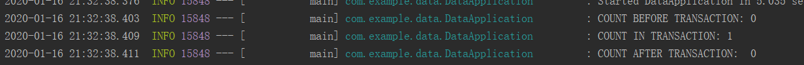

# 0x05 了解 Spring 的抽象 

- #### Spring事务理解

   看了几篇博客，举个形象的例子来简单理解：一个转账程序，执行过程分为建立交易、一方扣钱、一方收钱、结束交易，那再一方扣钱完毕一方收钱时报错，那钱一方扣了一方没收着，咋办？使用事务。事务是一个转账整体，事务可进行提交，执行事务出错可进行回滚，还原到事务发生之前的状态，保证数据的完整性和一致性。

- #### 事务抽象 

  - Spring提供了⼀致的事务模型 
    - 无论使用哪种驱动：JDBC/Hibernate/myBatis 
    - 无论使用哪种数据源：DataSource/JTA 

  - 事务抽象的核⼼接⼝ 
    - PlatformTransactionManager 
      - DataSourceTransactionManager （默认事务模型）
      - HibernateTransactionManager （Hibernate事务模型）
      - JtaTransactionManager （JTA事务模型）

    - TransactionDefinition （事务定义）
      - Propagation （传播特性）
      - Isolation （隔离特性）
      - Timeout （超时）
      - Read-only status （只读特性）

- #### Spring事务的传播特性

  | 传播性                    | 值   | 描述                                 |
  | ------------------------- | ---- | ------------------------------------ |
  | PROPAGATION_REQUIRED      | 0    | 当前有事务就⽤当前的，没有就⽤新的   |
  | PROPAGATION_SUPPORTS      | 1    | 事务可有可⽆，不是必须的             |
  | PROPAGATION_MANDATORY     | 2    | 当前⼀定要有事务，不然就抛异常       |
  | PROPAGATION_REQUIRES_NEW  | 3    | ⽆论是否有事务，都起个新的事务       |
  | PROPAGATION_NOT_SUPPORTED | 4    | 不⽀持事务，按⾮事务⽅式运⾏         |
  | PROPAGATION_NEVER         | 5    | 不⽀持事务，如果有事务则抛异常       |
  | PROPAGATION_NESTED        | 6    | 当前有事务就在当前事务⾥再起⼀个事务 |

- #### Spring的事务隔离特性

  | 隔离性                     | 值   | 脏读 | 不可重复度 | 幻读 |
  | -------------------------- | ---- | ---- | ---------- | ---- |
  | ISOLATION_READ_UNCOMMITTED | 1    | √    | √          | √    |
  | ISOLATION_READ_COMMITTED   | 2    | ×    | √          | √    |
  | ISOLATION_REPEATABLE_READ  | 3    | ×    | ×          | √    |
  | ISOLATION_SERIALIZABLE     | 4    | ×    | ×          | ×    |

- ### 编程式事务的实现

  - TransactionTemplate 的使用
    - TransactionCallback 接口的实现
    - TransactionCallbackWithoutResult 接口的实现
  - PlatformTransactionManager 的使用
    - 可以传⼊TransactionDefinition进⾏定义 


- application.java

  ```java
  @Slf4j
  @SpringBootApplication
  public class ProgrammatictransactionApplication implements CommandLineRunner {
  
      @Autowired
      private TransactionTemplate transactionTemplate;
  
      @Autowired
      private JdbcTemplate jdbcTemplate;
  
      public static void main(String[] args) {
          SpringApplication.run(ProgrammatictransactionApplication.class, args);
      }
  
      @Override
      public void run(String... args) throws Exception {
  
          log.info("COUNT BEFORE TRANSACTION: {}",getCount());
  
          transactionTemplate.execute(new TransactionCallbackWithoutResult() {
              @Override
              protected void doInTransactionWithoutResult(TransactionStatus transactionStatus) {
                  jdbcTemplate.execute("INSERT INTO FOO (ID,BAR) VALUES (1,'AAA')");
                  log.info("COUNT IN TRANSACTION: {}",getCount());
                  transactionStatus.setRollbackOnly();
              }
          });
  
          log.info("COUNT AFTER TRANSACTION: {}",getCount());
      }
  
      private Long getCount(){
  
          return (Long) jdbcTemplate.queryForList("SELECT COUNT(*) AS CNT FROM FOO")
                  .get(0).get("CNT");
      }
  }
  ```

- 运行结果

  

---

- ### 声明式事务 的实现

  

  - 基于注解的配置⽅式 
    - 开启事务注解的⽅式 
      - `@EnableTransactionManagement` 
      - `<tx:annotation-driven/>` 
    - ⼀些配置 
      - `proxyTargetClass` 面向接口做增强
      - `mode` 
      - `order` 事务的顺序
  - `@Transactional` 注解常用属性
    - `transactionManager` 
    - `propagation` 
    - `isolation` 
    - `timeout` 
    - `readOnly` 
    - 怎么**判断回滚** 

---

- application.java

  ```java
  
  @SpringBootApplication
  @Slf4j
  public class DeclarationTransactionDemoApplication implements CommandLineRunner {
  
      @Autowired
      private FooService fooService;
  
      @Autowired
      private JdbcTemplate jdbcTemplate;
  
      public static void main(String[] args) {
          SpringApplication.run(DeclarationTransactionDemoApplication.class, args);
      }
  
      @Override
      public void run(String... args) throws Exception {
  
          fooService.insertRecord();
  
          log.info("AAA: {}",jdbcTemplate
                  .queryForObject("SELECT COUNT(*) FROM FOO WHERE BAR='AAA'",Long.class ));
  
          try{
              fooService.insertThenRollback();
          }catch (Exception e){
  
              log.info("BBB :{}",
                      jdbcTemplate
                              .queryForObject("SELECT COUNT(*) FROM FOO WHERE BAR='BBB'",Long.class));
          }
  
          try {
              fooService.invokeInsertThenRollback();
          }catch (Exception e){
  
              log.info("BBB: {}",jdbcTemplate
                      .queryForObject("SELECT COUNT(*) FROM FOO WHERE BAR='BBB'",Long.class));
          }
  
      }
  }
  ```

- `FooServiceImpl.java`

  ```java
  package com.example.data;
  
  import org.springframework.beans.factory.annotation.Autowired;
  import org.springframework.jdbc.core.JdbcTemplate;
  import org.springframework.stereotype.Component;
  import org.springframework.transaction.annotation.Transactional;
  
  @Component
  public class FooserviceImpl implements FooService{
      @Autowired
      private JdbcTemplate jdbcTemplate;
  
      @Override
      @Transactional
      public void insertRecord() {
          jdbcTemplate.execute("INSERT INTO FOO (BAR) VALUES ('AAA')");
      }
  
      @Override
      @Transactional(rollbackFor = RollbackException.class)// Rollback异常自定义，继承Exception
      public void insertThenRollback() throws RollbackException {
          jdbcTemplate.execute("INSERT INTO FOO (BAR) VALUES ('BBB')");
          throw new RollbackException();
      }
  
      @Override
      public void invokeInsertThenRollback() throws RollbackException {
          insertThenRollback();
      }
  }
  
  ```

- 运行结果

  

- 为什么`insertThenRollback()`可以回滚（变为0），而`invokeInsertThenRollback()`无法回滚呢？

   在Spring当中，其实是为你的类做了一个代理。既然是代理类，所以需要被调用，我需要去调用那个代理类，才能执行那些被代理的增强的方法。但如果方法是在类的内部做调用，没有走到代理方法。因此，在这里，虽然`invokeInsertThenRollback()`调用了带`@Transactional`注解的方法，但本身这个方法是没有事务的（Spring代理后才有），因此在调用`insertThenRollback()`时候也不会有事务支持，没有事务。

- Spring事务额外学习资料整理

  - [【好】浅谈Spring中的事务回滚](https://www.cnblogs.com/zeng1994/p/8257763.html)
  - [【好】SpringBoot 使用 @Transactional 注解配置事务](https://blog.csdn.net/abysscarry/article/details/80189232)
  - [Spring Transaction](<https://blog.csdn.net/xichenguan/article/details/88184209>)
  - [【全】spring事务管理(详解和实例)](https://www.cnblogs.com/yixianyixian/p/8372832.html)
  - [Spring事务管理之几种方式实现事务](<https://blog.csdn.net/qq_42914528/article/details/83743726>)
  - [声明式例子1](<https://blog.csdn.net/qq_34337272/article/details/80419316>)
  - [例子2](<https://blog.csdn.net/qq_34644183/article/details/79213132>)，[后续](<https://blog.csdn.net/qq_34644183/article/details/79235313>)

  注：这两个例子没啥好看的···就是增强了方法而已，例1还直接增强在类上了，**不好**，原因见下

- 网课例子，如果希望最后的`invokeInsertThenRollback()`带事务，会被回滚，如何改正？

  ```java
  法1： 把自己注入到自己类里来代理，调用自己注入来的代理类的方法
  
  @Autowired
  private FooService fooService;
  ..
  @Override
  public void invokeInsertThenRollback() throws RollbackException{
    fooService.insertThenRollback();
  }
  
  法2：调用代理类，即本来类内调用改为代理
  
      @Override
      public void invokeInsertThenRollback() throws RollbackException {
          ((FooService)(AopContext.currentProxy())).invokeInsertThenRollback();
      }
  ```

  注：还有一位大牛(大刘哥)写了友好详细的代码，见[此](<https://time.geekbang.org/course/detail/156-80200>)的评论

- 运行结果

  

- 再来一个，**使用编程式以及基于AspectJ的声明式和基于注解的事务方式，实现烂大街的转账业务**,[参考](<https://blog.csdn.net/qq_34337272/article/details/80419316>)

  ```
  //算了不想写了想睡觉，就例1  
  //https://blog.csdn.net/qq_34337272/article/details/80419316
  写的不太好，在类上做事务增强，不好！见下↓
  ```

- ##### 在类上加`@Transacational`注解，则类里的public方法都会带上事务。而且属性都是用同一个。

- #### 拓展

  - ##### 由`@EnableTransactionManagement(mode = AdviceMode.PROXY)`引出
    - [代理模式与aspectJ实现AOP](<https://blog.csdn.net/qq_34886352/article/details/79317967>)

    - 我们有接口额实现类，使用Proxy模式；如果没有借口，则可以使用（雾Sglabel..?没听清），直接对类进行增强。找了篇[好博客](<https://blog.csdn.net/weixin_34413065/article/details/91361722>),貌似是源码分析的，好深，脑壳昏**下次**看...

  - ##### `Could not autowire. No beans of 'FooService' type found. less... (Ctrl+F1)` 
    `Checks autowiring problems in a bean class.`

    这个复制了去网上搜，可以搜到和`mapper`等等相关的，但一般是`Serviceimpl`需要`@Autowired`,所以先检查`Serviceimpl`里有没有申明是**Bean**：

    ```java
    @Component
    public class FooserviceImpl implements FooService{
    ···
    }
    ```

  - `REQUIRES_NEW`  v.s. `NESTED`

    - `REQUIRES_NEW`，始终启动一个新事物

      - 两个事物没有关联

    - `NESTED`， 在原事务内启动一个内嵌事务

      - 两个事物有关联
      - 外部事物回滚，内嵌事务也会回滚

    - 例子1：事务A**内嵌**事务B，事务B为**`REQUIRES_NEW`**，则事务A回滚不影响事务B，事务B回滚不影响事务A

      - `FooServiceimpl.java`主要代码

        ```java
            @Override
            @Transactional(rollbackFor = RollbackException.class, propagation = Propagation.REQUIRES_NEW)
            public void insertThenRollback() throws RollbackException {
                jdbcTemplate.execute("INSERT INTO FOO (BAR) VALUES ('BBB')");
        //        throw new RollbackException();
            }
        
            @Override
            @Transactional(rollbackFor = RuntimeException.class)
            public void invokeInsertThenRollback() throws RollbackException {
                //((FooService)(AopContext.currentProxy())).invokeInsertThenRollback();
                jdbcTemplate.execute("INSERT INTO FOO (BAR) VALUES ('AAA')");
                try {
                    fooService.insertThenRollback();
                } catch (RollbackException e) {
                    log.info("RollbackException", e);
                }
                throw new RuntimeException();
            }
        ```

      - `Application`主要代码

        ```java
        		try {
        			fooService.invokeInsertThenRollback();
        		} catch (Exception e) {
        			log.info("AAA {}",
        				jdbcTemplate
        						.queryForObject("SELECT COUNT(*) FROM FOO WHERE BAR='AAA'", Long.class));
        			log.info("BBB {}",
        					jdbcTemplate
        							.queryForObject("SELECT COUNT(*) FROM FOO WHERE BAR='BBB'", Long.class));
        		}
        ```

      - 运行结果

        

    - 例子2：事务A**内嵌**事务B，事务B为**`NESTED`**，则事务A回滚事务B**也滚**，事务B回滚**不影响**事务A

      `insertThenRollback()`的`@Transactional`内 `propagation = Propagation.NESTED`

      - 运行结果

        


# 0x06 JDBC 异常抽象 

- Spring 的 JDBC 异常抽象 
  - Spring 会将数据操作的异常转换为 `DataAccessException` 
  - ⽆论使⽤何种数据访问⽅式，都能使⽤⼀样的异常 
  - 
- Spring是怎么认识那些错误码的 

  - 通过 `SQLErrorCodeSQLExceptionTranslator` 解析错误码 
  - `ErrorCode` 定义 
    - `org/springframework/jdbc/support/sql-error-codes.xml` 
    - `Classpath 下的 sql-error-codes.xml` 
- 定制错误码解析逻辑 
- 

---

- `sql-error-codes.xml`

  ```xml
  <?xml version="1.0" encoding="UTF-8"?>
  <!DOCTYPE beans PUBLIC "-//SPRING//DTD BEAN 2.0//EN" "http://www.springframework.org/dtd/spring-beans-2.0.dtd">
  
  <beans>
  
      <bean id="H2" class="org.springframework.jdbc.support.SQLErrorCodes">
          <property name="badSqlGrammarCodes">
              <value>42000,42001,42101,42102,42111,42112,42121,42122,42132</value>
          </property>
          <property name="duplicateKeyCodes">
              <value>23001,23505</value>
          </property>
          <property name="dataIntegrityViolationCodes">
              <value>22001,22003,22012,22018,22025,23000,23002,23003,23502,23503,23506,23507,23513</value>
          </property>
          <property name="dataAccessResourceFailureCodes">
              <value>90046,90100,90117,90121,90126</value>
          </property>
          <property name="cannotAcquireLockCodes">
              <value>50200</value>
          </property>
          <property name="customTranslations">
              <bean class="org.springframework.jdbc.support.CustomSQLErrorCodesTranslation">
                  <property name="errorCodes" value="23001,23505" />
                  <!--这里是自定义的~ -->
                  <property name="exceptionClass"
                            value="com.example.demo.CustomDuplicateKeyException" />
              </bean>
          </property>
      </bean>
  
  </beans>
  ```

- `CustomDuplicatedKeyException.java`

  

- `SpringTest.java`

```java
@RunWith(SpringRunner.class)
@SpringBootTest
class ErrorcodeDemoApplicationTests {
  @Autowired
  private JdbcTemplate jdbcTemplate;

  @Test(expected = CustomDuplicateKeyException.class)

  public void contextLoads() {

      jdbcTemplate.execute("INSERT INTO FOO (ID,BAR) VALUES (1,'A')");
      jdbcTemplate.execute("INSERT INTO FOO (ID,BAR) VALUES (1,'B')");
  }
```
  }

- 异常拓展1：从源码解析[Spring JDBC异常](<https://juejin.im/post/5ce8e9f251882530e4653404>)

- 异常拓展2：另一种定制错误的方法Registrar

  ```java
  //摘自评论
  通过继承 SQLExceptionSubclassTranslator 类，重新 doTranslate 方法，我是通过配置类，通过jdbctemplate的方法setExceptionTranslator注入自定义的 SQLExceptionSubclassTranslator 类
  
  https://gist.github.com/lzq420241/086e77e294d741e9e41715f898f742c4
  
  但是按照老师的提示（jdbc.support下Registrar类），看了下CustomSQLExceptionTranslatorRegistrar这个类，但是仍不知道如何将上例当中CustomSQLExceptionSubclassTranslator设置到CustomSQLExceptionTranslatorRegistrar的translators成员当中，后面的答疑也没有提到这个思考题的解答，期待能有更进一步的提示。
  ```


# 答疑课

- #### 多数据源、分库分表、读写分离的关系

  

  注：**分库分表**可使用[`shardingsphere`](<https://shardingsphere.apache.org/>),**主库备库**可使用淘宝的`TDDL`

  老师在数据库分库分表里面提到的组件名字：

  ```
  TDDL、Cobar、MyCAT、Sharding-Shpere
  ```

- #### 数据库中间件

  

  注：一般是，**带事务**的操作去**主库**，**不带事务**的操作去**从库**

- #### Spring注解总结：

    `Java Config` 相关注解
    • `@Configuration`
    • `@ImportResource`
    • `@ComponentScan`
    • `@Bean`
    • `@ConfigurationProperties`
    定义相关注解
    • `@Component` / `@Repository` 数据库访问层/ `@Service`
    • `@Controller` / `@RestController`(`ResposeBody`+`Controller`)
    • `@RequestMapping`
    注⼊相关注解
    • `@Autowired` / `@Qualifier`（指定名字） / `@Resource`
    • `@Value`（注入常量）

- #### 如何解禁 Endpoint
    (/actuator/health 健康检查
    /actuator/beans 查看容器中的所有 Bean
    /actuator/mappings 查看 Web 的 URL 映射
    /actuator/env 查看环境信息)
    默认
    • /actuator/health 和 /actuator/info 可 Web 访问
    解禁**所有** **Endpoint**
    • application.properties / application.yml
    • management.endpoints.web.exposure.include=*

- 关于Maven

    这个是我自己新手上想说的55，有时候Maven报红找不到包，先看看配置的Maven位置是否对，不行的话就`ProjectStructure -> Modules ->Dependencies`把包加入到`classpath`里