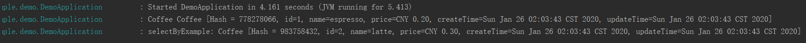
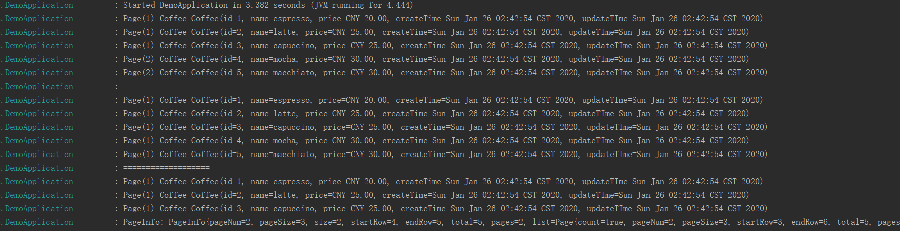

# 0x05 通过Mybatis操作数据库

- 认识 MyBatis

  - MyBatis（https://github.com/mybatis/mybatis-3）
    - ⼀款优秀的持久层框架
    - ⽀持定制化 SQL、存储过程和⾼级映射

- 在 Spring 中使⽤ MyBatis 
  - MyBatis Spring Adapter（https://github.com/mybatis/spring）
  - MyBatis Spring-Boot-Starter（https://github.com/mybatis/spring-boot-starter）

- 简单配置

  - mybatis.mapper-locations = classpath*:mapper/**/*.xml
  - mybatis.type-aliases-package = 类型别名的包名
  - mybatis.type-handlers-package = TypeHandler扫描包名
  - mybatis.configuration.map-underscore-to-camel-case = true

- Mapper 的定义与扫描
  - @MapperScan 配置扫描位置
  - @Mapper 定义接⼝
  - 映射的定义—— XML 与注解

- [@Param注解的用法解析](https://www.cnblogs.com/cangqinglang/p/9279254.html)

  ```java
  //e.g.①
  //dao层示例
  Public User selectUser(@param(“userName”) String name,@param(“userpassword”) String password);
  //xml映射对应示例
  <select id=" selectUser" resultMap="BaseResultMap">  
     select  *  from user_user_t   where user_name = #{userName，jdbcType=VARCHAR} and user_password=#{userPassword,jdbcType=VARCHAR}  
  </select>
  //=================================================================================
  //e,g,②
  //Dao层
  Coffee findById(@Param("id") Long id);
  //Application调用
  c = coffeeMapper.findById(c.getId());
  ```

- **mybatis.configuration.map-underscore-to-camel-case=true**

  ​	`application.properties`使用该配置可以让mybatis自动将SQL中查出来的带下划线的字段，**转换为驼峰标志**，再去匹配类中的属性。如数据库字段为`user_name`,转换为驼峰标志，再去匹配类中的属性`userName`

- TypeHandler解析

  [网上找的参考](<https://www.jianshu.com/p/6172c7f6e27e>)

  ```java
  //e.g.  处理钱的
  //先再application.properties里设置
  //mybatis.type-handlers-package=com.example.demo.mapper
  /**
   *  在 Money 与 Long 之间转换的 TypeHandler，处理 CNY 人民币
   */
  public class MoneyTypeHandler extends BaseTypeHandler<Money> {
      /**
       * 把Java类型参数转换为对应的数据库类型
       * @param ps 当前的PreparedStatement对象
       * @param i 当前参数位置
       * @param parameter 当前参数的Java对象
       * @param jdbcType 当前参数的数据库类型
       * @throws SQLException
       */
      @Override
      public void setNonNullParameter(PreparedStatement ps, int i, Money parameter, JdbcType jdbcType) throws SQLException {
          ps.setLong(i, parameter.getAmountMajorLong());
      }
      /**
       * 获取数据结果集时把数据库类型转换为对应的Java类型
       * @param rs 当前的结果集
       * @param columnName 当前的字段名称
       * @return  转换后的Java对象
       * @throws SQLException
       */
      @Override
      public Money getNullableResult(ResultSet rs, String columnName) throws SQLException {
          return parseMoney(rs.getLong(columnName));
      }
      /**
       * 通过字段位置获取字段数据时把数据库类型转换为对应的Java类型
       * @param rs 当前的结果集
       * @param columnIndex 当前字段的位置
       * @return 转换后的Java对象
       * @throws SQLException
       */
      @Override
      public Money getNullableResult(ResultSet rs, int columnIndex) throws SQLException {
          return parseMoney(rs.getLong(columnIndex));
      }
      /**
       * 调用存储过程后把数据库类型的数据转换为对应的Java类型
       * @param cs  当前的CallableStatement执行后的CallableStatement
       * @param columnIndex  当前输出参数的位置
       * @return
       * @throws SQLException
       */
      @Override
      public Money getNullableResult(CallableStatement cs, int columnIndex) throws SQLException {
          return parseMoney(cs.getLong(columnIndex));
      }
  
      private Money parseMoney(Long value) {
          return Money.of(CurrencyUnit.of("CNY"), value / 100.0);
      }
  }
  
  ```

- 项目例子：**springbucks**

  - resources/application.properties

    ```properties
    mybatis.type-handlers-package=geektime.spring.data.mybatisdemo.handler
    mybatis.configuration.map-underscore-to-camel-case=true
    ```

  - resources/schema.sql

    ```sql
    create table t_coffee (
        id bigint not null auto_increment,
        name varchar(255),
        price bigint not null,
        create_time timestamp,
        update_time timestamp,
        primary key (id)
    );
    ```

  - model/Coffee.java

    ```java
    @Data
    @AllArgsConstructor
    @NoArgsConstructor
    @Builder
    public class Coffee {
        private Long id;
        private String name;
        private Money price;
        private Date createTime;
        private Date updateTime;
    }
    ```

  - mapper/CoffeeMapper.java

    ```java
    @Component		//用于自动注入
    @Mapper
    public interface CoffeeMapper {
        @Insert("insert into t_coffee (name, price, create_time, update_time)"
                + "values (#{name}, #{price}, now(), now())")
        @Options(useGeneratedKeys = true)
        int save(Coffee coffee);
    
        @Select("select * from t_coffee where id = #{id}")
        @Results({
                @Result(id = true, column = "id", property = "id"),
                @Result(column = "create_time", property = "createTime"),
                // map-underscore-to-camel-case = true 可以实现一样的效果
                // @Result(column = "update_time", property = "updateTime"),
        })
        Coffee findById(@Param("id") Long id);
    }
    ```

  - MoneyTypeHandler.java

    ```java
    /**
     * 在 Money 与 Long 之间转换的 TypeHandler，处理 CNY 人民币
     */
    public class MoneyTypeHandler extends BaseTypeHandler<Money> {
        @Override
        public void setNonNullParameter(PreparedStatement ps, int i, Money parameter, JdbcType jdbcType) throws SQLException {
            // 由于BaseTypeHandler中已经把parameter为null的情况做了处理，所以这里我们就不用在判断parameter是否为空，直接用就可以了
            ps.setLong(i, parameter.getAmountMinorLong());
        }
    
        @Override
        public Money getNullableResult(ResultSet rs, String columnName) throws SQLException {
            return parseMoney(rs.getLong(columnName));
        }
    
        @Override
        public Money getNullableResult(ResultSet rs, int columnIndex) throws SQLException {
            return parseMoney(rs.getLong(columnIndex));
        }
    
        @Override
        public Money getNullableResult(CallableStatement cs, int columnIndex) throws SQLException {
            return parseMoney(cs.getLong(columnIndex));
        }
    
        private Money parseMoney(Long value) {
            return Money.of(CurrencyUnit.of("CNY"), value / 100.0);
        }
    }
    ```

  - Application

    ```java
    @SpringBootApplication
    @Slf4j
    @MapperScan("com.example.demo.mapper")
    @ComponentScan("com.example.demo.mapper")
    public class DemoApplication implements CommandLineRunner {
    	@Autowired
    	private CoffeeMapper coffeeMapper;
    
    	public static void main(String[] args) {
    		SpringApplication.run(DemoApplication.class, args);
    	}
    
    	@Override
    	public void run(String... args) throws Exception {
            Coffee c = Coffee.builder().name("espresso")
                    .price(Money.of(CurrencyUnit.of("CNY"), 20.0))
                    .build();
            int count = coffeeMapper.save(c);
            log.info("Save {} Coffee: {}", count, c);
    
            c = Coffee.builder().name("latte")
                    .price(Money.of(CurrencyUnit.of("CNY"), 25.0))
                    .build();
            count = coffeeMapper.save(c);
            log.info("Save {} Coffee: {}", count, c);
    
            c = coffeeMapper.findById(c.getId());
            log.info("Find Coffee: {}", c);
    	}
    }
    ```

  - **犯错注意点①**:

    ```properties
    #注意在applciation.properties一定要加此句将handler注入进来
    mybatis.type-handlers-package=geektime.spring.data.mybatisdemo.handler
    ```

  - **犯错注意点②**：

    ```properties
    mybatis 2.0.1版本Mapper要这样配置 @Options(useGeneratedKeys = true, keyProperty = "id") ，插入时才能自动填充id
    ```

    

# 0x06 让 MyBatis 更好⽤的那些⼯具-MyBatis Generator

- 认识 MyBatis Generator
  - MyBatis Generator（http://www.mybatis.org/generator/）
    - MyBatis 代码⽣成器
    - 根据数据库表⽣成相关代码
      - POJO
      - Mapper 接⼝
      - SQL Map XML

- 运⾏ **MyBatis Generator**

  - **命令⾏**

    - java -jar mybatis-generator-core-x.x.x.jar -configfile generatorConfig.xml 

  - **Maven Plugin**（mybatis-generator-maven-plugin）

    - mvn mybatis-generator:generate 
    - ${basedir}/src/main/resources/generatorConfig.xml

  - **Eclipse Plugin** 

  - **Java 程序**

    ```
    课程中采用的是这种
    ```

  - **Ant Task**

- 配置 **MyBatis Generator**
  - generatorConfiguration 
  - context 
    - jdbcConnection
    - javaModelGenerator
    - sqlMapGenerator
    - javaClientGenerator （ANNOTATEDMAPPER(基于注解的mapper，适用于简单逻辑) / XMLMAPPER(基于XML的mapper，适用于复杂逻辑需要微调的) / MIXEDMAPPER(混合型的mapper，对于简单的接口实现使用注解完成，对于复杂的接口实现则通过XML的配置实现)）
    - table

- ⽣成时可以使⽤的插件
  - 内置插件都在 `org.mybatis.generator.plugins` 包中
    - FluentBuilderMethodsPlugin
    - ToStringPlugin
    - SerializablePlugin
    - RowBoundsPlugin
    - ……

- 使⽤⽣成的对象
  - 简单操作，直接使⽤⽣成的 xxxMapper 的⽅法
  - 复杂查询，使⽤⽣成的 xxxExample 对象

- example对象使用解析

  在查询、修改当中使用。具体使用请见[此](<https://www.cnblogs.com/liuzunli/articles/9257949.html>)

- ##### 一些经验①：
  把自动生成的代码和手工写的代码放在不同的地方，`xml`和`Mapper`都**分开放**，比如一个放`src/main/java/xxx/mapper/auto`里，一个放`src/main/java/xxx/manual`里，`xml`也是类似的，这样就不用担心**覆盖**的问题了。公司项目强制要求手写的和自动生成的分开放，分开放能够很好的支持后期数据表新增字段或者修改字段的维护工作。手写的部分**遵从规范**，自动生成的**忽略掉规范**，并且**不要去改动**自动生成的产物。

- 一些经验②：

  **MyBatis-Plus**，它也带有代码的自动生成机制和一些原生的**CRUD**接口，答疑课老师会讲差异。

- 使用例子：StuckBacks

  - schema.sql

    ```sql
    create table t_coffee (
        id bigint not null auto_increment,
        name varchar(255),
        price bigint not null,
        create_time timestamp,
        update_time timestamp,
        primary key (id)
    );
    ```

  - application.properties

    ```properties
    mybatis.mapper-locations=classpath*:/mapper/**/*.xml
    mybatis.type-aliases-package=com.example.demo.model
    mybatis.type-handlers-package=com.example.demo.handler
    mybatis.configuration.map-underscore-to-camel-case=true
    ```

  - MoneyTypeHandler.java

    同之前的

  - generatorConfig.xml

    ```xml
    <?xml version="1.0" encoding="UTF-8"?>
    <!DOCTYPE generatorConfiguration
            PUBLIC "-//mybatis.org//DTD MyBatis Generator Configuration 1.0//EN"
            "http://mybatis.org/dtd/mybatis-generator-config_1_0.dtd">
    
    <generatorConfiguration>
        <context id="H2Tables" targetRuntime="MyBatis3">
            <plugin type="org.mybatis.generator.plugins.FluentBuilderMethodsPlugin" />
            <plugin type="org.mybatis.generator.plugins.ToStringPlugin" />
            <plugin type="org.mybatis.generator.plugins.SerializablePlugin" />
            <plugin type="org.mybatis.generator.plugins.RowBoundsPlugin" />
    
            <jdbcConnection driverClass="org.h2.Driver"
                            connectionURL="jdbc:h2:mem:testdb"
                            userId="sa"
                            password="">
            </jdbcConnection>
    
            <javaModelGenerator targetPackage="com.example.demo.model"
                                targetProject="./src/main/java">
                <property name="enableSubPackages" value="true" />
                <property name="trimStrings" value="true" />
            </javaModelGenerator>
    
            <sqlMapGenerator targetPackage="com.example.demo.mapper"
                             targetProject="./src/main/resources/mapper">
                <property name="enableSubPackages" value="true" />
            </sqlMapGenerator>
    
            <javaClientGenerator type="MIXEDMAPPER"
                                 targetPackage="com.example.demo.mapper"
                                 targetProject="./src/main/java">
                <property name="enableSubPackages" value="true" />
            </javaClientGenerator>
    
            <table tableName="t_coffee" domainObjectName="Coffee" >
                <generatedKey column="id" sqlStatement="CALL IDENTITY()" identity="true" />
                <columnOverride column="price" javaType="org.joda.money.Money" jdbcType="BIGINT"
                                typeHandler="com.example.demo.handler.MoneyTypeHandler"/>
            </table>
        </context>
    </generatorConfiguration>
    ```

  - Application：①生成**POJO**，**mapper**(`注解类 / xml`)

    ```java
    private void generateArtifacts() throws Exception {
    		List<String> warnings = new ArrayList<>();
    		ConfigurationParser cp = new ConfigurationParser(warnings);
    		Configuration config = cp.parseConfiguration(
    				this.getClass().getResourceAsStream("/generatorConfig.xml"));
    		DefaultShellCallback callback = new DefaultShellCallback(true);
    		MyBatisGenerator myBatisGenerator = new MyBatisGenerator(config, callback, warnings);
    		myBatisGenerator.generate(null);
    	}
    ```

  - Application：②使用示例

    ```java
    private void playWithArtifacts() {
            Coffee espresso = new Coffee()
                    .withName("espresso")
                    .withPrice(Money.of(CurrencyUnit.of("CNY"), 20.0))
                    .withCreateTime(new Date())
                    .withUpdateTime(new Date());
            coffeeMapper.insert(espresso);
    
            Coffee latte = new Coffee()
                    .withName("latte")
                    .withPrice(Money.of(CurrencyUnit.of("CNY"), 30.0))
                    .withCreateTime(new Date())
                    .withUpdateTime(new Date());
            coffeeMapper.insert(latte);
    
            Coffee s = coffeeMapper.selectByPrimaryKey(1L);
            log.info("Coffee {}", s);
    
            CoffeeExample example = new CoffeeExample();
            example.createCriteria().andNameEqualTo("latte");
            List<Coffee> list = coffeeMapper.selectByExample(example);
            list.forEach(e -> log.info("selectByExample: {}", e));
        }
    ```

  - 运行结果

    

  

# 0x07  让 MyBatis 更好⽤的那些⼯具- MyBatis PageHelper

- 认识 MyBatis PageHelper

    - MyBatis PageHepler（https://pagehelper.github.io）
      - ⽀持多种数据库
      - ⽀持多种分⻚⽅式
      - SpringBoot ⽀持（https://github.com/pagehelper/pagehelper-spring-boot ）
      - pagehelper-spring-boot-starter

- 示例代码

    - application.poperties

      ```properties
      mybatis.type-handlers-package=com.example.demo.handler
      mybatis.configuration.map-underscore-to-camel-case=true
      
      pagehelper.offset-as-page-num=true
      pagehelper.reasonable=true
      pagehelper.page-size-zero=true
      pagehelper.support-methods-arguments=true
      ```

    - data.sql(schema.sql同之前的)

      ```sql
      insert into t_coffee (name, price, create_time, update_time) values ('espresso', 2000, now(), now());
      insert into t_coffee (name, price, create_time, update_time) values ('latte', 2500, now(), now());
      insert into t_coffee (name, price, create_time, update_time) values ('capuccino', 2500, now(), now());
      insert into t_coffee (name, price, create_time, update_time) values ('mocha', 3000, now(), now());
      insert into t_coffee (name, price, create_time, update_time) values ('macchiato', 3000, now(), now());
      ```

    - CoffeeMapper.java

      ```java
      import java.util.List;
      
      @Mapper
      @Component
      public interface CoffeeMapper {
          @Select("select * from t_coffee order by id")
          List<Coffee> findAllWithRowBounds(RowBounds rowBounds);
      
          @Select("select * from t_coffee order by id")
          List<Coffee> findAllWithParam(
                  @Param("pageNum") int pageNum,
                  @Param("pageSize") int pageSize
          );
      }
      
      ```

    - Application

      ```java
      coffeeMapper.findAllWithRowBounds(new RowBounds(1, 3))
          .forEach(c -> log.info("Page(1) Coffee {}", c));
      coffeeMapper.findAllWithRowBounds(new RowBounds(2, 3))
          .forEach(c -> log.info("Page(2) Coffee {}", c));
      
      log.info("===================");
      
      coffeeMapper.findAllWithRowBounds(new RowBounds(1, 0))
          .forEach(c -> log.info("Page(1) Coffee {}", c));
      
      log.info("===================");
      //演示PageInfo的用法
      coffeeMapper.findAllWithParam(1, 3)
          .forEach(c -> log.info("Page(1) Coffee {}", c));
      List<Coffee> list = coffeeMapper.findAllWithParam(2, 3);
      PageInfo page = new PageInfo(list);
      log.info("PageInfo: {}", page);
      ```

    - 运行结果

      

    

    


# 0x09 SpringBucks 项目Mybatis实现

- 首先是收集的资料

  ```
  druid数据源
  https://blog.csdn.net/linpeng_1/article/details/80053534
  使用mybatis的xml方式
  https://blog.csdn.net/solocoder/article/details/84990904
  例子1
  https://www.cnblogs.com/TimerHotel/p/springboot_matatis_05.html
  例子2
  https://blog.csdn.net/qq_40646143/article/details/79665352
  例子3
  https://blog.csdn.net/YKenan/article/details/88910730
  例子4【俺看了这个才懂】
  https://www.cnblogs.com/yangji0202/p/10673208.html
  generator的坑
  https://blog.csdn.net/qq_40307945/article/details/81351302
  ```

- 碰到的问题

  ```
  //1.org.apache.ibatis.binding.BindingException: Invalid bound statement(not found)问题
  // 解决连接
  https://blog.csdn.net/zhwyj1019/article/details/79088073
  //其他链接：
  https://blog.csdn.net/sundacheng1989/article/details/81630370
  //具体步骤
  //修改properties，mybatis.mapper-locations=classpath:mapper/*.xml
  
  //2.Loading class `com.mysql.jdbc.Driver'. This is deprecated警告处理，jdbc更新处
  // 解决连接
  https://blog.csdn.net/weixin_42323802/article/details/82500458
  
  //3.schema.sql中的drop table语句
  老师的课程中是H2数据库，语法是drop table t_coffee if exists;
  现在我使用mysql，改为drop table if exists t_coffee;
  
  //4.timestamp的默认值问题，不能是0.0.0.0，而得设置为1970xxx的
  // 解决连接
  【Wrong】https://blog.csdn.net/xiyang_1990/article/details/97794694
  【True】https://blog.csdn.net/liujian197905187511/article/details/51221777
  //具体步骤
  //1.增加alter table t_coffee alter column CREATE_TIME set default '1970-01-01 10:00:00';，发现不行，因为Springboot建表的时候就报错了
  //2.`create_time` timestamp NOT NULL DEFAULT CURRENT_TIMESTAMP ON UPDATE CURRENT_TIMESTAMP  成功
  ```

- 学习点

  - Money变量，在类中为**Long**，在数据库中存为**bigint**(因为去掉了小数点存的),在Mybatis中的mapper-xml映射的**ResultMap**中使用设定的**TypeHandler转换**

    ```xml
    <result column="PRICE" jdbcType="BIGINT" property="price" typeHandler="com.example.demo.handler.MoneyTypeHandler" />
    ```

    `MoneyTypeHandler`构造见前。

  - **测试类编写**（还是失败的···）

    参考Chapter2的ErrorCode

    ```java
    @RunWith(SpringRunner.class)
    @SpringBootTest
    public class ErrorCodeDemoApplicationTests {
        @Autowired
        private JdbcTemplate jdbcTemplate;
    
        @Test(expected = CustomDuplicatedKeyException.class)
        public void testThrowingCustomException() {
            jdbcTemplate.execute("INSERT INTO FOO (ID,BAR) VALUES (1,'AAA')");
            jdbcTemplate.execute("INSERT INTO FOO (ID,BAR) VALUES (1,'BBB')");
        }
    }
    ```

  - Mybatis **枚举自定义转换**

    参考[此](<https://blog.csdn.net/kevin_Luan/article/details/79857827>)，最终解决方法是找到了一个默认的解决方法····见下：

    在`*.xml`找那个引入自定义枚举类时加上调用的**TypeHandler**：

    ```xml
    #{state,typeHandler=org.apache.ibatis.type.EnumOrdinalTypeHandler}
    ```

  - **枚举类Update时作为参数传入，报错：Object does not represent an enum type.**

    解决方法：insert时候是使用`EnumOrdinalTypeHandler`进行转换的，查看源码，发现`enum`的`ordinal`方法，直接调用接口转为Integer传入了。

    这样的话，传入解决了，那如何取出呢？单单取出或者取出整个Order类？

    取出类，那就构造ResultMap来取出呗，类似的例子见[此](<https://blog.csdn.net/qq_42103591/article/details/88981427>)

    取出State，可以直接取出Integer再转化为Enum呗（或者state都转为int来对比即可）

    后来发现了这个，<https://blog.csdn.net/liranke/article/details/22751453>

    ```
    (1)	 ordinal()方法: 返回枚举值在枚举类种的顺序。这个顺序根据枚举值声明的顺序而定。  
    (2)  compareTo()方法: Enum实现了java.lang.Comparable接口，因此可以比较象与指定对象的顺序。
    (3)  values()方法： 静态方法，返回一个包含全部枚举值的数组。
    (4)  toString()方法： 返回枚举常量的名称。
    (5)  valueOf()方法： 这个方法和toString方法是相对应的，返回带指定名称的指定枚举类型的枚举常量。
    (6)  equals()方法： 比较两个枚举类对象的引用。
    ```

    

  - #### Mybatis  如何实现多对多映射？

    看了前面搜集的那么多资料，也没找如何直接insert如下面 Employee一样多对多映射的类。

    只找到了嵌套查询select的resultmap写法，使得可以返回类似于

    ```java
    public class Employee {
    	private Long id;
    	private String name;
        private List<Role>;
    }
    ```

    这样的对象。这里具体是通过嵌套结果映射，其实就是一对多的查询，因为桥表的存在。

    JPA里`@JoinTable`可以使得自动插入删除桥表，Mybatis得手动·····

    这里找到了过来人的经验：<https://blog.csdn.net/weixin_43960336/article/details/89344495>

    唉真麻烦···第一次做花了挺久的时间。

  - `Spring Boot2.x` 执行`schema.sql`**初始化数据库**

    原来使用H2没啥问题，若改为Mysql的话得注意几点事项，见

    - <https://blog.csdn.net/qq_19671173/article/details/83077260>
    - <https://blog.csdn.net/zhengzizhi/article/details/81505900>

  - Mybatis (ParameterType) 如何传递多个不同类型的参数

    <https://www.jianshu.com/p/d977eaadd1ed>

  - Mybatis关联外键

    - <https://blog.csdn.net/death05/article/details/51724722>
    - <https://blog.csdn.net/zuo_h_dr/article/details/85963898>
    - SpringMVC+Mybatis书十章


# 拓展：Mybatis 关联映射

这里就稍微记录一点`SpringMVC+Mybatis企业应用实战第二版`第十章的内容。关联映射的学习可以参考之前记录的，和这一章的笔记。
关联关系有如下分类：
- 一对一
- 一对多
- 多对多

### 一对一

一对一的关系，比如一个人只能有一张身份证。由于是一对一的关联，因此还要给外键列增加unique唯一约束

e.g.

```mysql
create table tb_person (
  id int primary key auto_increment,
  name varchar(18),
  sex varchar(18),
  age int,
  card_id int unique,
  foreign key (card_id) references tb_card (id)
);
```

tb_person表的card_id作为外键参照tb_card表的主键id，并将card_id做唯一性约束。**外键只能引用外表中的列的值！**可以使得两张表关联，保证数据的一致性和实现一些级联操作

这是一个[外键使用的例子](<https://www.cnblogs.com/yinzhengjie/p/10285553.html>)

我的外键作用总结：

- 桥表数据必须在外键关联的主键表中存在
- 删除外键关联的主键表数据，先得删除桥表内的关再执行删除操作


### 一对多

- 懒加载

  比如说你搜索班级类，班级类有一个属性是学生类的列表。设置为懒加载时，其不会立即发送SQL语句去查询班级类里的学生，而是等到需要用到学生列表的属性时候才会发送SQL语句去查询班级的所有学生。

  - 设置

    - application.properties

      ```properties
      #这两条属性使得延迟加载生效
      #下面这条表示延迟加载的全局开关
      mybatis.configuration.lazy-loading-enabled=true
      #下面这属性启用时，会使带有延迟加载属性的对象立即加载，所以得取消
      mybatis.configuration.aggressive-lazy-loading=false
      ```

    - ClazzMapper.xml

      ```xml
              <!-- 这里是ResultMap里 -->
      		<!-- 一对多关联映射：collection fetchType=“lazy”表示懒加载-->
              <collection property="students" column="id" javaType="ArrayList"
                          ofType="com.example.demo.domain.Student"
                          select="com.example.demo.mapper.StudentMapper.selectStudentByClazzId"
                          fetchType="lazy" >
                  <id property="id" column="id" />
                  <result property="name" column="name" />
                  <result property="sex" column="sex" />
                  <result property="age" column="age" />
              </collection>
      ```

- 一对多映射问题

  举个例子，当你想打印学生类，那学生类里存在属性班级类；你打印班级类，那班级类里存在学生类；理论上说，如果你打印每个类全属性，那就无限套娃了······所以得用ResultMap，取必要的属性映射。

  也就是打印学生类时，学生类里的属性班级类是不完整的，里面的班级类只有一些必要属性，没有学生列表属性；而打印班级类时，班级类里的属性学生是不完整的，里面的学生只有一些必要熟悉，没有班级。

  - 打印班级类

  ```xml
  <resultMap id="ClazzMapper" type="com.example.demo.domain.Clazz">
          <id property="id" column="id" />
          <result property="code" column="code" />
          <result property="name" column="name" />
          <!-- 一对多关联映射：collection fetchType=“lazy”表示懒加载-->
          <collection property="students" column="id" javaType="ArrayList"
                      ofType="com.example.demo.domain.Student"
                      select="com.example.demo.mapper.StudentMapper.selectStudentByClazzId"
                      fetchType="lazy" >
              <id property="id" column="id" />
              <result property="name" column="name" />
              <result property="sex" column="sex" />
              <result property="age" column="age" />
          </collection>
      </resultMap>
  ```

  

  构造`ResultMap`有一点麻烦，如果直接**不用ResultMap**而用`ResultType`，举个例子，查询学生。

  - 学生数据库构造

    ```mysql
    create table tb_student (
      id int primary key auto_increment,
      name varchar (18),
      sex varchar (18),
      age int,
      clazz_id int,
      foreign key (clazz_id) references tb_clazz (id)
    );
    ```

  - 原来的学生查询xml,这里`resultMap`，是返回一个Clazz类作为属性`clazz`的

    ```xml
        <select id="selectStudentById" resultMap="StudentResultMapper" parameterType="INTEGER">
            select * from tb_student s, tb_clazz c
            where s.clazz_id = c.id
            and s.id = #{id}
        </select>
    
        <resultMap id="StudentResultMapper" type="com.example.demo.domain.Student">
            <id property="id" column="id" />
            <result property="name" column="name" />
            <result property="sex" column="sex" />
            <result property="age" column="age" />
            <!-- 多对一关联映射：ass-->
            <association property="clazz" column="clazz_id" javaType="com.example.demo.domain.Clazz" select="com.example.demo.mapper.ClazzMapper.selectClazzByIdSimple">
                <id property="id" column="id"/>
                <result property="code" column="code" />
                <result property="name" column="name" />
            </association>
        </resultMap>
    ```

  - 多对一的时候其实不用select得到数据，下一个问题时得到解决

  - 现在的学生查询xml

    ```xml
        <select id="selectStudentById" resultType="com.example.demo.domain.Student" parameterType="INTEGER">
            select * from tb_student s, tb_clazz c
            where s.clazz_id = c.id
            and s.id = #{id}
        </select>
    ```

  

  也就是说，现在数据库查询，表这边多了一列`clazz_id`没有映射，而学生类这里少了一个属性`clazz`是空的。程序能运行，只是没映射到而已~

- 然后随之而来的问题，`association`的数据**必须由内置的select得来吗？**

  不用，参考见[此](<https://www.cnblogs.com/dreamyoung/p/11801950.html>),**方式三：使用内连接+association引用resultMap**

  这里的查询语句构造的注意了，有相似列名的要加以区分，不然赋值给属性时会填错地方,举个例子。

  ```xml
  <?xml version="1.0" encoding="UTF-8" ?>
  <!DOCTYPE mapper
  PUBLIC "-//mybatis.org//DTD Mapper 3.0//EN"
  "http://mybatis.org/dtd/mybatis-3-mapper.dtd">
  
  <mapper namespace="com.sunwii.mybatis.mapper.PersonMapper">
      <resultMap type="PersonResult" id="PersonMap">
          <id property="id" column="id" />
          <result property="name" column="name" />
  
          <!-- 一对一关联：单向。方式三：使用resultMap引用。
               注意的是column名称必须与关联表select时的一致（需要修改关联表的select，所以更建议使用select引用方式（见下） -->
          <association property="idCard" column="cid"
              resultMap="com.sunwii.mybatis.mapper.IdCardMapper.IdCardMap" />
  
      </resultMap>
      <select id="selectById" parameterType="Integer"
          resultMap="PersonMap">
          select p.id id, p.name name,c.id cid,c.number
          number,c.expired_time expired_time from t_person p
          inner join t_idcard
          c on p.idcard_id=c.id and p.id=#{id}
      </select>
  </mapper>
  ```

  **通常多对多的collection是得内置select的，association不用**

    然后我们对前面，学生查询xml,这里`resultMap`(多学生对一班级的)进行更新，如下

  ```xml
  <resultMap id="StudentResultMapper" type="com.example.demo.domain.Student">
          <id property="id" column="id" />
          <result property="name" column="name" />
          <result property="sex" column="sex" />
          <result property="age" column="age" />
          <!-- 多对一关联映射：ass-->
          <association property="clazz" column="clazz_id" javaType="com.example.demo.domain.Clazz"> <!-- select="com.example.demo.mapper.ClazzMapper.selectClazzByIdSimple" -->
              <id property="id" column="cid"/>
              <result property="code" column="code" />
              <result property="name" column="cname" />
          </association>
      </resultMap>
  
  
      
      <select id="selectStudentByClazzId" resultType="com.example.demo.domain.Student" parameterType="INTEGER">
          select * from tb_student
          where clazz_id=#{id}
      </select>
      
      <select id="selectStudentById" resultMap="StudentResultMapper" parameterType="INTEGER">
          select s.*, c.id as cid, c.name as cname, code from tb_student s, tb_clazz c
          where s.clazz_id = c.id
          and s.id = #{id}
      </select>
  ```

  

### OneToOne、OneToMany、ManyToMany的例子我放在笔记中啦~ 

  


