# 0x00 认识Spring Data JPA

- 对象与关系的范式不匹配,由此诞生了**JPA**的开发需求

    |          | Object                       | RDBMS                          |
    | -------- | ---------------------------- | ------------------------------ |
    | 继承     | 有                           | 没有                           |
    | 唯⼀性   | a == b                       | 主键                           |
    | 关联     | 引⽤                         | 外键                           |
    | 数据访问 | 逐级访问（通过对象属性访问） | SQL 数量要少(通过join链接访问) |
    | 粒度     | 类                           | 表                             |


- `Hibernate`

  - 一款开源的对象关系映射（`Object / Relational Mapping`）框架
  - 将开发者从 95% 的常⻅数据持久化⼯作中解放出来
  - 屏蔽了底层数据库的各种细节

- `Hibernate` 发展历程

  - 2001年，Gavin King 发布第⼀个版本 
  - 2003年，Hibernate 开发团队加⼊ JBoss 
  - 2006年，Hibernate 3.2 成为 JPA 实现 

- `Java Persistence API` 即JPA

  - JPA 为对象关系映射提供了⼀种基于 POJO 的持久化模型 
    - 简化数据持久化代码的开发⼯作 
    - 为 Java 社区屏蔽不同持久化 API 的差异 
  - 2006 年，JPA 1.0 作为 JSR 220 的⼀部分正式发布 

- `Spring Data` 

  - 在保留底层存储特性的同时，提供相对⼀致的、基于 **Spring** 的编程模型 主要模块 
    - Spring Data Commons 
    - Spring Data JDBC 
    - Spring Data JPA 
    - Spring Data Redis 
    - …… 

    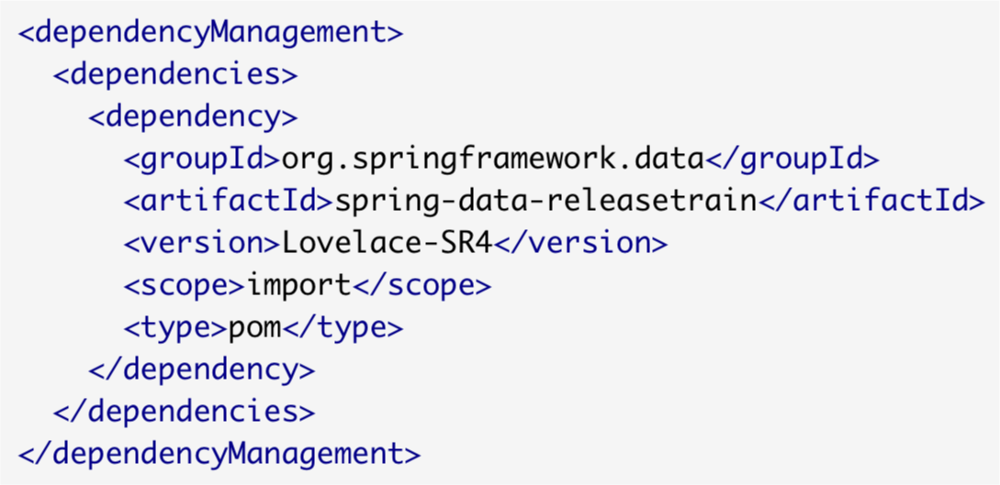
    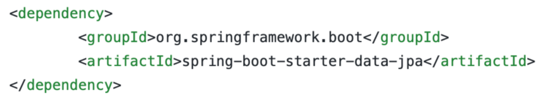

# 0x01 定义JPA实体对象

[常用JPA注解参考](<https://www.cnblogs.com/hoojjack/p/6568920.html>)

- 常⽤ JPA 注解 

  - 实体 
    - @Entity(标注实体)、@MappedSuperclass(实体共同的父类使用此注解标注) 
    - @Table(name) 
  - 主键 
    - @Id (标识ID)
    - @GeneratedValue(strategy, generator) (标识生成主键，指明生成策略及生成器)
    - @SequenceGenerator(name, sequenceName) (标识序列化生成器)

    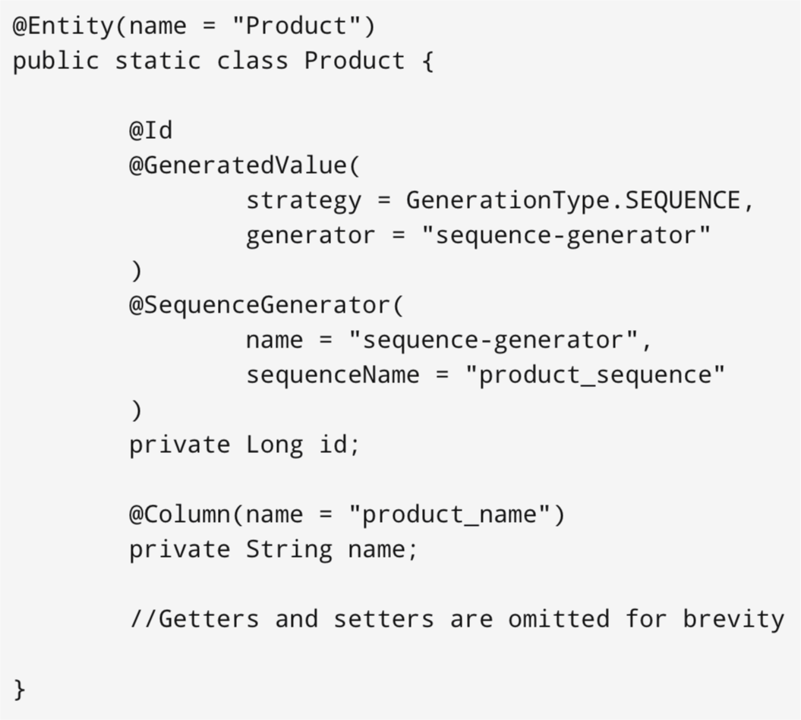

  - 映射 

    - @Column(name, nullable, length, insertable, updatable) 
    - @JoinTable(name)、@JoinColumn(name) (关联join时使用)

  - 关系 
    - @OneToOne、@OneToMany、@ManyToOne、@ManyToMany 
    - @OrderBy 


- Project Lombok 

  - Project Lombok 能够⾃动嵌⼊ IDE 和构建⼯具，提升开发效率 
  - 常⽤功能 
    - @Getter / @Setter 

    - @ToString 

    - @NoArgsConstructor / @RequiredArgsConstructor / @AllArgsConstructor 

    - @Data 

    - @Builder 

      ```java
      //这个注解对应使用方式--调用builder()然后一路赋值，最后用build()构造对象
      //e.g.
      Coffee espresso = Coffee.builder().name("espresso")
                        .price(Money.of(CurrencyUnit.of("CNY"), 20.0)).build();
      ```

    - @Slf4j / @CommonsLog / @Log4j2 

- 注意点1：**钱**

  一般不是用float定义钱变量，而是用专有的类

  - 如何在Hibernate中使用o`rg.jadira.usertype.moneyandcurrency.joda.PersistentMoneyAmountAndCurrency`类型映射`Joda Money`？[链接](<http://www.voidcn.com/article/p-zbahlshi-bxy.html>)

  - 首先引入包

    ```xml
    		<dependency>
                <groupId>org.joda</groupId>
                <artifactId>joda-money</artifactId>
                <version>1.0.1</version>
            </dependency>
    		<!--这个包用于使用joda-money的 -->
            <dependency>
                <groupId>org.jadira.usertype</groupId>
                <artifactId>usertype.core</artifactId>
                <version>6.0.1.GA</version>
            </dependency>
    ```

  - 然后在定义的类中设定钱变量

    ```java
    @Type(type = "org.jadira.usertype.moneyandcurrency.joda.PersistentMoneyAmount",
              parameters = {@org.hibernate.annotations.Parameter(name = "currencyCode", value = "CNY")})
      private Money price;
    ```

  - 创建该类对象

    ```java
    Coffee latte = Coffee.builder().name("latte")
                      .price(Money.of(CurrencyUnit.of("CNY"), 30.0))
                      .build();
    ```

- 注意点2：**`@EnableJpaRepositories`**

  配置再Application里，扫描`Repositories`,搜到[一篇用法](<https://blog.csdn.net/andy_zhang2007/article/details/84099595>)

  自己的疑问：Entity和Repositories有啥区别？

  ```
  - Entity是Hibernate映射都要有的注释
  - Repositories说明该类是Dao类，和数据库操作有关
  ```

- 注意点3：主键的`@GeneratedValue`

  这里有[说明介绍](<https://blog.csdn.net/sswqzx/article/details/84337921>)，也看一看上面例子的用法

- 注意点4：子类**继承**父类的注意事项

  ```java
  （1）使用@Data时，@EqualsAndHashCode(callSuper=true)
  		手动标记子类hash时要调用父类的hash方法对属于父类的部分内容生成哈希值
  （2）@ToString(callSuper = true)
      	打印类时包括父类的属性
  （3）父类加上@MappedSuperclass
  ```

  

# 0x02 线上咖啡馆实战项⽬-SpringBucks 起始

- 项⽬⽬标 
  - 通过⼀个完整的例⼦演示 Spring 全家桶各主要成员的⽤法 

  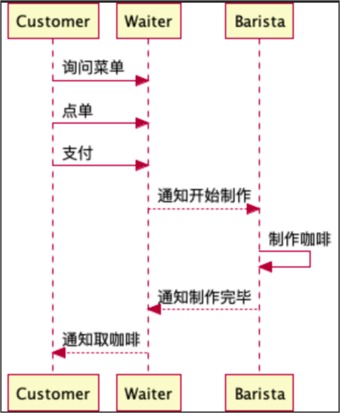
  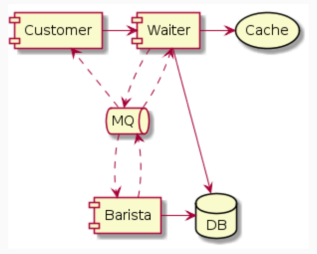

- 项⽬中的对象实体 
  - 实体 

    - 咖啡、订单、顾客、服务员、咖啡师 
  - 实体关系

    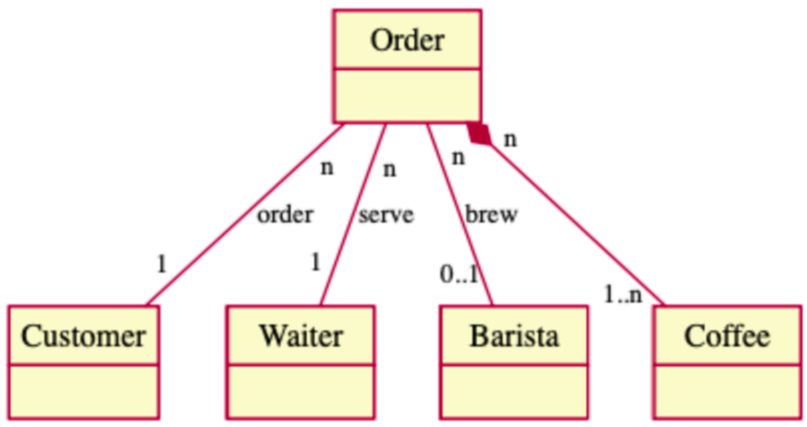

- 状态图

    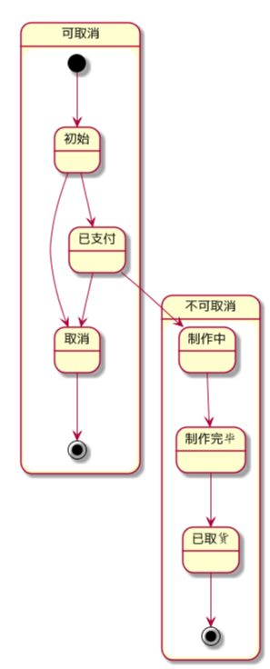

- 实体定义

  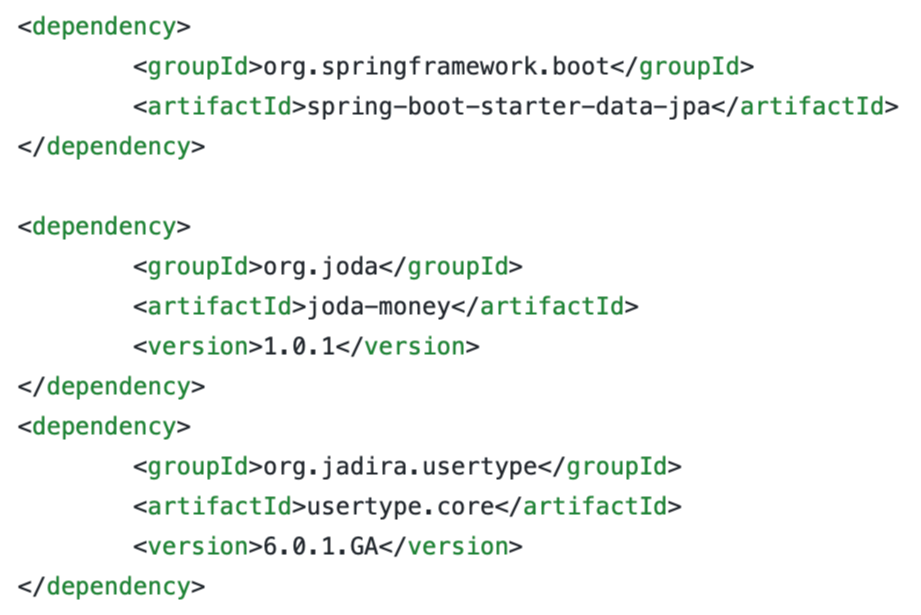
  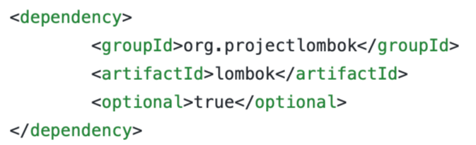

- ### 简单的JPA-Demo

  - `application.properties`

    ```properties
    spring.jpa.hibernate.ddl-auto=create-drop
    spring.jpa.properties.hibernate.show_sql=true
    spring.jpa.properties.hibernate.format_sql=true
    ```

  - Coffee.java

    ```java
    @Entity
    @Table(name = "T_MENU")
    @Builder
    @Data
    @NoArgsConstructor      //自动生成无参数构造函数
    @AllArgsConstructor     //自动生成全参数构造函数
    public class Coffee implements Serializable {
        @Id                 //主键字段
        @GeneratedValue(strategy = GenerationType.IDENTITY)     // 提供主键的生成策略,自增
        private Long id;
        private String name;
        @Column             //声明该属性与数据库字段的映射关系
        @Type(type = "org.jadira.usertype.moneyandcurrency.joda.PersistentMoneyAmount",//PersistentMoneyMinorAmount
                    parameters = {@org.hibernate.annotations.Parameter(name = "currencyCode", value = "CNY")})
        private Money price;
        @Column(updatable = false)
        @CreationTimestamp
        private Date createTime;
        @UpdateTimestamp
        private Date updateTime;
    }
    
    ```

  - CoffeeOrder.java

    ```java
    @Entity
    @Table(name = "T_ORDER")
    @Data
    @NoArgsConstructor
    @AllArgsConstructor
    @Builder
    public class CoffeeOrder implements Serializable {
        @Id
        @GeneratedValue
        private Long id;
        private String customer;
        @ManyToMany
        @JoinTable(name = "T_ORDER_COFFEE")
        private List<Coffee> items;
        @Column(nullable = false)
        private Integer state;
        @Column
        @CreationTimestamp
        private Date createTime;
        @UpdateTimestamp
        private Date updateTime;
    }
    ```

  - ApplicationDemo.java

    程序入口采用默认的即可

  - 运行结果

    - 开始前删表后建表，结束时删表

      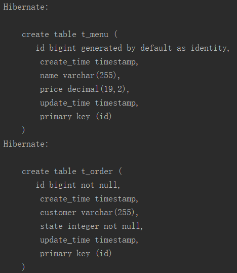

      - 建立外链`@JoinTable(name = "T_ORDER_COFFEE")`

        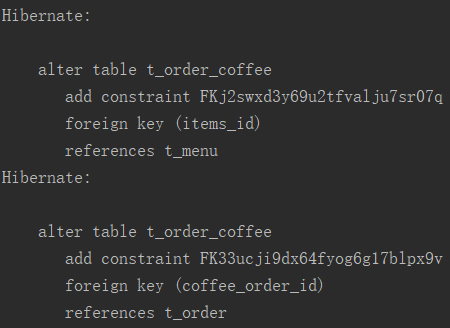

- ### JPA-Complex-Demo

    - 创建BaseEntity父类来写公共属性，子类继承

    - `CoffeeOrder类`的`state属性`，使用枚举表示，在Hibernate中自动转成int

    - BaseEntity.java

      ```java
      @MappedSuperclass
      @Data
      @NoArgsConstructor
      @AllArgsConstructor
      public class BaseEntity implements Serializable {
          @Id
          @GeneratedValue
          private Long id;
          @Column(updatable = false)
          @CreationTimestamp
          private Date createTime;
          @UpdateTimestamp
          private  Date updateTime;
      }
      ```

    - Coffee.java

      ```java
      @Entity
      @Table(name = "T_MENU")
      @Builder
      @Data
      @ToString(callSuper = true)
      @EqualsAndHashCode(callSuper=true)
      @NoArgsConstructor
      @AllArgsConstructor
      public class Coffee extends BaseEntity implements Serializable {
          private String name;
          @Type(type = "org.jadira.usertype.moneyandcurrency.joda.PersistentMoneyAmount",
                  parameters = {@org.hibernate.annotations.Parameter(name = "currencyCode", value = "CNY")})
          private Money price;
      }
      ```

    - CoffeeOrder.java

      ```java
      @Entity
      @Table(name = "T_ORDER")
      @Data
      @EqualsAndHashCode(callSuper=true)
      @ToString(callSuper = true)
      @NoArgsConstructor
      @AllArgsConstructor
      @Builder
      public class CoffeeOrder extends BaseEntity implements Serializable {
          private String customer;
          @ManyToMany
          @JoinTable(name = "T_ORDER_COFFEE")
          @OrderBy("id")
          private List<Coffee> items;
          @Enumerated
          @Column(nullable = false)
          private OrderState state;
      }
      ```

    - OrderState.java

      ```java
      public enum OrderState {
          INIT, PAID, BREWING, BREWED, TAKEN, CANCELLED
      }
      ```

      
# 0x03  通过 Spring Data JPA 操作数据库

- #### Repository

  - `@EnableJpaRepositories` 注解启用jpa Repository
  - Repository<T, ID> 接⼝的实现有哪些
    - CrudRepository<T, ID>

    - PagingAndSortingRepository<T, ID>

    - JpaRepository<T, ID>

      ```java
      //e.g.
      @NoRepositoryBean
      public interface BaseRepository<T, Long> extends PagingAndSortingRepository<T, Long> {
          List<T> findTop3ByOrderByUpdateTimeDescIdAsc();
      }
      //==========================================
      public interface CoffeeRepository extends BaseRepository<Coffee, Long> {
      }
      //==========================================
      public interface CoffeeOrderRepository extends BaseRepository<CoffeeOrder, Long>{
          List<CoffeeOrder> findByCustomerOrderById(String customer);
          List<CoffeeOrder> findByItems_Name(String name);
      }
      ```

- 如何定义查询

  - 根据⽅法名定义查询
    - find…By… / read…By… / query…By… / get…By…
    - count…By…
    - …OrderBy…[Asc / Desc]
    - And / Or / IgnoreCase
    - Top / First / Distinct

- 分⻚查询的实现

  - PagingAndSortingRepository<T, ID>
  - Pageable / Sort
  - Slice<T> / Page<T>

- **BaseRepository**

  定义了一些公共的方法，抽象出来就不用再每个子的接口里重复定义了，然后尤其要注意我加了`@NoRepositoryBean`，免得它也被声明成**Repository**。它只是在**Repository**和您要为每个实体定义的实际存储库接口之间起中间作用。要将扩展存储库的接口排除在实例化为存储库实例之外，请使用**`@NoRepositoryBea`**.

  - 关于`@NoRepositoryBean`的资料见[此](<https://blog.csdn.net/qq_39818325/article/details/86653947>)

- ### 保存实体

  ```java
  private void initOrders() {
  		Coffee latte = Coffee.builder().name("latte")
  				.price(Money.of(CurrencyUnit.of("CNY"), 30.0))
  				.build();
  		coffeeRepository.save(latte);
  		log.info("Coffee: {}", latte);
  
  		Coffee espresso = Coffee.builder().name("espresso")
  				.price(Money.of(CurrencyUnit.of("CNY"), 20.0))
  				.build();
  		coffeeRepository.save(espresso);
  		log.info("Coffee: {}", espresso);
  
  		CoffeeOrder order = CoffeeOrder.builder()
  				.customer("Li Lei")
  				.items(Collections.singletonList(espresso))
  				.state(OrderState.INIT)
  				.build();
  		orderRepository.save(order);
  		log.info("Order: {}", order);
  
  		order = CoffeeOrder.builder()
  				.customer("Li Lei")
  				.items(Arrays.asList(espresso, latte))
  				.state(OrderState.INIT)
  				.build();
  		orderRepository.save(order);
  		log.info("Order: {}", order);
  	}
  
  ```

- 运行结果

  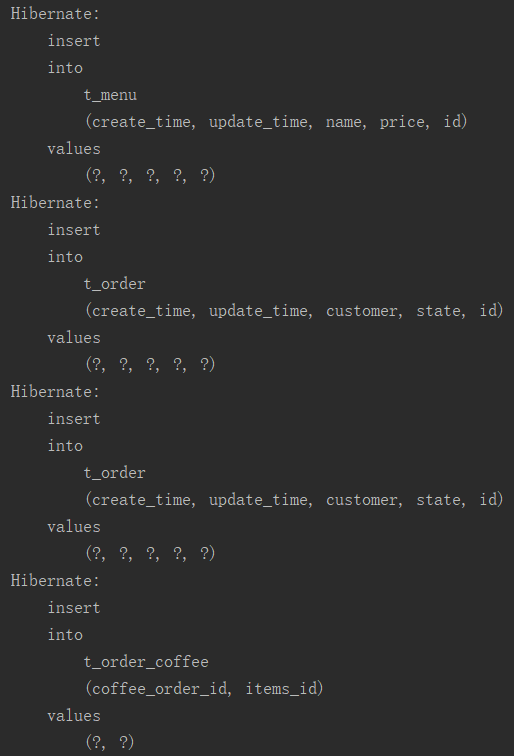

- #### 查找实体

  - [关于Stream()和Collectors.joining（）字符串连接器](https://blog.csdn.net/qq_40673345/article/details/91420180)

  - BaseRespostory.java

    ```java
    @NoRepositoryBean
    public interface BaseRepository<T, Long> extends PagingAndSortingRepository<T, Long> {
        List<T> findTop3ByOrderByUpdateTimeDescIdAsc();
    }
    
    ```

  - CoffeeRespostory.java

    ```java
    public interface CoffeeRepository extends BaseRepository<Coffee, Long> {
    }
    ```

  - CoffeeOrderRespostory.java

    ```java
    public interface CoffeeOrderRepository extends BaseRepository<CoffeeOrder, Long> {
        List<CoffeeOrder> findByCustomerOrderById(String customer);
        List<CoffeeOrder> findByItems_Name(String name);
    }
    ```

  - Application中

    ```java
    private void findOrders() {
    		coffeeRepository
    				.findAll(Sort.by(Sort.Direction.DESC, "id"))
    				.forEach(c -> log.info("Loading {}", c));
    
    		List<CoffeeOrder> list = orderRepository.findTop3ByOrderByUpdateTimeDescIdAsc();
    		log.info("findTop3ByOrderByUpdateTimeDescIdAsc: {}", getJoinedOrderId(list));
    
    		list = orderRepository.findByCustomerOrderById("Li Lei");
    		log.info("findByCustomerOrderById: {}", getJoinedOrderId(list));
    
    		// 不开启事务会因为没Session而报LazyInitializationException
    		list.forEach(o -> {
    			log.info("Order {}", o.getId());
    			o.getItems().forEach(i -> log.info("  Item {}", i));
    		});
    
    		list = orderRepository.findByItems_Name("latte");
    		log.info("findByItems_Name: {}", getJoinedOrderId(list));
    	}
    
    	private String getJoinedOrderId(List<CoffeeOrder> list) {
    		return list.stream().map(o -> o.getId().toString())
    				.collect(Collectors.joining(","));
    	}
    ```

    - 运行结果1：			`coffeeRepository.findAll()`

        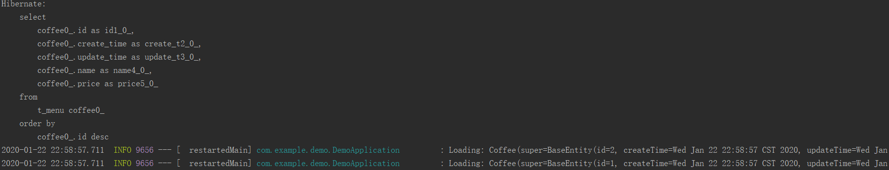

    - 运行结果2:`orderRepository.findTop3ByOrderByUpdateTimeDescIdAsc()`

        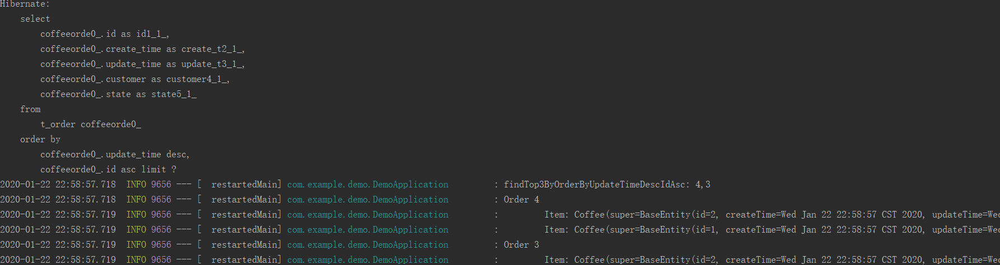

    - 运行结果3：       `orderRepository.findByItems_Name("latte")`

        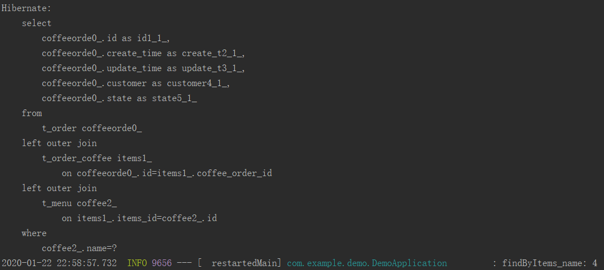

  

# 0x04 Repository 是怎么从接⼝变成 Bean 的

- Repository Bean 是如何创建的

  - JpaRepositoriesRegistrar
    - 激活了 @EnableJpaRepositories
    - 返回了 JpaRepositoryConfigExtension
  - RepositoryBeanDefinitionRegistrarSupport.registerBeanDefinitions 
    - 注册 Repository Bean（类型是 JpaRepositoryFactoryBean ）
  - RepositoryConfigurationExtensionSupport.getRepositoryConfigurations 
    - 取得 Repository 配置
  - JpaRepositoryFactory.getTargetRepository 
    - 创建了 Repository

- 接⼝中的⽅法是如何被解释的

  - RepositoryFactorySupport.getRepository 添加了Advice 增强
    - DefaultMethodInvokingMethodInterceptor
    - QueryExecutorMethodInterceptor
  - AbstractJpaQuery.execute 执⾏具体的查询
    - 语法解析在 Part 中


# 0x08 SpringBucks项目小结

把关于JPA的知识点串了一遍，主要关注了以下几点

- application.properties中

  ```properties
  spring.jpa.hibernate.ddl-auto=none
  #参数create-drop ：启动时删数据库中的表，然后创建，退出时删除数据表 如果表不存在报错
  ```

- **model（POJO）**中

  创建`BaseEntity`写共有属性，子类Coffee和COffeeOrder

- **Repository**中

  都是继承`extends JpaRepository<子类, Long>`

- **Service**中

  **CoffeeService**调用`coffeeRepository.findOne`接口，传入`Example`和`ExampleMatcher`，实现**findOneCoffee**方法

  **COffeeOrderService**调用 `orderRepository.save(order)`方法实现**createOrder**和**updateState**方法，注意updateState中有**不可逆的**业务逻辑，如下：

  ```java
  if (state.compareTo(order.getState()) <= 0) {
              log.warn("Wrong State order: {}, {}", state, order.getState());
              return false;
          }
  ```

- **Application**中

  测试方法

  ```java
  coffeeRepository.findAll()
  coffeeService.findOneCoffee() {}
  orderService.createOrder()
  orderService.updateState() #测试了不可逆业务
  ```

- 运行结果

  - coffeeRepository.findAll

      ```verilog
      2020-01-26 17:51:36.479  INFO 13552 --- [  restartedMain] com.example.demo.DemoApplication         : ALL Coffee: [Coffee(super=BaseEntity(id=1, createTime=2020-01-26 17:51:33.961, updateTime=2020-01-26 17:51:33.961), name=espresso, price=CNY 20.00), Coffee(super=BaseEntity(id=2, createTime=2020-01-26 17:51:33.969, updateTime=2020-01-26 17:51:33.969), name=latte, price=CNY 25.00), Coffee(super=BaseEntity(id=3, createTime=2020-01-26 17:51:33.969, updateTime=2020-01-26 17:51:33.969), name=capuccino, price=CNY 25.00), Coffee(super=BaseEntity(id=4, createTime=2020-01-26 17:51:33.969, updateTime=2020-01-26 17:51:33.969), name=mocha, price=CNY 30.00), Coffee(super=BaseEntity(id=5, createTime=2020-01-26 17:51:33.969, updateTime=2020-01-26 17:51:33.969), name=macchiato, price=CNY 30.00)]
      ```

  - coffeeService.findOneCoffee

    ```verilog
    Coffee Found: Optional[Coffee(super=BaseEntity(id=2, createTime=2020-01-26 17:51:33.969, updateTime=2020-01-26 17:51:33.969), name=latte, price=CNY 25.00)]
    ```

  - orderService.createOrder

      ```verilog
      New Order: CoffeeOrder(super=BaseEntity(id=1, createTime=Sun Jan 26 17:51:36 CST 2020, updateTime=Sun Jan 26 17:51:36 CST 2020), customer=Li lei, items=[Coffee(super=BaseEntity(id=2, createTime=2020-01-26 17:51:33.969, updateTime=2020-01-26 17:51:33.969), name=latte, price=CNY 25.00)], state=INIT)
      ```

  - orderService.updateState

      ```verilog
      2020-01-26 17:51:36.743  INFO 13552 --- [  restartedMain] c.e.demo.service.CoffeeOrderService      : Updated Order: CoffeeOrder(super=BaseEntity(id=1, createTime=Sun Jan 26 17:51:36 CST 2020, updateTime=Sun Jan 26 17:51:36 CST 2020), customer=Li lei, items=[Coffee(super=BaseEntity(id=2, createTime=2020-01-26 17:51:33.969, updateTime=2020-01-26 17:51:33.969), name=latte, price=CNY 25.00)], state=PAID)
      
      
      2020-01-26 17:51:36.747  INFO 13552 --- [  restartedMain] com.example.demo.DemoApplication         : Update INIT to PAID:true
      2020-01-26 17:51:36.748  WARN 13552 --- [  restartedMain] c.e.demo.service.CoffeeOrderService      : Wrong State order: INIT, PAID
      2020-01-26 17:51:36.748  INFO 13552 --- [  restartedMain] com.example.demo.DemoApplication         : Update INIT to PAID:false
      ```

      