# 0x00 Controller

### 认识Spring MVC

- DispatcherServlet

  - Controller

  - xxxResolver

    - ViewResolver
    - HandlerExceptionResolver
    - MultipartResolver

  - HandlerMapping

    请求映射处理(到`Controller`上)的逻辑

### Spring MVC 中的常用注解

- @Controller

  - @RestController

    是`ResponseBody+Controller`

- @RequestMapping

  - @GetMapping /  @PostMapping
  - @PutMapping /  @DeleteMapping

- @RequestBody  /  @ResponseBody  /  @ResponseStatus

### 知识点

这里**项目SpringBucks**和上次差不多，放Controller：

```java
//CoffeeController
@Controller
@RequestMapping("/coffee")
public class CoffeeController {
    @Autowired
    private CoffeeService coffeeService;

    @GetMapping("/")
    @ResponseBody
    public List<Coffee> getAll() {
        return coffeeService.getAllCoffee();
    }
}

//CoffeeOrderController
@RestController
@RequestMapping("/order")
@Slf4j
public class CoffeeOrderController {
    @Autowired
    private CoffeeOrderService orderService;
    @Autowired
    private CoffeeService coffeeService;

    @PostMapping("/")
    @ResponseStatus(HttpStatus.CREATED)
    public CoffeeOrder create(@RequestBody NewOrderRequest newOrder) {
        log.info("Receive new Order {}", newOrder);
        Coffee[] coffeeList = coffeeService.getCoffeeByName(newOrder.getItems())
                .toArray(new Coffee[] {});
        return orderService.createOrder(newOrder.getCustomer(), coffeeList);
    }
}
```

- #### 嵌套RequestMapping

  ​    比如访问`CoffeeController`的，得先访问第一层`@RequestMapping("/order")`然后加上第二层`@PostMapping("/")`，完整链接为`http://localhost:8080/coffee/`

- #### @RequestBody 绑定，请求参数映射

​	  注意`CoffeeOrderController的create函数`，这里`@RequestBody`使用自定义的类绑定来接受映射参数。

`NewOrderRequest`类

```java
@Getter
@Setter
@ToString
public class NewOrderRequest {
    private String customer;
    private List<String> items;
}
```

发送的**POST请求**的`RequestBody`

```json
{
  "customer": "Shen Kevin",
  "items": [
    "latte", "mocha"
  ]
```

- #### Cache

首先放一个详细的学习链接，基本能懂的，[链接](<https://www.cnblogs.com/yueshutong/p/9381540.html>)

配置方法 

（1）Application上 

```java
@EnableCacheing 
```

（2）Service里

```java
//类上@CacheConfig（指定缓存名称，就是value值）
//方法上@Cacheable，如果不指定Key，则缺省按照方法的所有参数进行组合
//e.g.
//CoffeeService.java
@Service
@Slf4j
@CacheConfig(cacheNames = "CoffeeCache")
public class CoffeeService {
    @Autowired
    private CoffeeRepository coffeeRepository;

    @Cacheable
    public List<Coffee> getAllCoffee() {
        return coffeeRepository.findAll(Sort.by("id"));
    }

    public List<Coffee> getCoffeeByName(List<String> names) {
        return coffeeRepository.findByNameInOrderById(names);
    }
}
```

- #### Springboot 使用JPA对数据进行排序  

  学习链接：<https://blog.csdn.net/john_1023/article/details/90522618>

  e.g.

```java
@Cacheable
public List<Coffee> getAllCoffee() {
    return coffeeRepository.findAll(Sort.by("id"));
}
```

- #### 测试工具

  对于写好的Controller进行测试，可以使用

  - **IDEA的  Restful Toolkits**

    

  - POSTMAN

    


# 0x02 理解Spring应用上下文

- #### 回顾Aop相关知识

  在之前`SpringMVC+Mybatis企业应用实战`学习中，于`Chapter2`时学了关于Aop的一些东西，做一个回顾：

  - Aop定义、原理
  - Spring中使用AOP的两种方式（其实使用了的是**ClassPathXmlApplciation**）
    - 注解方式 (编写增强类`@Aspect`并注明切面，配置增强类`<aop:aspectj-autoproxy />`)
    - xml方式 (编写增强类-手动写方法参数为joinPoint，配置增强类配置切面)

- 

- 

- 

- 

  左边是基于xml的配置，右边是基于注解的配置

  - **基于注解**的配置，可以看到分别配置了RootConfig和ServletConfig的配置。
  - 在**xml配置**方式里，`RootConfig`的配置是通过`ContextLoaderListener`来加载的，而`ServletConfig`的配置是通过`DispatcherServlet`实现的。一般会把应用的`Service，Dao`相关的配置配置在`contextConfigLocation`，让`ContextLoaderListener`来加载

- #### ApplciationContext实现类的使用

  - Spring中使用`AnnotationConfigApplication`类实现

    - 构造Config类

      ```java
      @Configuration
      @EnableAspectJAutoProxy
      public class FooConfig {
          @Bean
          public TestBean testBeanX() {
              return new TestBean("foo");
          }
          @Bean
          public TestBean testBeanY() {
              return new TestBean("foo");
          }
          @Bean
          public FooAspect fooAspect() {
              return new FooAspect();
          }
      }
      ```

    - 传入Application

      ```java
      ApplicationContext fooContext = new AnnotationConfigApplicationContext(FooConfig.class);
      
      TestBean bean = fooContext.getBean("testBeanX", TestBean.class);
      ```

  - **不同于**之前使用 `ClassPathXmlApplciation` 时候的 

    - `<aop:config>` 、`<aop:aspect>`  (xml手动申明)

    - `<aop:aspectj-autoproxy>`(注解使用Aop)

    - 传入Application

      ```java
      //1. 创建 Spring 的 IOC 容器
      ClassPathXmlApplicationContext ctx = new ClassPathXmlApplicationContext("beans.xml");
      
      //2. 从 IOC 容器中获取 bean 的实例
      HelloWorld  helloWorld = (HelloWorld) ctx.getBean("helloWorld");
      ```

      

- #### 实验：Context-hierarchy-demo

  - **起因**：生产环境中，父上下文为`Root WebApplicationContext`，子上下文为`Servlet WebApplicationContext`，一般想通过设置AOP切面来实现记录操作到log。但可能错误的将AOP作用于子上下文`Servlet WebApplicationContext`而导致记录操作失效。

  - **实验目的**：为研究父子上下文的AOP配置对AOP增强的支持的影响

  - TestBean.java

    ```java
    @AllArgsConstructor
    @Slf4j
    public class TestBean {
        private String context;
    
        public void hello() {
            log.info("hello: {}" + context);
        }
    }
    ```

  - FooAspect.java

    ```java
    @Aspect
    @Slf4j
    public class FooAspect {
        @AfterReturning("bean(testBean*)")
        public void printAfter() {
            log.info("after hello()");
        }
    }
    ```

  - FooConfig.java

    ```java
    @Configuration
    @EnableAspectJAutoProxy
    public class FooConfig {
        @Bean
        public TestBean testBeanX() {
            return new TestBean("foo");
        }
        @Bean
        public TestBean testBeanY() {
            return new TestBean("foo");
        }
        @Bean
        public FooAspect fooAspect() {
            return new FooAspect();
        }
    }
    ```

  - applicationContext.xml

    ```xml
    <beans xmlns="http://www.springframework.org/schema/beans"
           xmlns:xsi="http://www.w3.org/2001/XMLSchema-instance"
           xmlns:aop="http://www.springframework.org/schema/aop"
           xsi:schemaLocation="http://www.springframework.org/schema/beans
            http://www.springframework.org/schema/beans/spring-beans.xsd
            http://www.springframework.org/schema/aop
            http://www.springframework.org/schema/aop/spring-aop.xsd">
    
        <aop:aspectj-autoproxy />
    
        <bean id="testBeanX" class="com.example.demo.context.TestBean">
            <constructor-arg name="context" value="Bar" />
        </bean>
    
        <!--<bean id="fooAspect" class="com.example.demo.foo.FooAspect" />-->
    </beans>
    ```

  - ContextHierarchyDemoApplication.java

    ```java
    @SpringBootApplication
    @Slf4j
    public class ContextHierarchyDemoApplication implements ApplicationRunner {
    
    	public static void main(String[] args) {
    		SpringApplication.run(ContextHierarchyDemoApplication.class, args);
    	}
    
    	@Override
    	public void run(ApplicationArguments args) throws Exception {
    		ApplicationContext fooContext = new AnnotationConfigApplicationContext(FooConfig.class);
    		ClassPathXmlApplicationContext barContext = new ClassPathXmlApplicationContext(
    				new String[] {"applicationContext.xml"}, fooContext);
    		TestBean bean = fooContext.getBean("testBeanX", TestBean.class);
    		bean.hello();
    
    		log.info("=============");
    
    		bean = barContext.getBean("testBeanX", TestBean.class);
    		bean.hello();
    
    		bean = barContext.getBean("testBeanY", TestBean.class);
    		bean.hello();
    	}
    }
    ```

  - 实验操作  (采用注解式)

    ```java
    FooConfig.java：父上下文（parent application context）。
    applicationContext.xml：子上下文（child application context）。
    
    FooConfig.java 中定义两个 testBean，分别为 testBeanX(foo) 和 testBeanY(foo)。
    applicationContext.xml 定义了一个 testBeanX(bar)。
    
    委托机制：在自己的 context 中找不到 bean，会委托父 context 查找该 bean。
    
    ----------
    
    代码解释：
    fooContext.getBean("testBeanX")，在父上下文查找 testBeanX，命中直接返回 testBeanX(foo)。
    barContext.getBean("testBeanX")，在子上下文查找 testBeanX，命中直接返回 testBeanX(bar)。
    barContext.getBean("testBeanY")，在子上下文查找 testBeanY，未命中；委托父上下文查找，命中，返回 testBeanY(foo)。
    
    ----------
    
    场景一：
    父上下文开启 @EnableAspectJAutoProxy 的支持
    子上下文未开启 <aop: aspectj-autoproxy />
    切面 fooAspect 在 FooConfig.java 定义（父上下文增强）
    
    输出结果：
    testBeanX(foo) 和 testBeanY(foo) 均被增强。
    testBeanX(bar) 未被增强。
    
    结论：
    在父上下文开启了增强，父的 bean 均被增强，而子的 bean 未被增强。
    
    ----------
     
    场景二：
    父上下文开启 @EnableAspectJAutoProxy 的支持
    子上下文开启 <aop: aspectj-autoproxy />
    切面 fooAspect 在 applicationContext.xml 定义（子上下文增加）
    
    输出结果：
    testBeanX(foo) 和 testBeanY(foo) 未被增强。
    testBeanX(bar) 被增强。
    
    结论：
    在子上下文开启增强，父的 bean 未被增强，子的 bean 被增强。
    
    ----------
    
    根据场景一和场景二的结果，有结论：“各个 context 相互独立，每个 context 的 aop 增强只对本 context 的 bean 生效”。如果想将切面配置成通用的，对父和子上下文的 bean 均支持增强，则：
    1. 切面 fooAspect 定义在父上下文。
    2. 父上下文和子上下文，均要开启 aop 的增加，即 @EnableAspectJAutoProxy 或<aop: aspectj-autoproxy /> 的支持。
    ```

  - 正确的实验结果

    


# 0x03 理解请求处理机制

- Spring MVC请求处理流程

  

  这里`Front controller`就是`Dispatch Servlet`，收到请求后会把请求代理给`Controller`处理类，处理完后会返回一个`Model`给`DispatchServlet`，`DispatchServlet`再将Model交给视图解析器，处理完后再返回`DispatchServlet`，最后返回请求。

- 一个请求的大致处理流程

  

- DispatchServlet类源码

  在`spring-webmvc.jar`包的`org/springframework/web/servlet`下

  - 继承关系：`DispatchServlet` **—extends—>**  `FrameworkServlet` **—extends—>**`HttpServletBean`

  - 核心方法：

    - （函数`doService`内）`void doService(HttpServletRequest request, HttpServletResponse response)`,内部做了request内部的赋值

    - （函数`doService -> doDispatch`内）然后在`doService`内进入到`doDispatch(request, response)`这里传入了`request`和`response`，首先`checkMultipart(request)`检查是否是`Multipart`请求，是的话会调用`this.multipartResolver.resolveMultipart(request)`进行解析，完成后请求变为MultiPart解析后的请求（不是原请求了）。

    - （函数`doService -> doDispatch`内）然后`getHandler`去取`Handler`。调用`mappedHandler.applyPreHandle(processedRequest, response)`对`Handler`做一个预处理，然后在`ha.handle(processedRequest, response, mappedHandler.getHandler())`做对实际`Handler`的调用

      （注：关于前置的Handler预处理和后置的处理，下次课程会讲）

    - （函数`doService -> doDispatch`内）这里Handler对具体方法的各种处理没详细展开，以后学进去了再补了。在网上看到一个对HandlerAdapter的源码深究的好博客：[链接](<https://www.cnblogs.com/wangbenqing/p/7384518.html>)

      > 介绍了为什么用HandlerAdapter将Controller封装起来，再在HandlerAdapter的handle方法里执行Controller的handleRequest方法，
      >
      > 而不是直接DispatcherServlet直接用Controller的handleRequest方法执行具体请求

      

    - （函数`doService -> doDispatch`内）在Handler方法执行后，在`this.applyDefaultViewName(processedRequest, mv);`开始解析返回的`ModelAndView`,找到`View`的名字。如果一切顺利的话，后面就是做视图渲染的动作。

  - 通过**DeBug**的方式来**找到Handler**

    首先得清楚一点。Controller是针对指定的类，Handler是针对指定的类的指定的方法。现在目标为找到某一个Handler。

    - 用**Debug**标记DoDispath方法内的 `this.getHandler(processedRequest)`，并使用**RestfulTools测试**发起请求

      

    - 看看是如何寻找Handler的：

      

      ​        在Dispatch Servlet中有一些Handler Mapping，其中的序号为0的`RequestMappingHandlerMapping`，就是去处理`RequestMapping`注解所绑定的一些`RequestMapping`的；还有一些其他的HandlerMapping。

      ​       这些handlerMapping会每一个都去找一下这个handler，点击

      这个进去

      

      会对每一个HandlerMappings做一个遍历

      

      这里点击按钮，this会遍历HandlerMapping，如果有哪一个找到了**HandlerExecutionChain**,就直接返回；若走遍了没有，返回null

      - 这里演示了一个没有找到的

        

        

      - 找到正确的

        

        这里编译完后`.class`里，直接getHandler返回的就是正确的Handler了，而且也直接返回最终的Handler结果（正确Handler、路径、对应方法后）——**HandlerExecutionChain**：

      

        然后进入`RequestMappingHandler`看一下。在这里会做一个寻找，会找到自己的目标。如图所示是按照路径`“coffee/1”`进行寻找，并做匹配

      

        匹配成功时返回的matchs。图中所示Get请求，请求路径为`“coffee/id”`，产生的是一个`application/json`

      

        找到对应的方法

      

      最后返回的是一个**HandlerExecutionChain**。

- 小插曲1：IDEA无法下载源码

  解决办法：[【已解决】在IDEA中使用Maven下载依赖源码](<https://blog.csdn.net/Chameleons1/article/details/89148000>)

- 小插曲2：[如何在IDEA上查看源码](<https://blog.csdn.net/qq_28666081/article/details/83898684>)


# 0X04 如何定义处理方法

本节课讲如何定义Controller，和Controller的那些方法

- 定义映射关系

  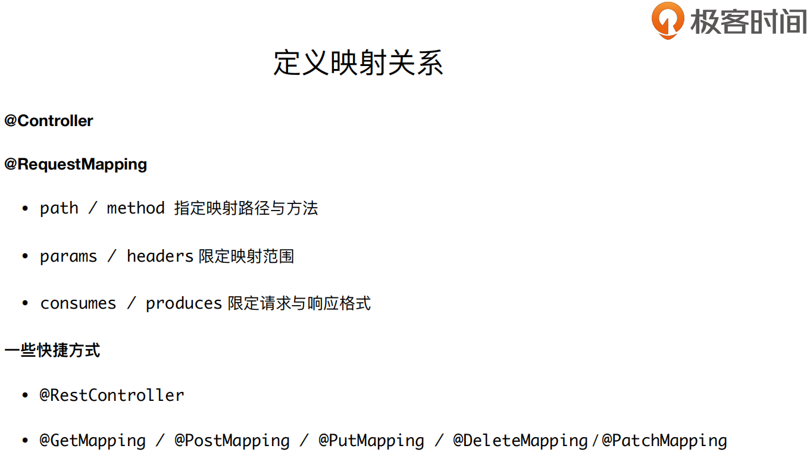

  其中consumes限定请求的**content-type**。

- 定义处理方法

  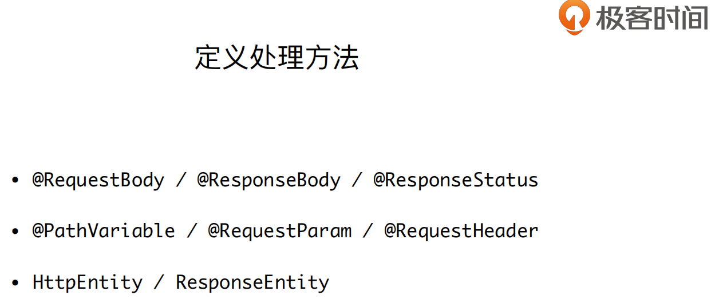

  - 详细参数：

    <https://docs.spring.io/spring/docs/5.1.5.RELEASE/spring-framework-reference/web.html#mvc-ann-arguments>

  - 详细返回

    <https://docs.spring.io/spring/docs/5.1.5.RELEASE/spring-framework-reference/web.html#mvc-ann-return-types>

- 方法示例1

  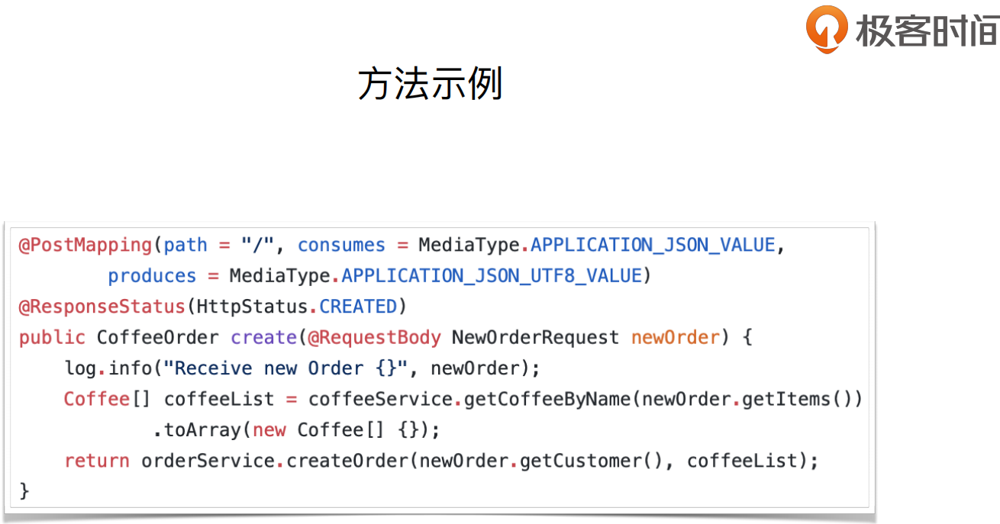

  `@PostMapping`这里`consumes`限定了请求必须带**Content-Type头**，且值必须为Json；`produces`限定了返回值也为Json且为UTF8编码，所以对应的我的**Accept头**必须要能接收。

  `@RequestBody`这里之前也记录过了，传入的**json**要和`NewOrder`里的属性**一一对应**。

  

- 方法示例2

  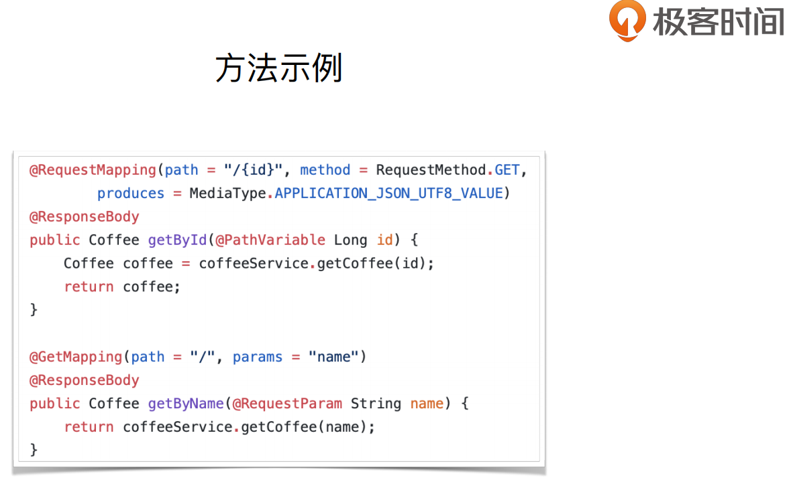

  `@PathVariable`从uri中取得id作为参数，这里并没有指定参数名字，该注解也可以添加指定。

  `@GetMapping`里params指定请求要有name参数，通过`@RequestParam`取得

  注：（1）如果params = “!name”，则不存在name参数时才匹配到

  ​	（2）如果params = "name!=David"，则name参数不为David时才匹配到


- 项目示例：**Springbucks**

  其余的基本和之前一样··放一点不一样的

  - BaseEntity

    ```java
    @MappedSuperclass
    @Data
    @NoArgsConstructor
    @AllArgsConstructor
    @JsonIgnoreProperties(value = {"hibernateLazyInitializer"})
    public class BaseEntity implements Serializable {
        @Id
        @GeneratedValue(strategy = GenerationType.IDENTITY)
        private Long id;
        @Column(updatable = false)
        @CreationTimestamp
        private Date createTime;
        @UpdateTimestamp
        private Date updateTime;
    }
    ```

    为什么要加`@JsonIgnoreProperties(value = {"hibernateLazyInitializer"})` 或者
    `spring.jackson.serialization.fail-on-empty-beans=false`?

    (注：不加的话会报错`Type definition error: [simple type, class org.hibernate.proxy.pojo.bytebuddy.ByteBuddyInterceptor];`)

    ```
    作者回复: 这里正好返回的是Hibernate的代理对象，如果没有加jackson-datatype-hibernate5这个依赖，序列化时就会报错，因此要做些特殊的属性处理。后面的例子中我们会在waiter-service的pom.xml里加上jackson-datatype-hibernate5的，后续的课程示例里你可以留意一下。
    ```

  - CoffeeController

    ```java
    package com.example.demo.controller;
    
    import com.example.demo.model.Coffee;
    import com.example.demo.service.CoffeeService;
    import org.springframework.beans.factory.annotation.Autowired;
    import org.springframework.http.MediaType;
    import org.springframework.stereotype.Controller;
    import org.springframework.web.bind.annotation.*;
    
    import java.util.List;
    
    @Controller
    @RequestMapping("/coffee")
    public class CoffeeController {
        @Autowired
        private CoffeeService coffeeService;
    
        @GetMapping(path = "/", params = "!name")
        @ResponseBody
        public List<Coffee> getALL() {
            return coffeeService.getAllCoffee();
        }
    
        @GetMapping(path = "/", params = "name")
        @ResponseBody
        public Coffee getByName(@RequestParam String name) {
            return coffeeService.getCoffee(name);
        }
    
        @RequestMapping(path = "/{id}", method = RequestMethod.GET,
                produces = MediaType.APPLICATION_JSON_UTF8_VALUE)
        @ResponseBody
        public Coffee getById(@PathVariable Long id) {
            Coffee coffee = coffeeService.getCoffee(id);
            return coffee;
        }
    }
    ```

  - CoffeeOrderController

    ```java
    package com.example.demo.controller.request;
    
    import com.example.demo.model.Coffee;
    import com.example.demo.model.CoffeeOrder;
    import com.example.demo.service.CoffeeOrderService;
    import com.example.demo.service.CoffeeService;
    import lombok.extern.slf4j.Slf4j;
    import org.springframework.beans.factory.annotation.Autowired;
    import org.springframework.http.HttpStatus;
    import org.springframework.http.MediaType;
    import org.springframework.web.bind.annotation.*;
    
    @RestController
    @RequestMapping("/order")
    @Slf4j
    public class CoffeeOrderController {
        @Autowired
        private CoffeeOrderService orderService;
        @Autowired
        private CoffeeService coffeeService;
    
        @GetMapping
        public CoffeeOrder getOrder(@PathVariable("id") Long id) {
            return orderService.get(id);
        }
        @PostMapping(path = "/", consumes = MediaType.APPLICATION_JSON_VALUE,
            produces = MediaType.APPLICATION_JSON_UTF8_VALUE)
        @ResponseStatus(HttpStatus.CREATED)
        public CoffeeOrder create(@RequestBody NewOrderRequest newOrder) {
            log.info("Receive new Order: {}", newOrder);
            Coffee[] coffeeList = coffeeService.getCoffeeByName(newOrder.getItems())
                    .toArray(new Coffee[]{});
            return orderService.createOrder(newOrder.getCustomer(), coffeeList);
        }
    
    }
    ```

  - 【查询咖啡】不带参数访问`“/coffee”`,全部结果返回

    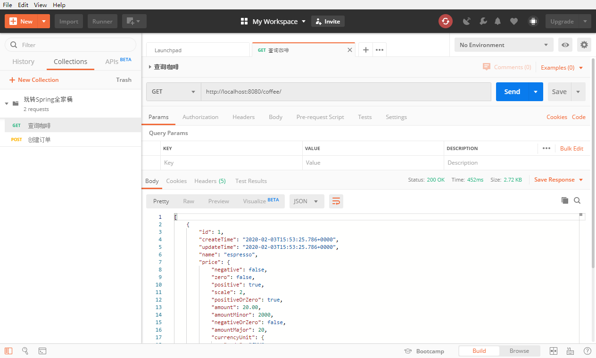

  - 【查询咖啡】带参数访问`"/coffee"`，只返回对应结果

    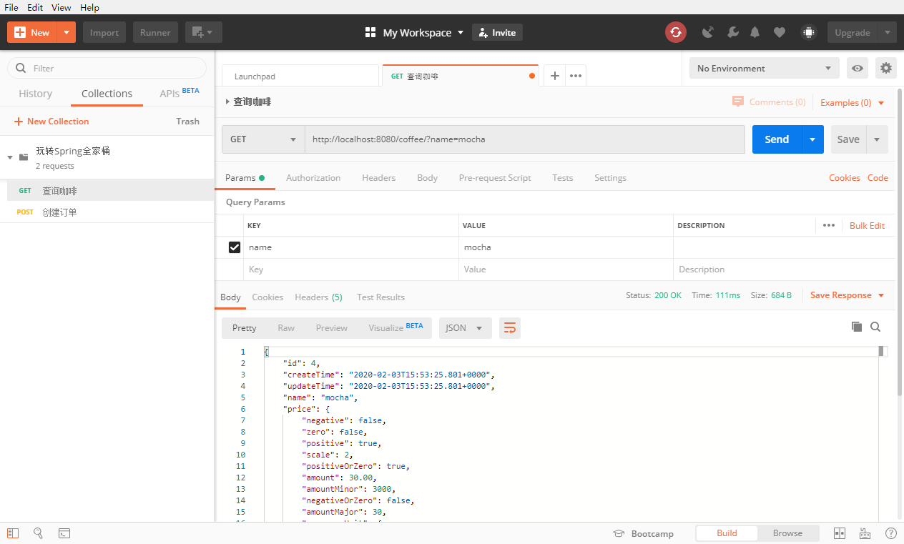

  - 【创建订单】访问“/order”，注意看请求头

    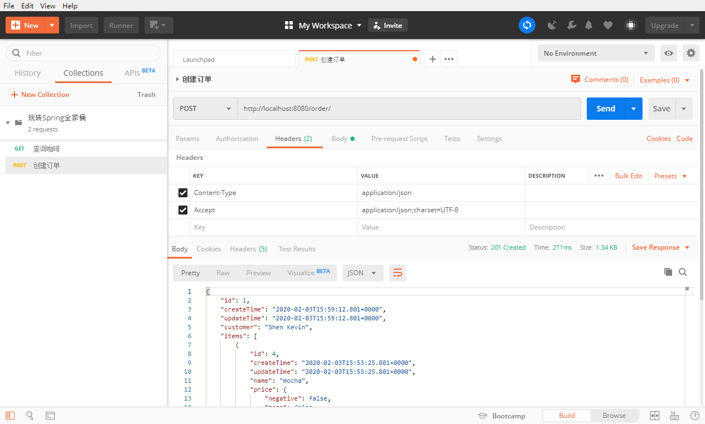

    RequestBody：

    ```json
    {
    	"customer": "Shen Kevin",
    	"items": [
    		"mocha", "macchiato"	
    	]
    }
    ```

    如果去掉`Content-Type`和`Accept`，会报错返回415的状态码

  

  # 0X05 定义类型转换

  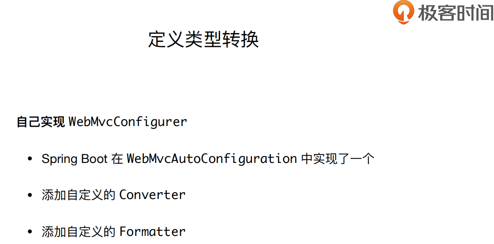

  

  - 康康**WebMvcAutoConfiguration源码**

    源码在`spring-boot-autoconfigure`包下`org.springframework.boot.autoconfigure.web.servlet`下

    - WebMvcAutoConfigurationAdapter

      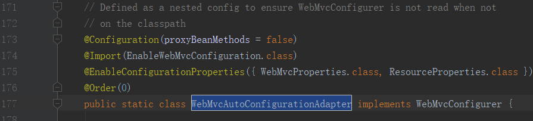

      继承了`WebMvcConfigurer`类，这个父类采用default的方式。

    - **重点函数：addFormatter**,这个函数可以**处理**`Converter、Formatter、GenericConverter`这三种类型的**Bean**并**添加到registry**里

      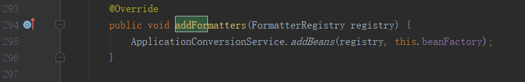

      进入到ApplicationConversionService里

      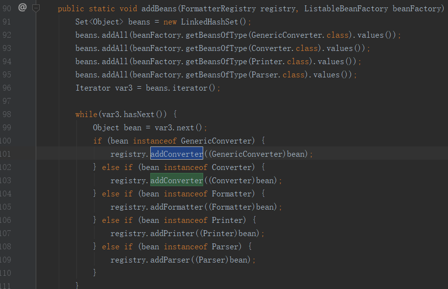

      比方说对于`Converter`，这里的`registry.addConverter`方法是`GenericConversionService.addConverter`方法，进入查看：

      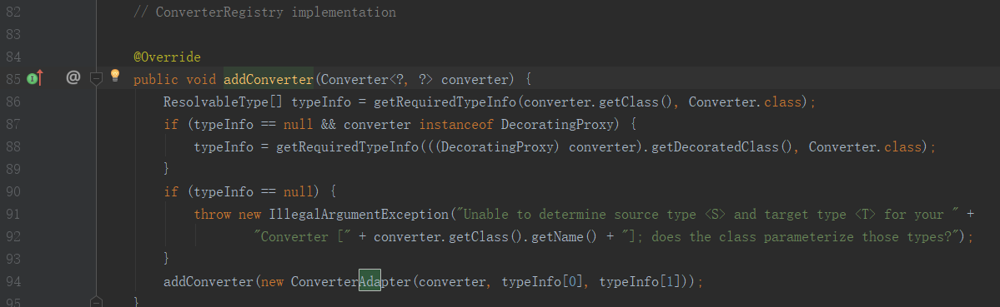

      这里会做一个转换，**将Converter转为ConverterAdapter添加进来**；

      对于Formatter，`registry.addFormatter`

      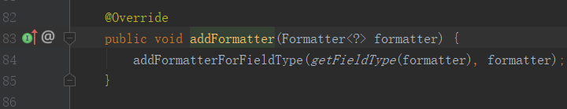

      再进去：

      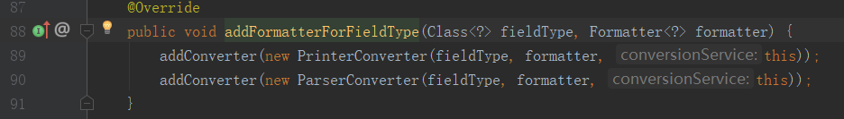

      会把**Formatter**的`Printer`和`Parser`分别添加进去

      这里有对`Printer`和`Parser`的介绍，[点此链接](<https://cloud.tencent.com/developer/article/1497655>)

      ```
      # Printer: 
      格式化显示接口，将T类型的对象根据Locale信息以某种格式进行打印显示（即返回字符串形式）
      # Parser:
      解析接口，根据Locale信息解析字符串到T类型的对象
      ```


# 0x06 定义校验

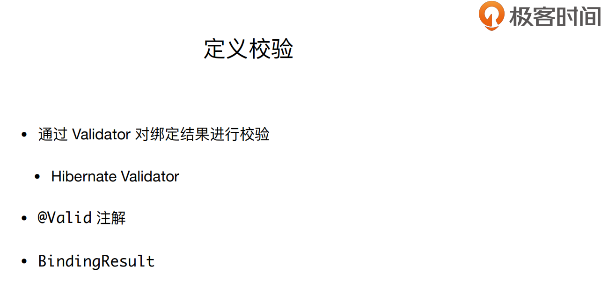

使用`Hibernate Validator`，在绑定的对象上添加**@Vaild**注解，SpringMVC便会做一个Validation，绑定的检查的结果通过`BindingResult`传递进来


[一个表单数据校验的例子](<https://www.cnblogs.com/tenWood/p/8644899.html>)


# 0x07 Multipart上传

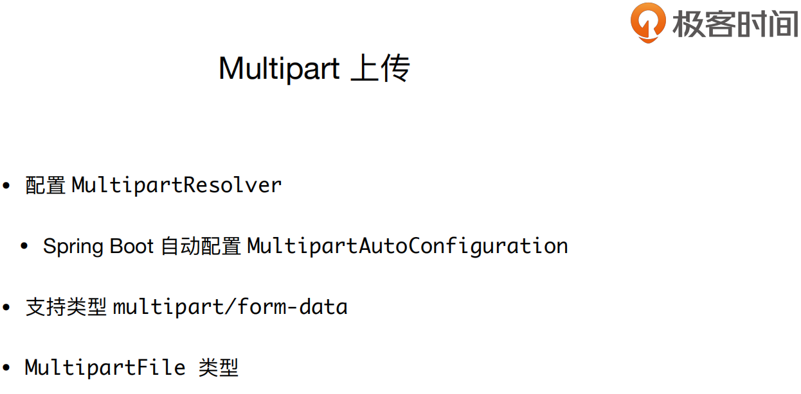

让我们来康康MultipartAutoConfiguration源码

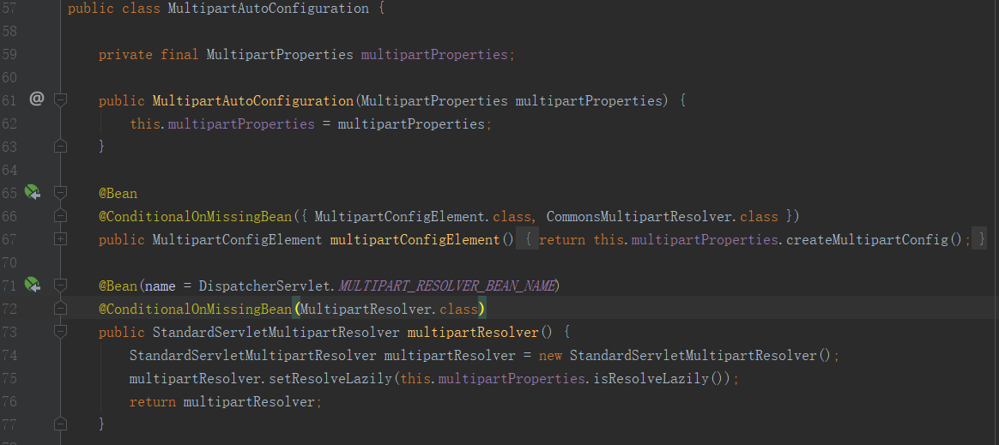

看到`MultipartProperties multipartProperties`这个属性，在

```java
@Bean
	@ConditionalOnMissingBean({ MultipartConfigElement.class, CommonsMultipartResolver.class })
	public MultipartConfigElement multipartConfigElement() {
		return this.multipartProperties.createMultipartConfig();
	}
```

这个函数中，配置了个`MultipartResolver`,用的是标准的Resolver：`StandardServletMultipartResolver()`


`MultipartProperties multipartProperties`这个属性是`MultipartProperties`类，其内有位置、文件大小、请求大小等配置属性。

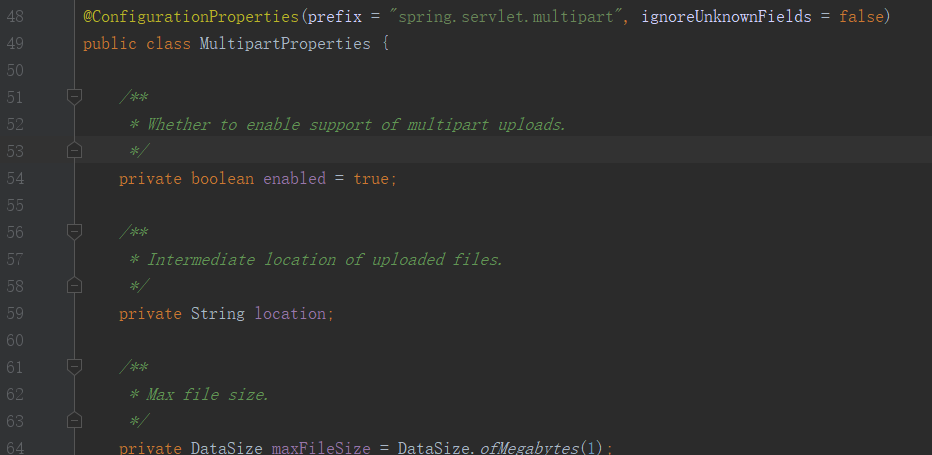


## 小项目：**more-complex-controller-demo**

​        这个项目是针对类型转换、校验和文件上传的。

​	与之前相比，**改动在于Controller，和MoneyFormatter**。还记得在学数据操作时候的Money**Handler**吗，那是**jdbc**转换用的，别搞混了。

#### MoneyFormatter

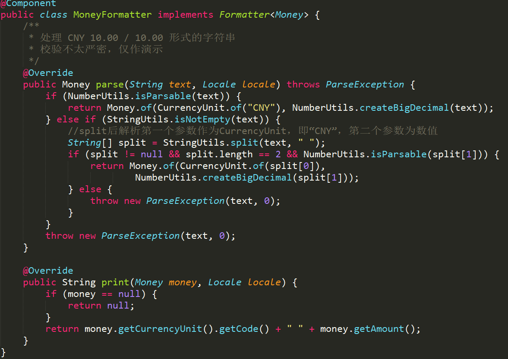

- **这里把MoneyFormatter注册成为@Component即可，在上面看源码时知道了`WebMvcAutoConfiguration`如何加入`Converter`（过程），至于是怎么加入（@Component如何生效），见下面SpringMVC常用视图章节里对`WebMvcAutoConfiguration`类初始化的解析~**

- 在parse方法里

  - Money.of(CurrencyUnit.of("CNY"), NumberUtils.createBigDecimal(text))

    BigDecimal类用来对超过16位有效位的数进行精确的运算，[参考链接](<https://www.cnblogs.com/zhangyinhua/p/11545305.html>)

  - StringUtils.isNotEmpty(text)

    判断文本不为空


### CoffeeService

- 数据校验

  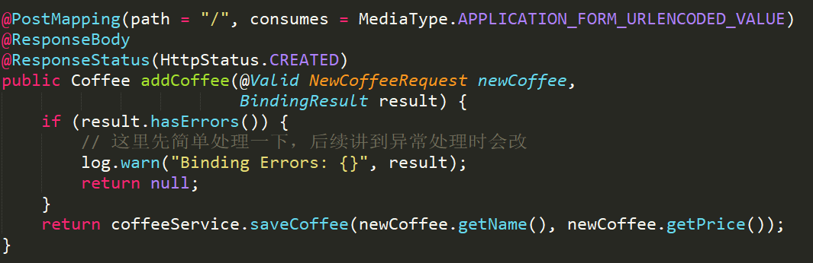

  其中`NewCoffeeRequest`

  ```java
  @Getter
  @Setter
  @ToString
  public class NewCoffeeRequest {
      @NotEmpty
      private String name;
      @NotNull
      private Money price;
  }
  ```

  **重点！**这里并没有加`@RequestBody`来将请求正文变成对象，而是通过`RequestParameter`将请求表单的参数一个个绑定的。这里有一篇[对Request.parameter的解析](<https://blog.csdn.net/zhanglu0223/article/details/96863748>)

  

  这里，如果不写`consumes = MediaType.APPLICATION_FORM_URLENCODED_VALUE`也是可以处理表单的，但后续有一个同样路由到同路径，`consumes = MediaType.MULTIPART_FORM_DATA_VALUE`来处理文件的，所以这指明参数来重载了

  注：

  ```java
  @RequestParam:
  	注解接收的参数是来自于requestHeader中，即请求头，也就是在url中。多用于GET请求
  @RequestBody:
  	注解接收的参数则是来自于requestBody中，即请求体中。多用于POST请求
  ```

  - 测试结果 

    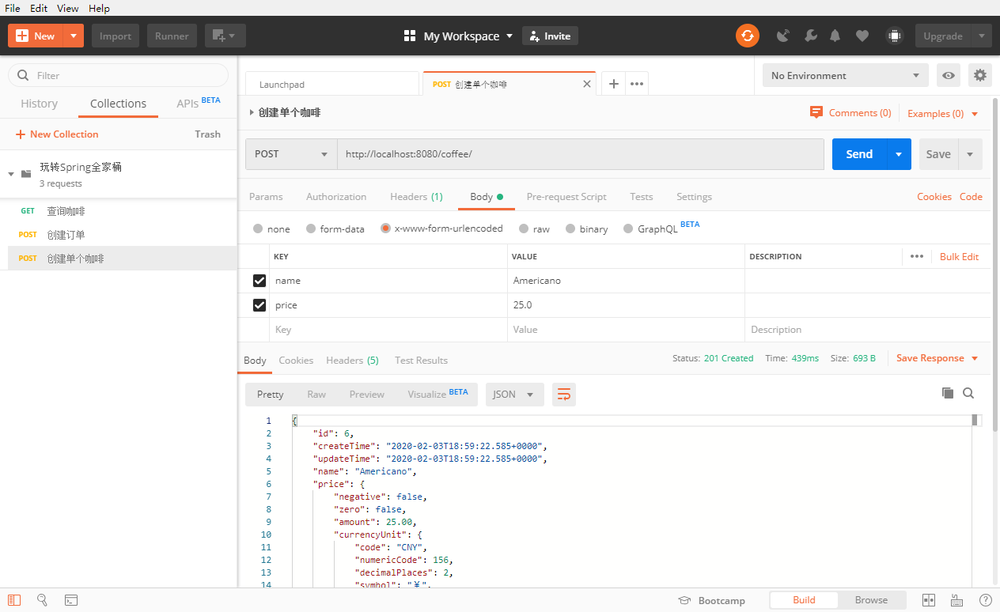咖啡创建成功！如果price为“CNY 25.0”也可成功

  - 如果去掉name属性，会报错“Not Empty”

    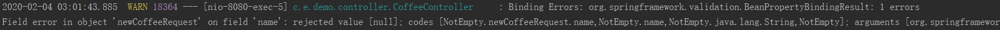

    


#### [postman中 form-data、x-www-form-urlencoded、raw、binary的区别--转](https://www.cnblogs.com/davidwang456/p/7799096.html)

  **multipart/form-data与x-www-form-urlencoded区别**

> multipart/form-data：既可以上传文件等二进制数据，也可上传表单键值对，只是最后会转化为一条信息
>
> x-www-form-urlencoded：只能上传键值对，并且键值对都是间隔分开的。


提问！如果我不希望SpringMVC来介入我的Validation失败后的操作，我希望自己来控制，该怎么办呢？

——使用`BuildingResult`,例子见下

```java
@PostMapping(path = "/", consumes = MediaType.APPLICATION_FORM_URLENCODED_VALUE)
    @ResponseBody
    @ResponseStatus(HttpStatus.CREATED)
    public Coffee addCoffee(@Valid NewCoffeeRequest newCoffee,
                            BindingResult result) {
        if (result.hasErrors()) {
            // 这里先简单处理一下，后续讲到异常处理时会改
            log.warn("Binding Errors: {}", result);
            return null;
        }
        return coffeeService.saveCoffee(newCoffee.getName(), newCoffee.getPrice());
    }
```

此时测试，去掉name属性，报错返回即为空值了

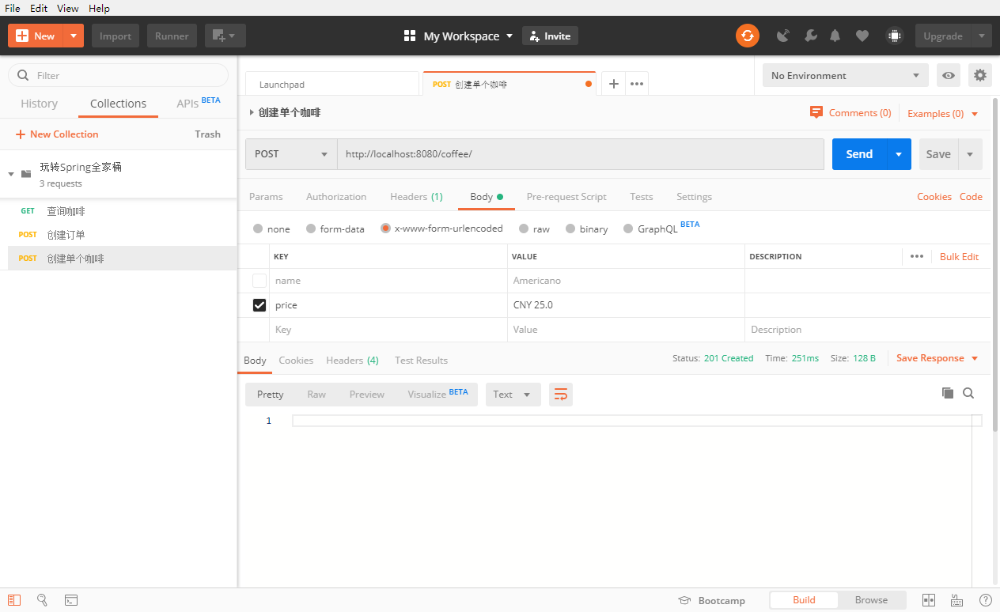


- 文件上传

  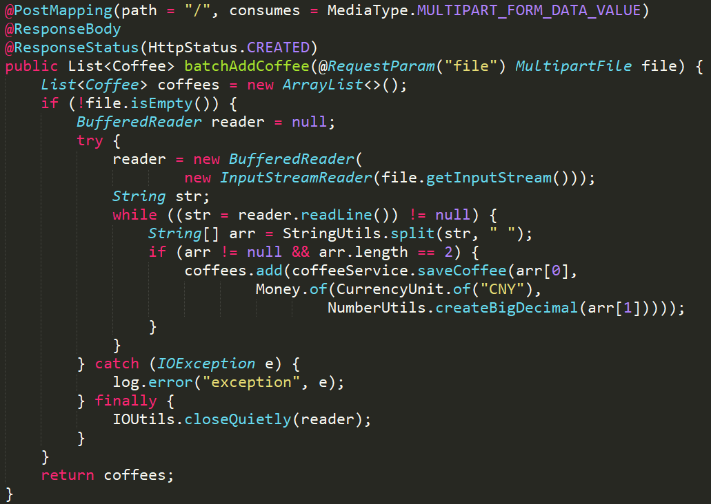

  测试结果

  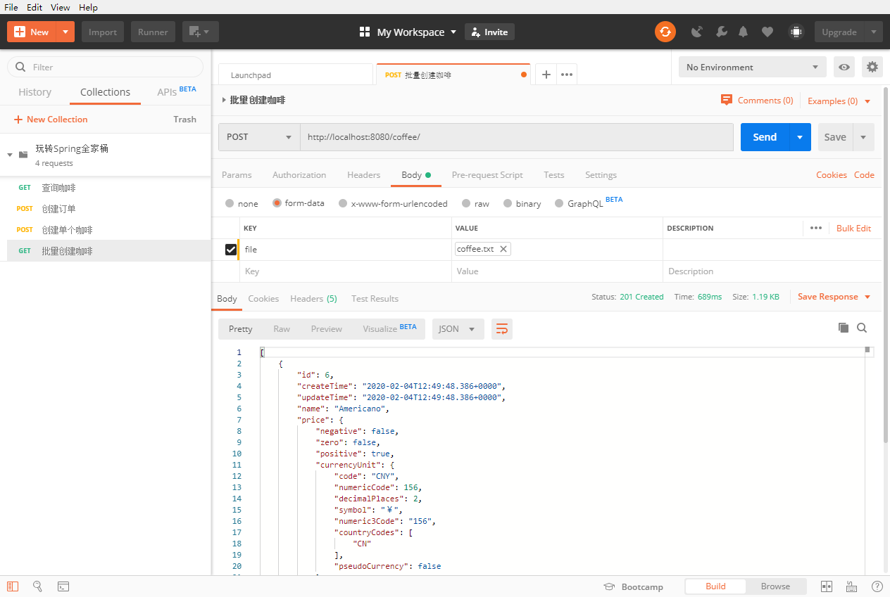


# 0x08 SpringMVC的视图解析机制

- ## 视图解析的实现基础

  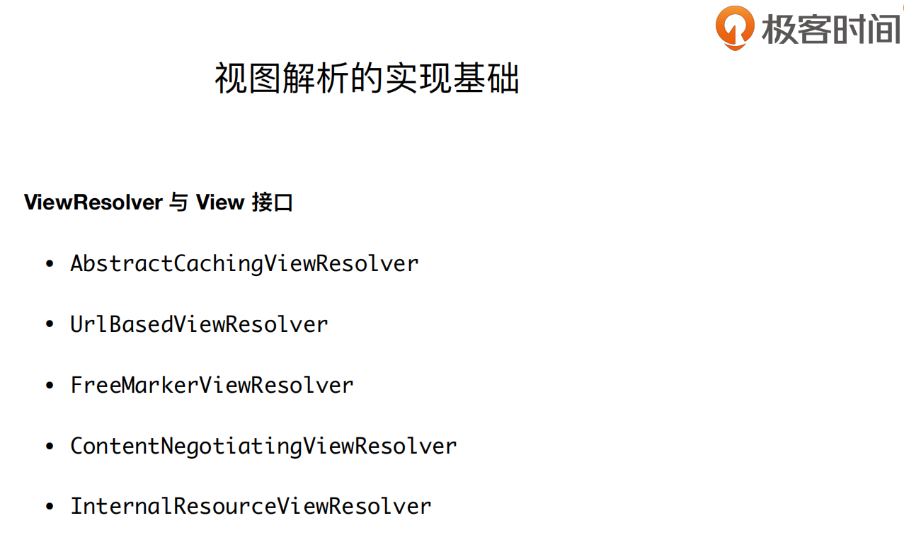

  视图主要通过**ViewResolver类**来解析的

  - `AbstractCachingViewResolver`，关于缓存的抽象基类
  - `ContentNegotiatingViewResolver`,通过我可以接受的返回类型来选择合适的响应，比如要求Xml响应则会返回xml
  - `InternalResolver`是默认的放于解析链最后的解析器，用于处理Jsp和jstl的

  所有的ViewResolver都在解析后会返回个View对象，用于呈现

  

- ## DispatchServlet中的试图解析逻辑

  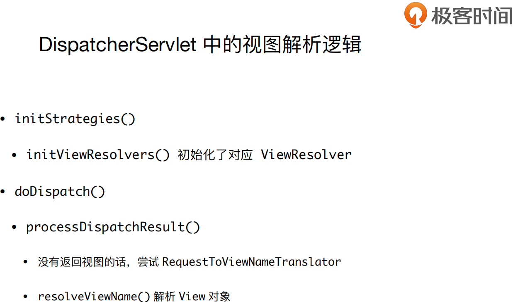

  `initViewResolvers()`对应源码，初始化加载了应用上下文里所有的ViewResolver，如果不想检测所有的ViewResolver，则更改如下的函数：

  ```java
  //boolean detectAllViewResolvers默认值为true
  public void setDetectAllViewResolvers(boolean detectAllViewResolvers) {
     this.detectAllViewResolvers = detectAllViewResolvers;
  }
  ```

  这个是应用上下文里所有的ViewResolver

  ```java
  //DispatchServlet类里
  	/** List of ViewResolvers used by this servlet. */
  	@Nullable
  	private List<ViewResolver> viewResolvers;
  ```

  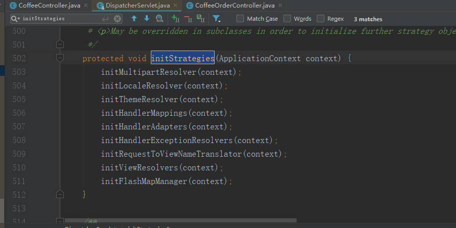

  进入initResolvers函数，这里从BeanFactory里取到了所有ViewResolver的Bean，然后去做了一个排序

  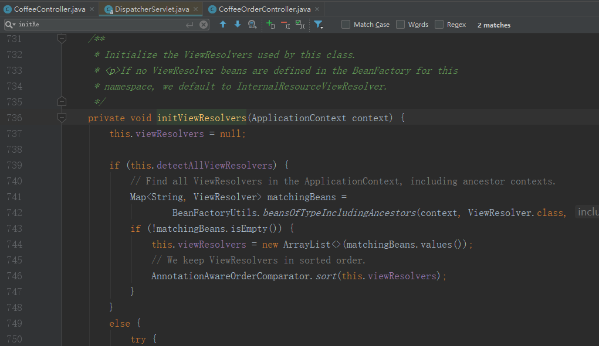

  

  `processDispatchResult()`对应源码

  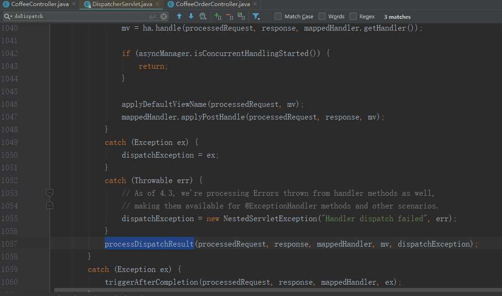

  这里会做从视图名到具体视图的解析，进入

  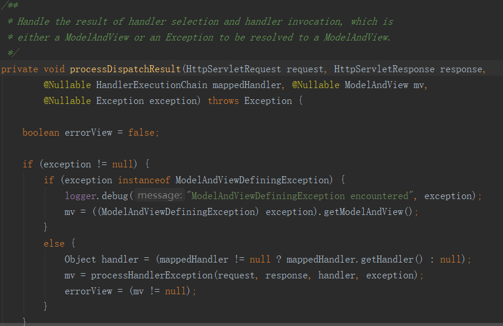

  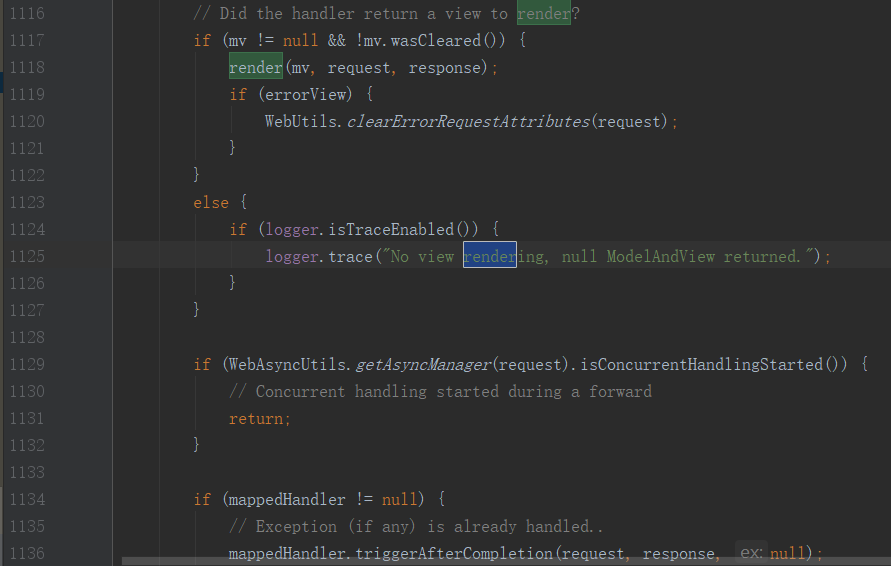

  这里，如果解析成功，返回了`View`对象给`render`函数，进入

  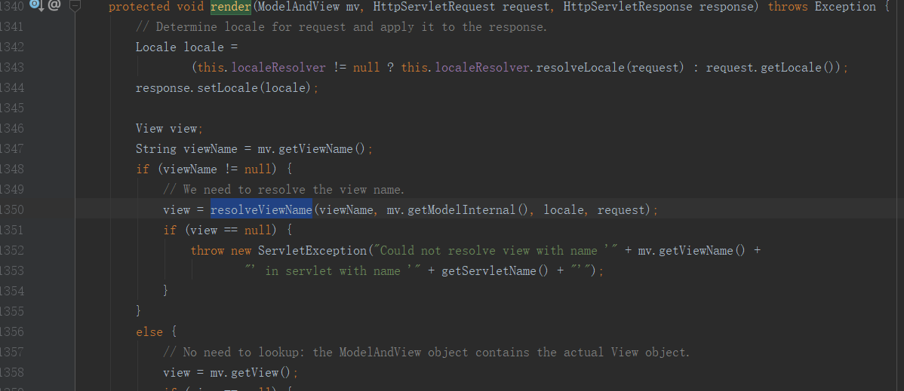

  `render`函数里，`resolveViewName`从视图名到视图的解析。然后调用视图view的方法：`view.render`进行渲染：`view.render(mv.getModelInternal(), request, response);`

  进入`view.render`

  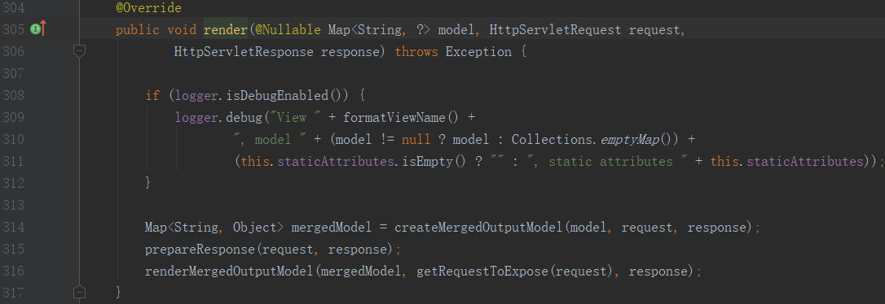

  其中`prepareResponse`函数为Response做了一些准备工作，比如设置`Header`

  然后`renderMergedOutputModel`函数，输出response等合并的输出结果，下面是函数的申明

  ```java
  protected abstract void renderMergedOutputModel(
  Map<String, Object> model, HttpServletRequest request, HttpServletResponse response) throws Exception;
  ```

  

  如果**没有返回视图**的话，尝试`RequestViewNameTranslator`，具体过程见下：

  找到了个它的初始化函数

  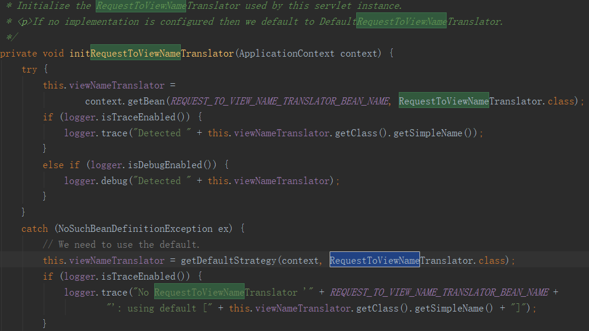

  这里是它的使用，`this.viewNameTranslator`即是一个`RequestViewNameTranslator`类

  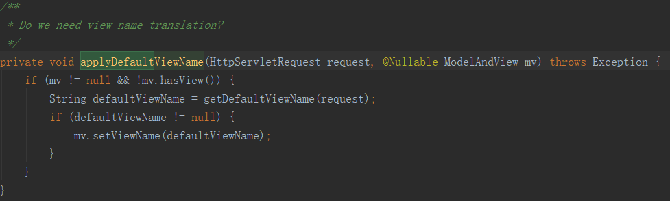

  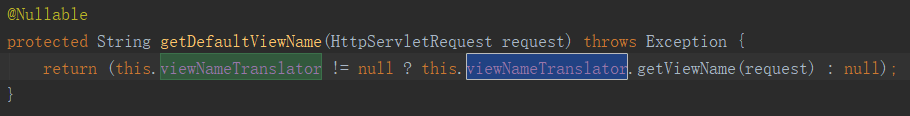

  在`doDispatch`函数，执行在在`processDispatchResult`函数前，先加载默认的viewName对应的View对象；所以`processDispatchResult`函数，若**没有解析出view对象**是`return;`，

  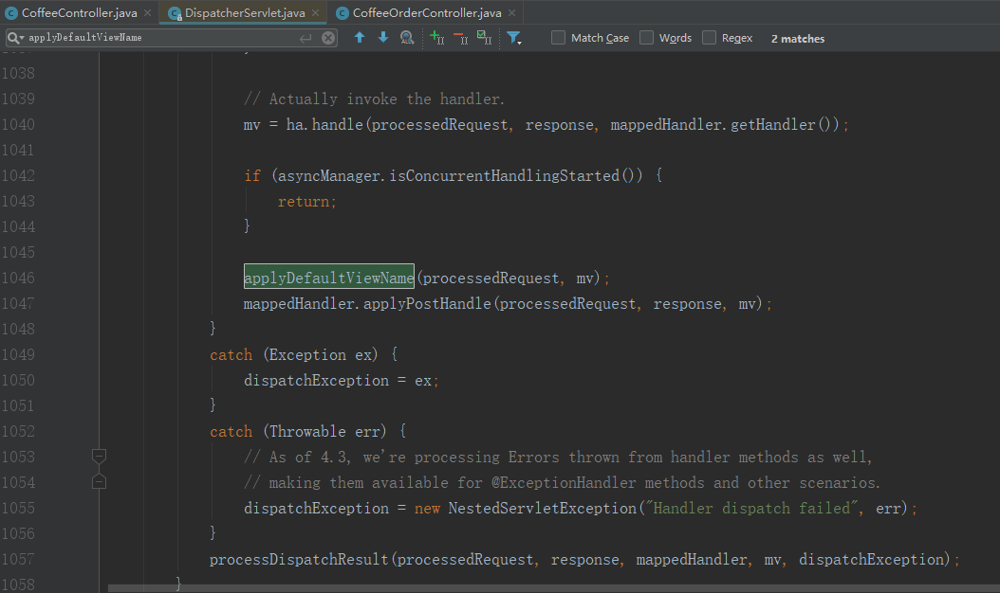

  

  - ### 使用@ResponseBody的情况

    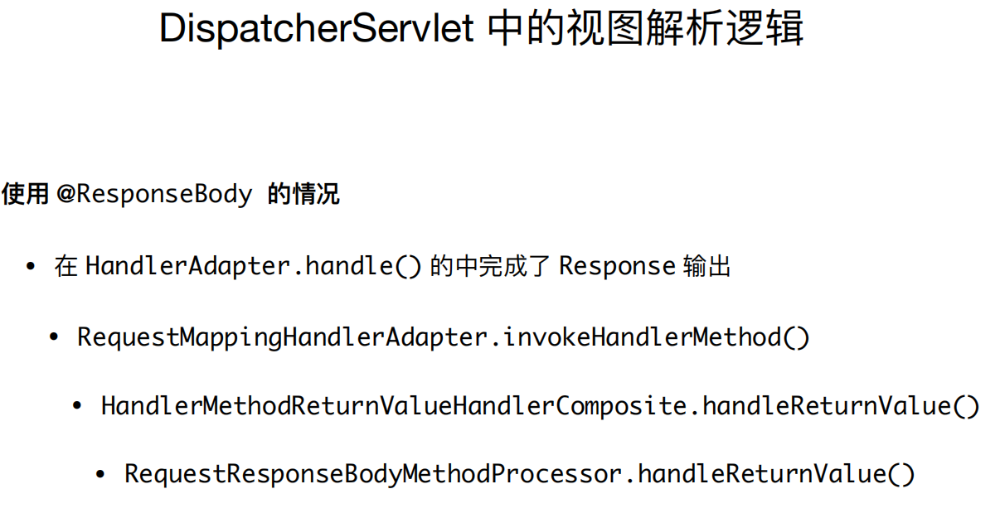

    这里我懒了····不想再贴源码的截图了，简单记录，如下：

    ```java
    //DidpatchServlet.java  						doDispatch()
    HandlerAdapter ha = getHandlerAdapter(mappedHandler.getHandler());
    //AbstractHandlerMtthodAdapter.java 			handler()
    handleInternal(request, response, (HandlerMethod) handler)
    //RequestMappingHandlerAdapter.java				handleInternal()
    mav = invokeHandlerMethod(request, response, handlerMethod);
    //RequestMappingHandlerAdapter.java				invokeHandlerMethod()
       //这是一个returnValueHandler的组合 
      invocableMethod.setHandlerMethodReturnValueHandlers(this.returnValueHandlers);
      //真正方法执行
    invocableMethod.invokeAndHandle(webRequest, mavContainer);
    //ServletInvocableHandlerMethod.java			invokeAndHandle()
    	//取到returnValue，就是比如说一个Coffee类
    	Object returnValue = invokeForRequest(webRequest, mavContainer, providedArgs);
    //真正对returnValue做一个Handler处理，this.returnValueHandlers是一个HandlerMethodReturnValueHandlerComposite类
    this.returnValueHandlers.handleReturnValue(
    					returnValue, getReturnValueType(returnValue), mavContainer, webRequest);
    //RequestResponseBodyMtrhodProcessor.java		handleReturnValue()
    //尝试对结果进行输出
    writeWithMessageConverters(returnValue, returnType, inputMessage, outputMessage);
    //AbstractMessageConverterMethodProcessor.java	writeWithMessageConverters()
    	//取结果的Type
    	valueType = getReturnValueType(body, returnType);
    	//根据MessageConverter一个一个做尝试，看能不能处理这类型，即这MediaType
    	for (HttpMessageConverter<?> converter : this.messageConverters) {
    //使用Convertor对结果进行输出
    genericConverter.write(body, targetType, selectedMediaType, outputMessage);
    ```

    这就是流程啦！这样写着没啥感觉，建议跟着老师把上面四个方法打点Debug跑一遍

    还有之前说的 `RequestMappingHandlerAdapter.java`的	

    `invocableMethod.setHandlerMethodReturnValueHandlers(this.returnValueHandlers);` 

     里的`returnValueHandlers`：

    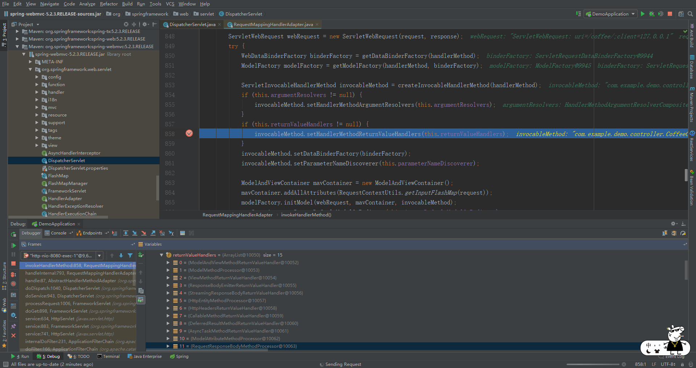

    这里有很多`returnValueHandler`，我们需要的是第十一个，`RequestResponseBodyMethodProcessor`

  

  - 还有`AbstractMessageConverterMethodProcessor.java`的`writeWithMessageConverters()`方法内，根据MessageConverter一个一个做尝试，看能不能处理这类型，即这MediaType这一步骤,打断点可以看到：

    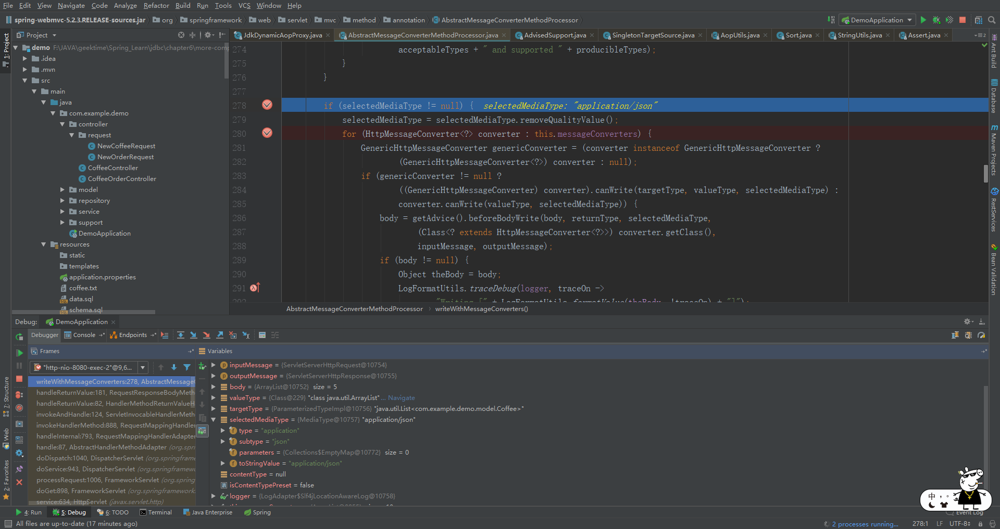

    这里需要的MediaType是`“application/json”`

    然后取得的Converter是

    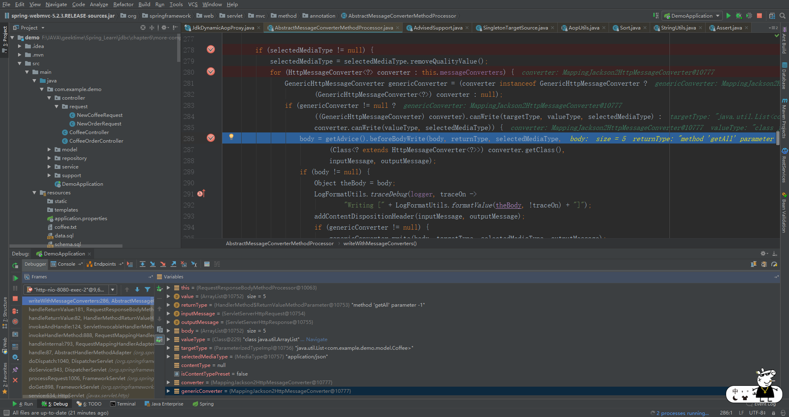

    然后拿到Body，这里的body就是我的Coffee

    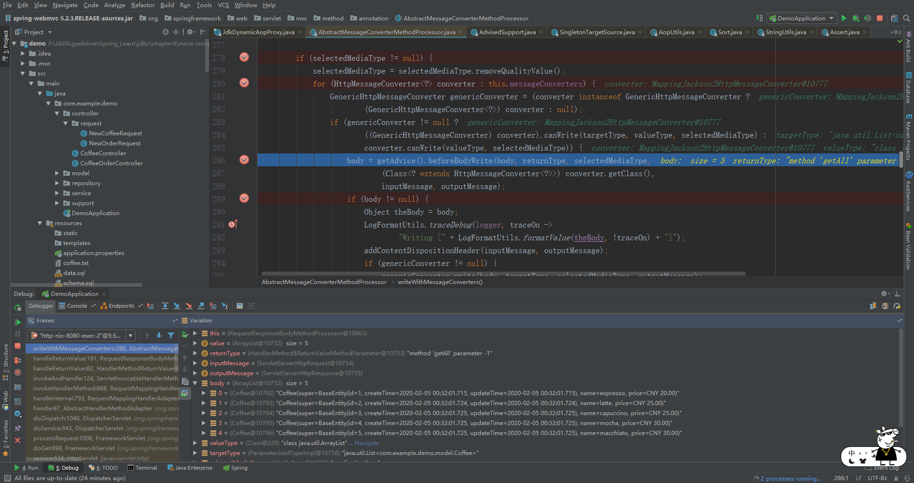

    最后经过`genericConverter.write(body, targetType, selectedMediaType, outputMessage);`，已经序列化成可见的json串，输出到response了


- ### 两个特殊的视图

  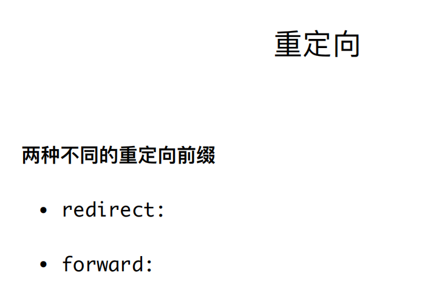

  **简单来说，**

  - forward

    服务器内部，浏览器url不会变化，不丢失request信息

  - redirect

    用户端（等于302跳转），浏览器url变化，丢失request信息

  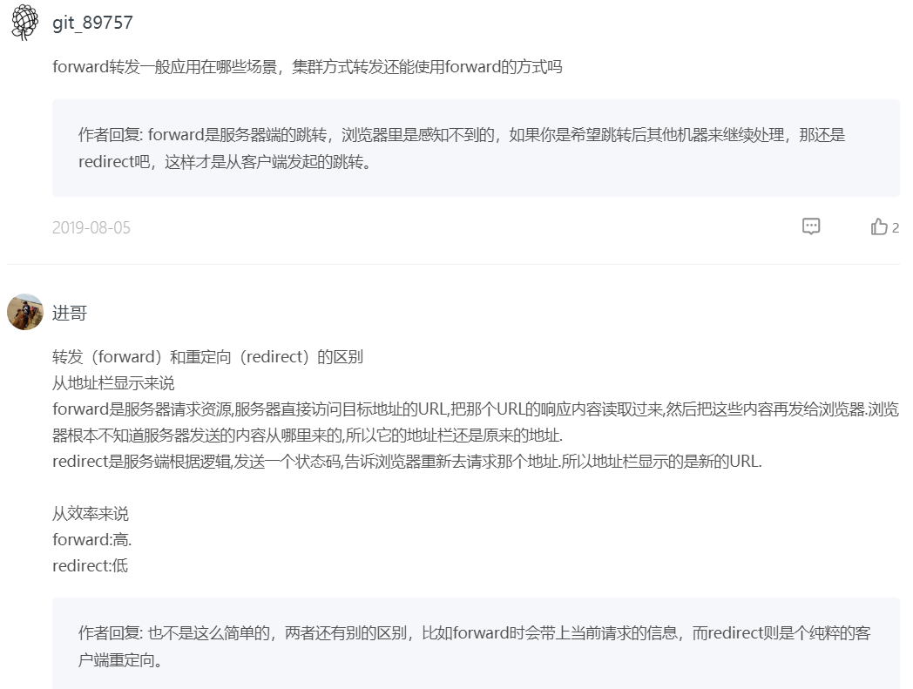

- redirect和forward前缀都写在哪里?

  > 写在View的名字里，比如我返回String，这个是View的名称我就可以写return "redirect:/index"

找到了网上的资料：

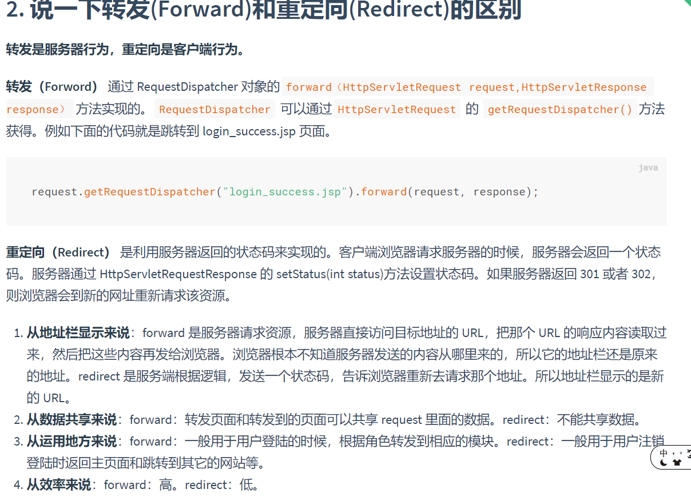


# 0x09 SpringMVC常用视图

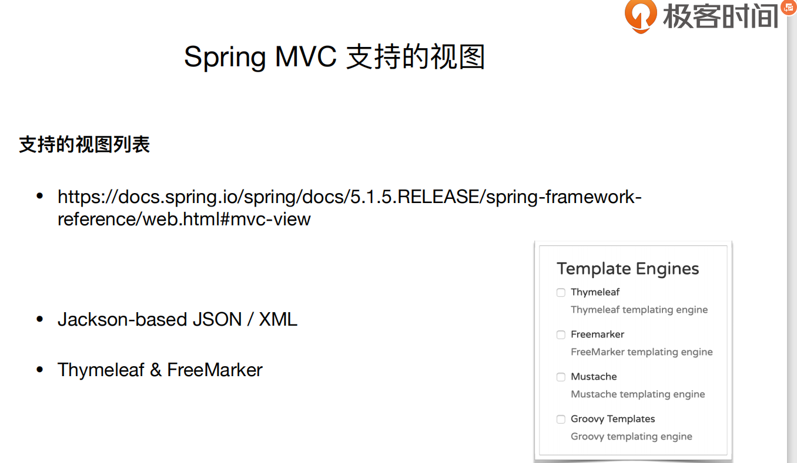

具体来说，官方文档的视图罗列：


- 消息转换器：MessageConverter

  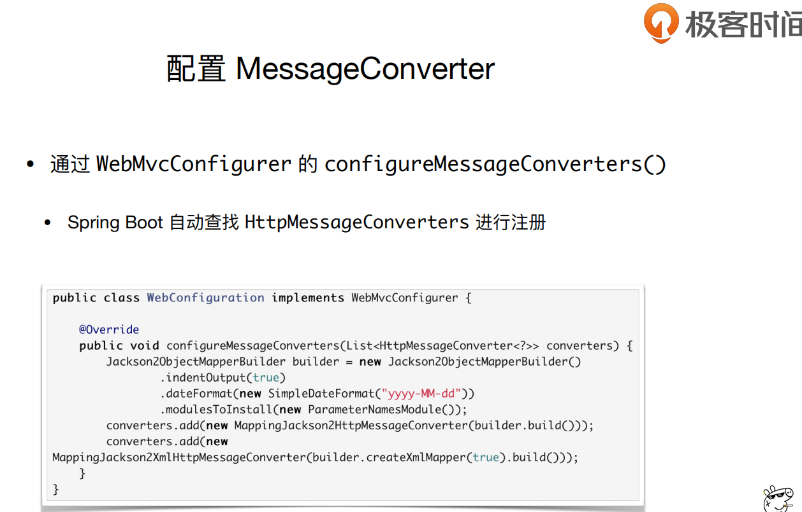

  ​	[自定义消息转换MessageConverter介绍说明](<https://www.cnblogs.com/hhhshct/p/9676604.html>)

  > ​	在SpringMVC中，可以使用@RequestBody和@ResponseBody两个注解，分别完成请求报文到对象和对象到响应报文的转换，底层这种灵活的消息转换机制就是利用HttpMessageConverter来实现的，Spring内置了很多HttpMessageConverter，比如MappingJackson2HttpMessageConverter，StringHttpMessageConverter等

  ​	在关于`Controller、RequestMapping`这种**handler**的method说明里就看到**自定义的消息转换**，还有上节课刚讲的`@ResponseBody`解析里。在视图部分也有对应的**MessageConverter**做类型到具体内容的转换。

  图示例子是在springboot中添加两个自定义的converter进去。

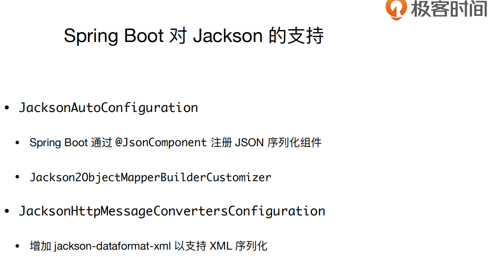


### 来看源码！

`WebMvcAutoConfiguration`类，在spring-boot-autoconfigure包的web/servlet下

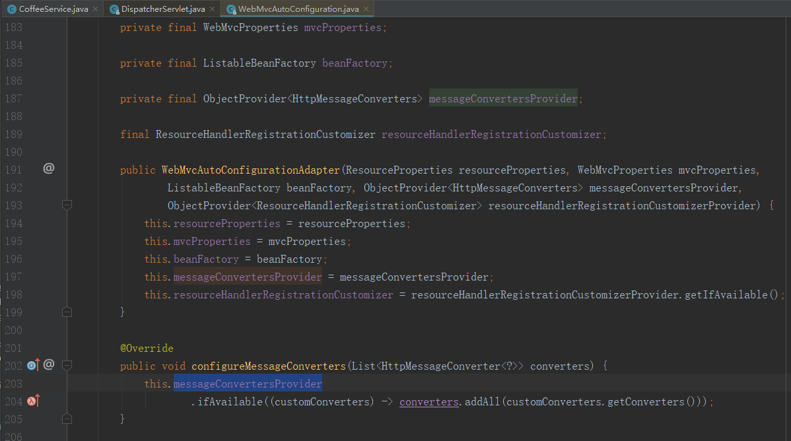

这里通过`this.messageConvertersProvider`取得类里的`HttpMessageConverters`集合，每个都取出来，一一加入converters这个List里去，**所以我们只要再应用上下文中配置HttpMessageConverters的Bean就可以了**。

`WebMvcAutoConfiguration`类还配置了很多ViewResolver，假设我们使用了freemarker，springboot会给我们配置了很多Freemarker相关的类（比如ViewResolver）

然后看看和Jackson相关的，  `JacksonAutoConfiguration`类

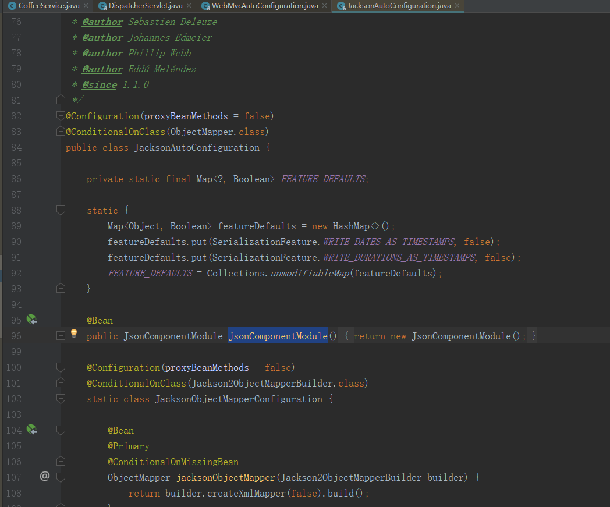

其中，

```java
@Bean
public JsonComponentModule jsonComponentModule() {
   return new JsonComponentModule();
}
```

这个便是用来处理jsonComponent注解的，在其内

```
private void addJsonBean(Object bean, Class<?>[] types, Scope scope)
//这个方法中，将JsonSerializer、JsonDeserializer添加到Json当中
```

还有`ObjectMapper`等等的配置

还有在spring-boot-autoconfigure包的http包下，`JacksonHttpMessageConvertersConfiguration`里，存在`mappingJackson2HttpMessageConverter`，和`mappingJackson2XmlHttpMessageConverter`

百度搜到了[MappingJackson2HttpMessageConverter的用法](<https://blog.csdn.net/m0_38016299/article/details/78338048>)


## 项目：json-view-demo

目标：

1.有一个Handler返回的`@ResponseBody`是一个Coffee类，不加`produces = MediaType.APPLICATION_JSON_UTF8_VALUE`使其返回json / xml  （通过Accept头决定）

2.定制money序列化为json时候为数值，而不是一个序列化的money类

3.接收Json的创建订单请求


- MoneyDeserializer

  ```java
  @JsonComponent
  public class MoneyDeserializer extends StdDeserializer<Money> {
      protected MoneyDeserializer() {
          super(Money.class);
      }
  
      @Override
      public Money deserialize(JsonParser p, DeserializationContext ctxt) throws IOException, JsonProcessingException {
          return Money.of(CurrencyUnit.of("CNY"), p.getDecimalValue());
      }
  }
  
  ```

- MoneySerializer

  ```java
  @JsonComponent
  public class MoneySerializer extends StdSerializer<Money>{
      protected MoneySerializer() {
          super(Money.class);
      }
      @Override
      public void serialize(Money money, JsonGenerator jsonGenerator, SerializerProvider serializerProvider) throws IOException {
          jsonGenerator.writeNumber(money.getAmount());
      }
  }
  ```

- CoffeeController

  ```java
      @RequestMapping(path = "/{id}", method = RequestMethod.GET)
      @ResponseBody
      public Coffee getById(@PathVariable Long id) {
          Coffee coffee = coffeeService.getCoffee(id);
          log.info("Coffee {}:", coffee);
          return coffee;
      }
  
      @GetMapping(path = "/", params = "name")
      @ResponseBody
      public Coffee getByName(@RequestParam String name) {
          return coffeeService.getCoffee(name);
      }
  ```

  

参考：[springboot序列化和反序列化](<https://blog.csdn.net/qq27Ke/article/details/81951947>)

- 通过name查询咖啡

  

  可以看到，返回的已经不是Money序列化后的结果了

  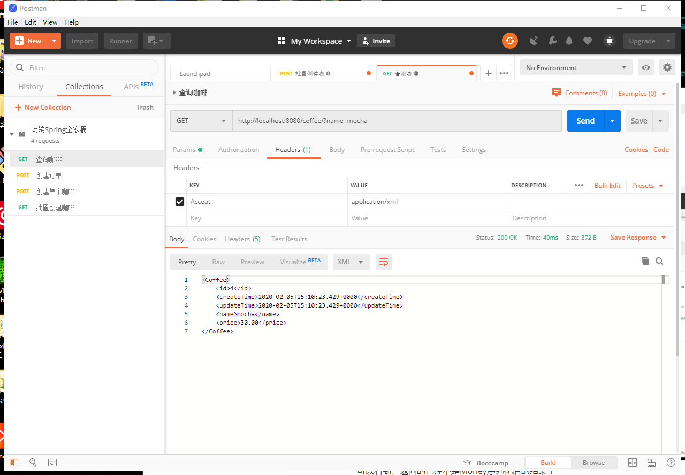

  加上Accept头后，返回xml

- 通过id查询咖啡

  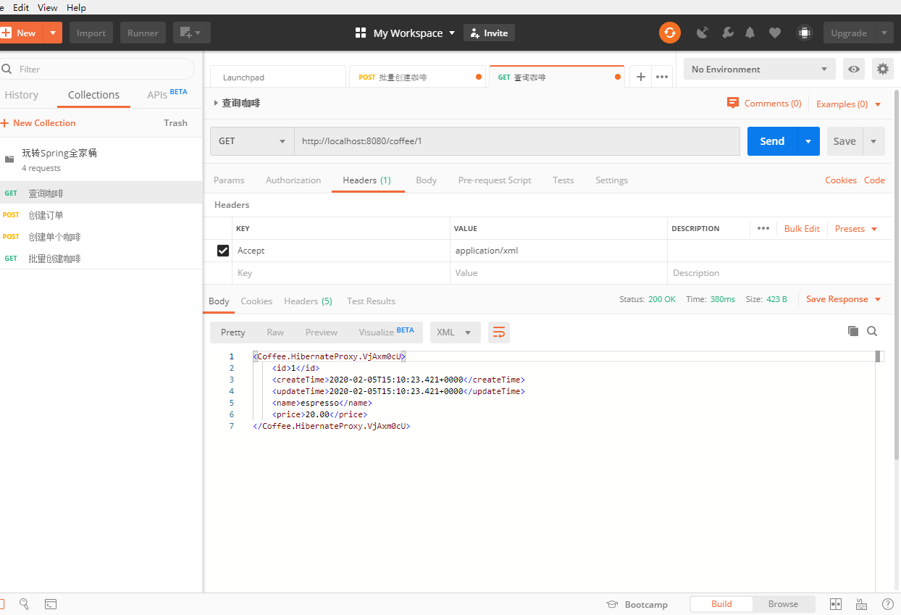

  这里返回的是HibernateProxy后的对象，是加入`Hibernate5Module`这个Bean后有的，如果不加的话会报错

- Json请求

  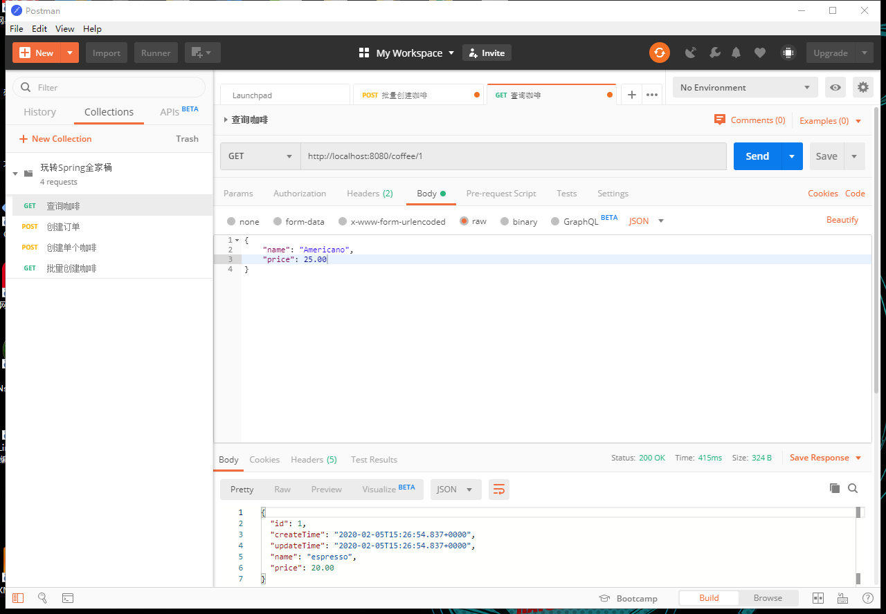

  在Terminal测试格式

  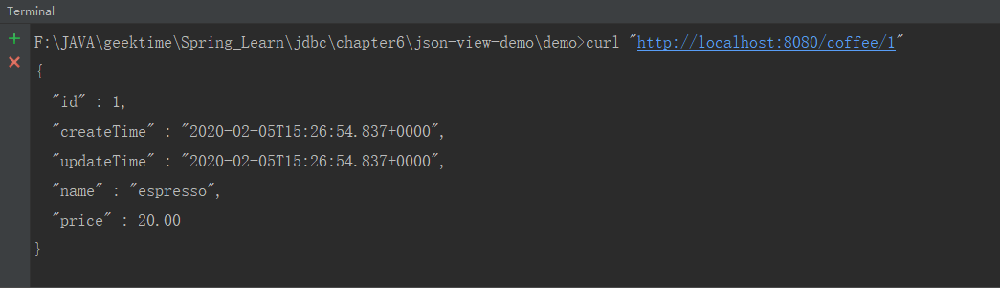


# 0x10 Thymeleaf

- 添加Thymeleaf依赖

  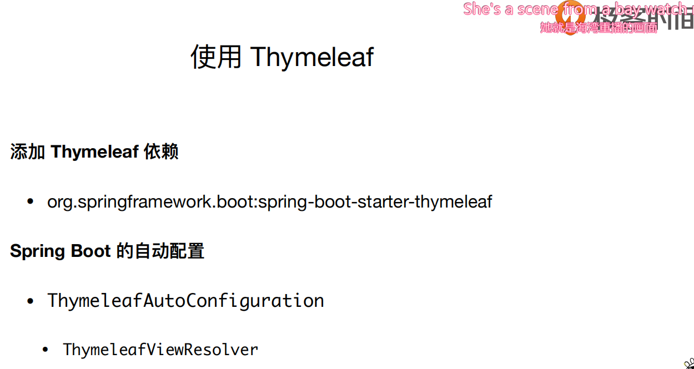

- Thymealeaf一些配置

  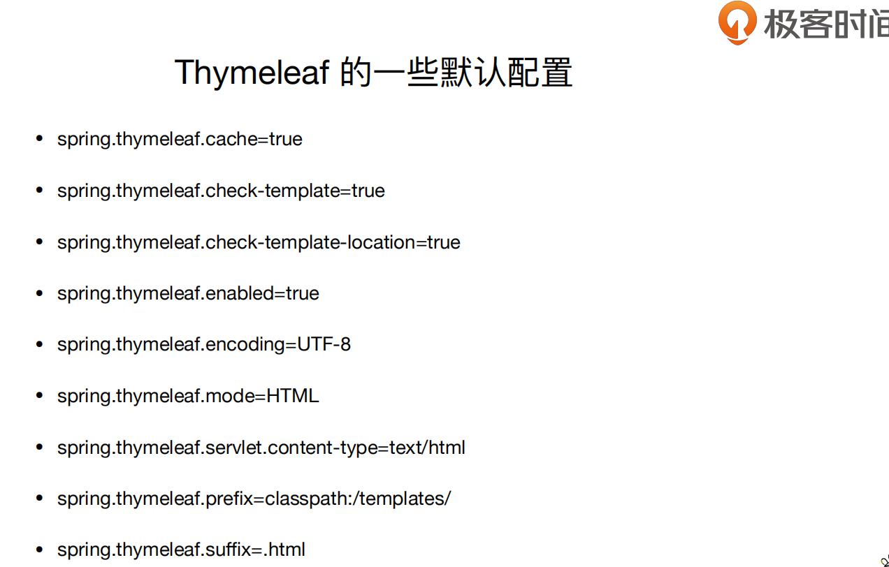

  

- 使用注意点：

  我们在`main/resource`目录下编辑，但要把更新的内容搬运到`target`文件夹里，不然不会显示更新内容。

- [Springboot---Model,ModelMap,ModelAndView](https://blog.csdn.net/likunpeng6656201/article/details/97503800)

- [Springboot-ObjectMapper类使用](https://blog.csdn.net/runbat/article/details/89164524)

  Object Mapeer应该是用于序列化的···

- @ModelAttribute

  被@ModelAttribute注释的方法会在此controller每个方法执行前被执行,它把请求参数加入到一个名为attributeName的model属性中

  ```java
      @ModelAttribute
      public List<Coffee> coffeeList() {
          return coffeeService.getAllCoffee();
      }
  ```


### 实验项目： Thymeleaf-demo

- CoffeeOrderController

  ```java
  	@GetMapping("/{id}")
      @ResponseBody
      public CoffeeOrder getOrder(@PathVariable("id") Long id) {
          return orderService.get(id);
      }
  	@ModelAttribute
      public List<Coffee> coffeeList() {
          return coffeeService.getAllCoffee();
      }
  
      @GetMapping(path = "/")
      public ModelAndView showCreateForm() {
          return new ModelAndView("create-order-form");
      }
  
      @PostMapping(path = "/", consumes = MediaType.APPLICATION_FORM_URLENCODED_VALUE)
      public String createOrder(@Valid NewOrderRequest newOrder,
                                      BindingResult result, ModelMap map) {
          if (result.hasErrors()) {
              log.warn("Binding Result: {}", result);
              map.addAttribute("message", result.toString());
              return "create-order-form";
          }
  
          log.info("Receive new Order {}", newOrder);
          Coffee[] coffeeList = coffeeService.getCoffeeByName(newOrder.getItems())
                  .toArray(new Coffee[] {});
          CoffeeOrder order = orderService.createOrder(newOrder.getCustomer(), coffeeList);
          return "redirect:/order/" + order.getId();
      }
  ```

- templates/create-order-form.html

  ````html
  <html xmlns:th="http://www.thymeleaf.org">
      <body>
          <h2>Coffee Available Today</h2>
          <table>
              <thead>
                  <tr>
                      <th>Coffee Name</th>
                      <th>Price</th>
                  </tr>
              </thead>
              <tbody>
                  <tr th:each="coffee : ${coffeeList}">
                      <td th:text="${coffee.name}">Espresso</td>
                      <td th:text="${coffee.price}">CNY 12.0</td>
                  </tr>
              </tbody>
          </table>
          <h2>Your Order</h2>
          <form action="#" th:action="@{/order/}" method="post">
              <label>Customer Name</label>
              <input type="text" name="customer" />
              <ul>
                  <li th:each="coffee : ${coffeeList}">
                      <input type="checkbox" name="items" th:value="${coffee.name}" />
                      <label th:text="${coffee.name}">Espresso</label>
                  </li>
              </ul>
              <input type="submit" value="Submit"/>
              <p th:text="${message}">Message</p>
          </form>
      </body>
  </html>
  ````

- 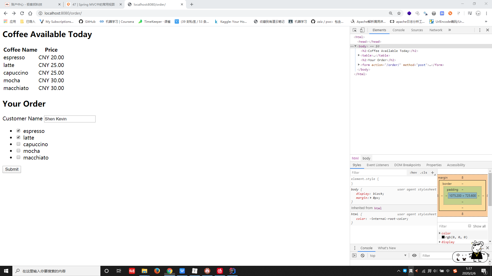

- 

  可以看到，**redict重定向**了


# 0x11 静态资源与缓存

- 首先的观点：**不推荐用Spring**做静态资源缓存服务，可以用**Nginx**，或者用**CDN\CMS**这样的系统专门来处理资源和做资源的变更

- ### Spring boot中的静态资源配置

  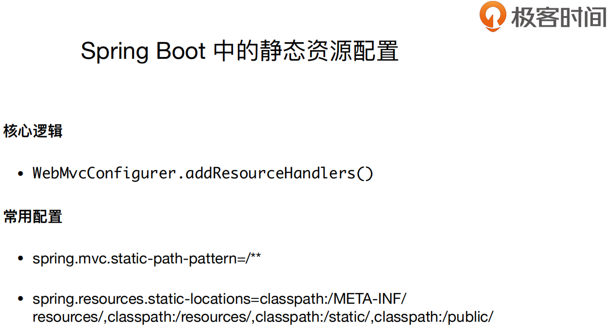

  [Springboot的resources下资源访问的问题](https://www.cnblogs.com/shuaiqin/p/11517849.html)，当时做hadoop可视化时搜的，还有访问`webapp/WEB-INF/page`下的jsp文件可以见hadoop项目笔记。

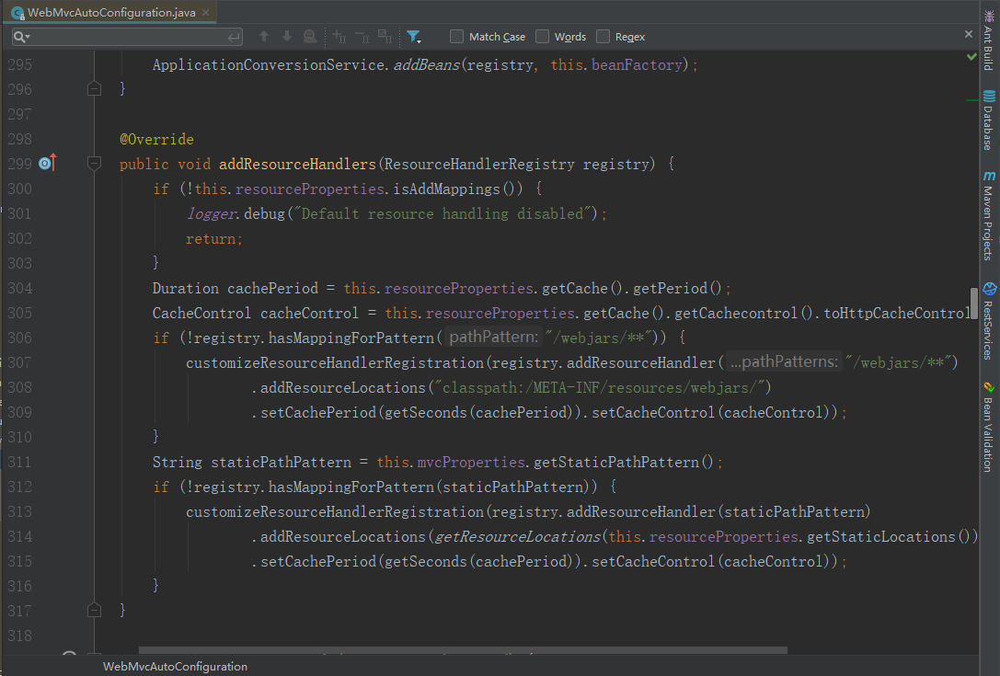

看到首先取出缓存相关配置，然后有webjar的话会设置webjar的支持

```java
String staticPathPattern = this.mvcProperties.getStaticPathPattern();
if (!registry.hasMappingForPattern(staticPathPattern)) {
  customizeResourceHandlerRegistration(registry.addResourceHandler(staticPathPattern)
        .addResourceLocations(getResourceLocations(this.resourceProperties
        .getStaticLocations()))
  		.setCachePeriod(getSeconds(cachePeriod))
        .setCacheControl(cacheControl));
			}
```

这里取出静态资源路径`staticPathPattern`，去**设置ResourceHandler**，去**找Locations资源路径**，还有**设置cache**，这里`CacheControl`的设置会覆盖掉上面`CachePeriod`

进入CacheControl

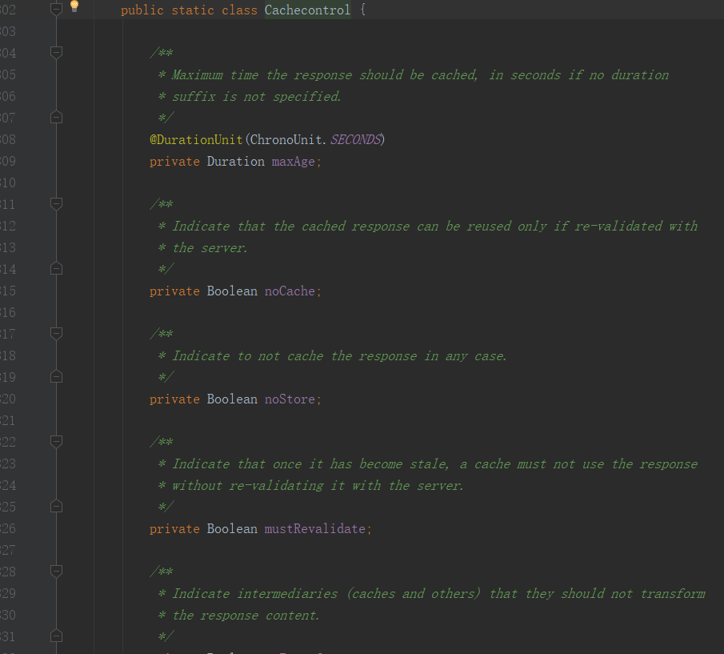

可进行相关设置

### 小实验：

- application.properties

  ```properties
  spring.mvc.static-path-pattern=/static/**
  ```

- 在resouce/static下放置spring.png

- 访问 http://localhost:8080/static/spring.png

  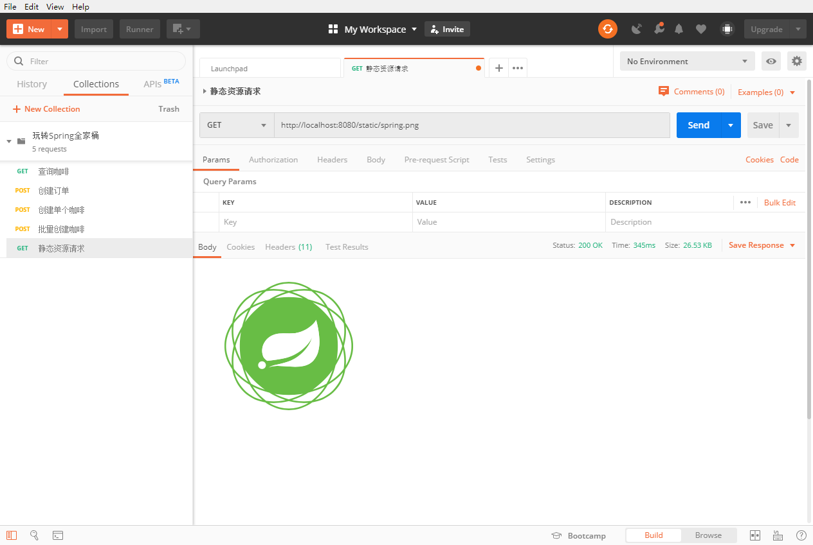


- ### Spring boot 中的缓存配置

  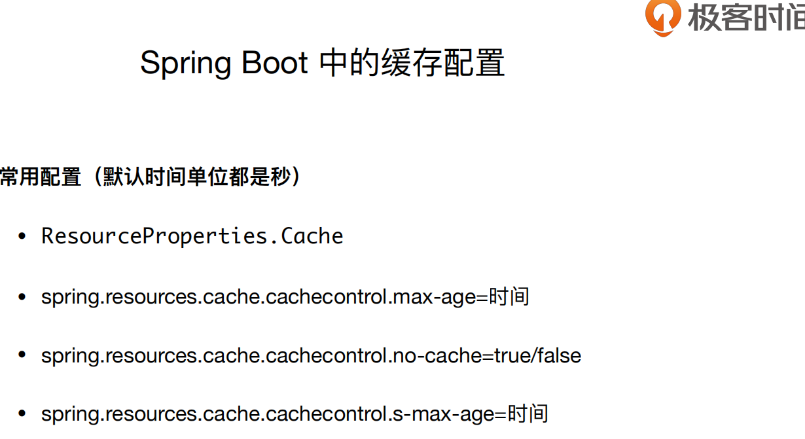

- Controller中设置缓存

  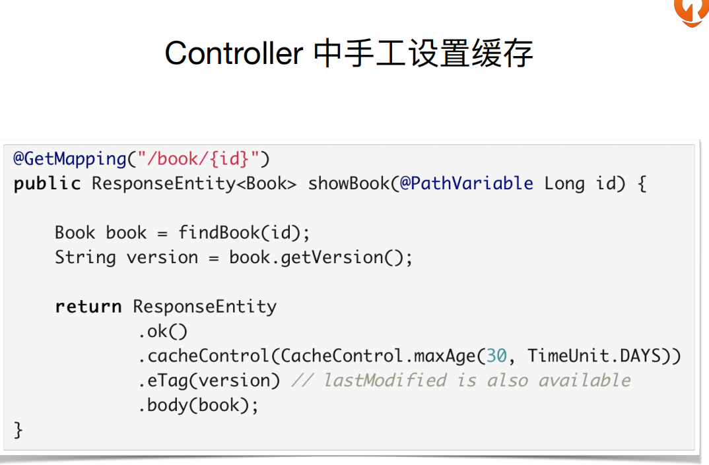

  

  [ResultBody<T>示例](<https://www.cnblogs.com/hickup089/p/9909845.html>)

  

  ### 小实验

- appilcaition.properties

  ```properties
  spring.resources.cache.cachecontrol.no-cache=true
  ```

- 如果上述配置不加，并且在请求头内添加`if-Modifield-Since`，（请求第二次）则状态码返回**302**

  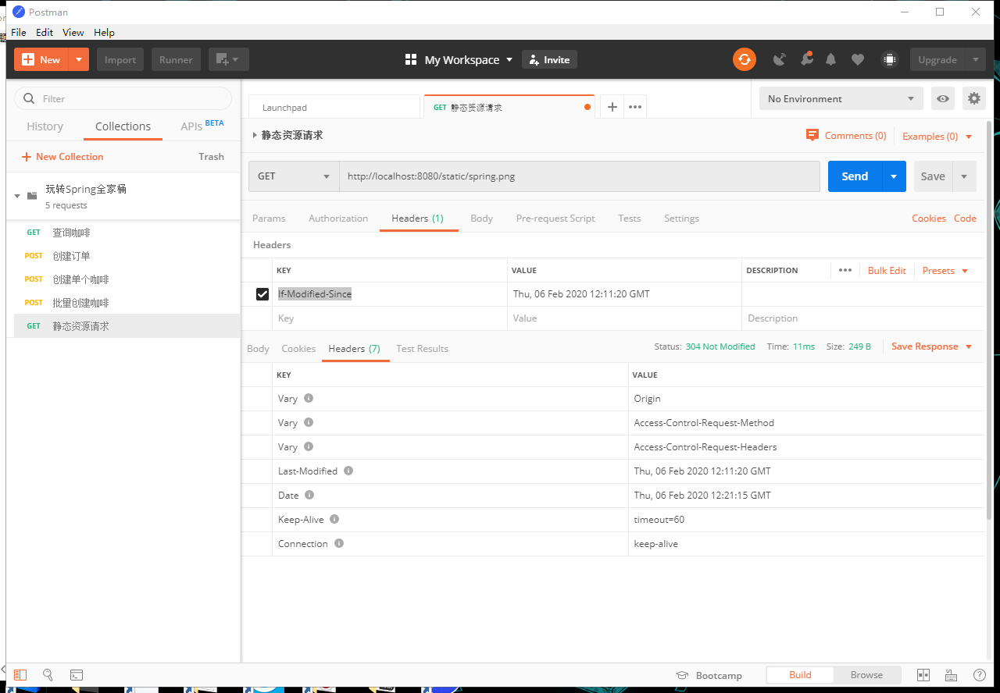

  `If-Modified-Since`是标准的HTTP请求头标签，在发送HTTP请求时，把浏览器端缓存页面的最后修改时间一起发到服务器去，服务器会把这个时间与服务器上实际文件的最后修改时间进行比较。

  - 如果时间一致，那么返回HTTP状态码304（不返回文件内容），客户端接到之后，就直接把本地缓存文件显示到浏览器中。

  - 如果时间不一致，就返回HTTP状态码200和新的文件内容，客户端接到之后，会丢弃旧文件，把新文件缓存起来，并显示到浏览器中。

- 如果添加上述配置，则返回Headers里

  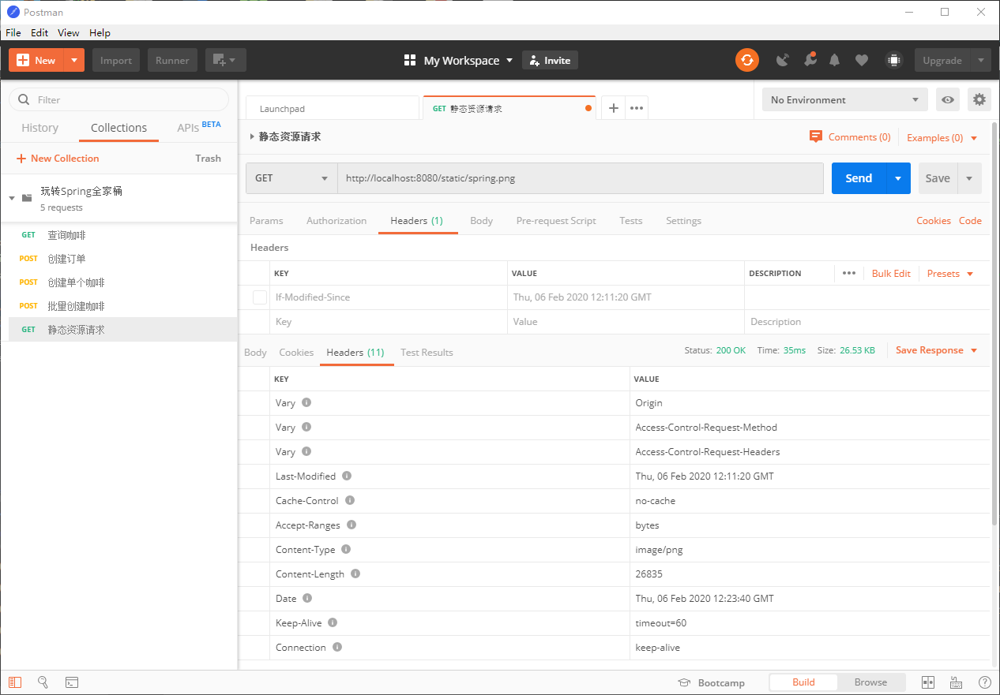

  返回响应Heade里cache-Control为no-cache，意为不直接使用缓存，要求向服务器发起（新鲜度）请求

  cache-Conreol解析: [链接](<https://blog.csdn.net/u012375924/article/details/82806617>)

- CoffeeController    ——使用ResponseBody

  ```java
  @RequestMapping(path = "/{id}", method = RequestMethod.GET,
              produces = MediaType.APPLICATION_JSON_UTF8_VALUE)
      @ResponseBody
      public ResponseEntity<Coffee> getById(@PathVariable Long id) {
          Coffee coffee = coffeeService.getCoffee(id);
          return ResponseEntity.ok()
                  .cacheControl(CacheControl.maxAge(10, TimeUnit.SECONDS))
                  .body(coffee);
      }
  ```

- 测试cache-Control的maxAge

  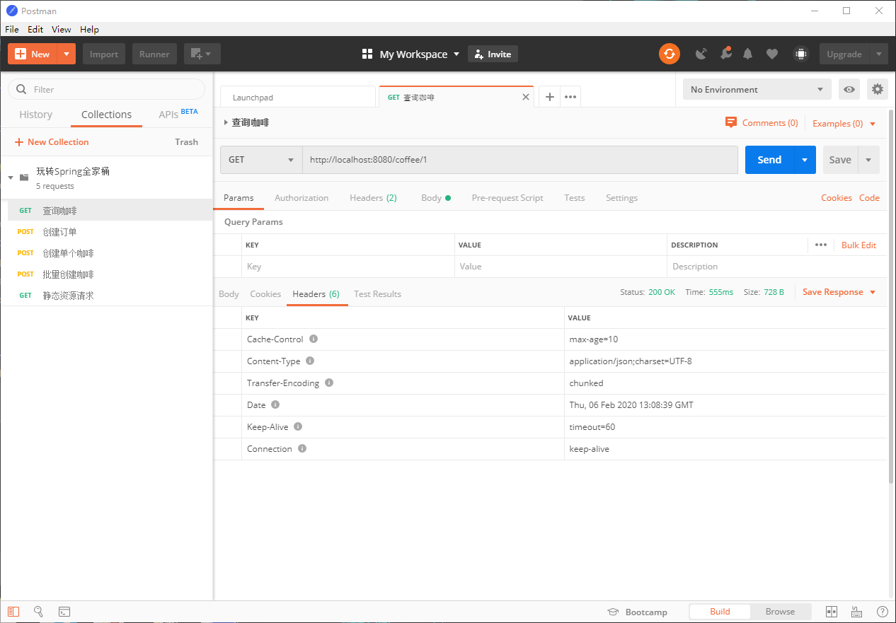

  MaxAge作用：<https://blog.csdn.net/zhongshanxian/article/details/81289034>

  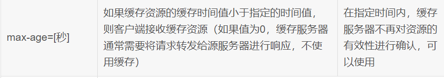


- 建议的资源访问方式

  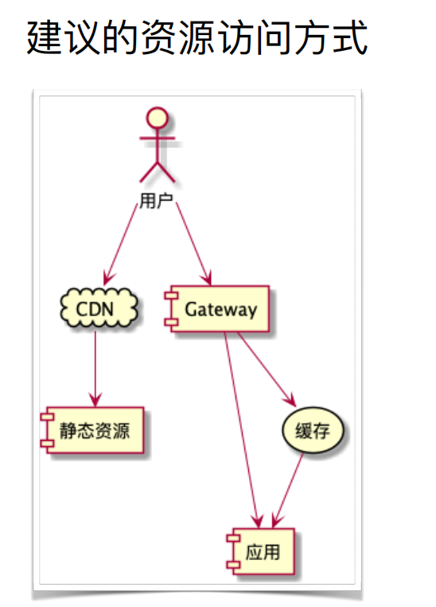

**CDN** 的全称是 `Content Delivery Network`，即内容分发网络。CDN 系统能够实时地根据网络流量和各节点的连接、负载状况以及到用户的距离和响应时间等综合信息将用户的请求重新导向离用户最近的服务节点上；其目的是使用户可就近取得所需内容，解决 Internet 网络拥挤的状况，提高用户访问网站的响应速度。

简要来说**CND**具有路由功能，能根据访问地址，进行负载均衡分配服务器

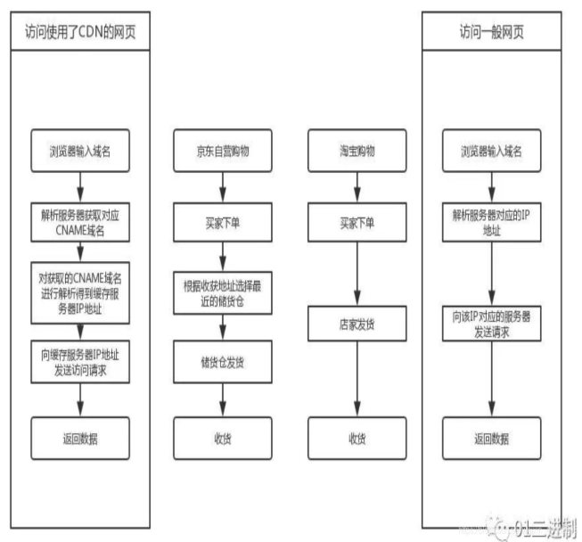


# Spring MVC异常处理机制

- ### SpringMVC 异常解析

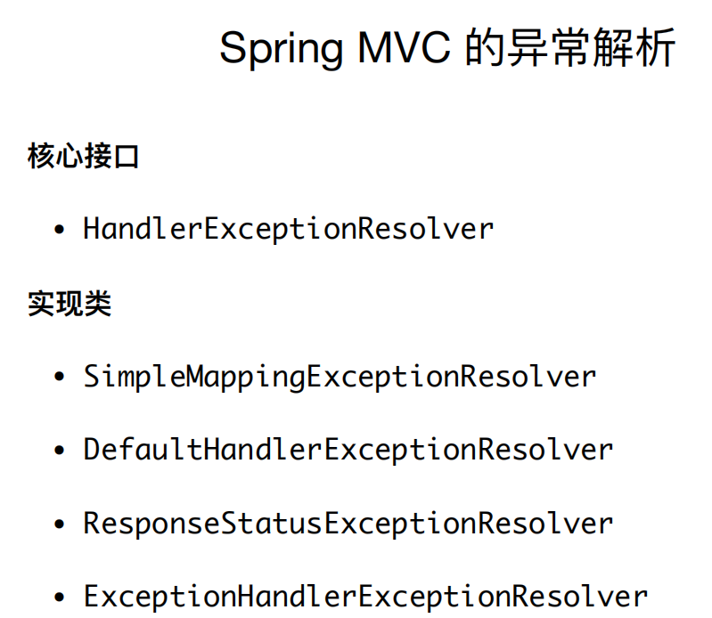

其中`ResponseStatusEcxeptionResolver`处理带`@ResponseStatus`的注解或者类的，可以在异常类上添加这个注解，标明http响应码会是什么

经过后面实验，发现`@ExceptionHandlerException`处理`Exception`异常


### 来看源码

在DispatchServlet.java的doService方法中，执行完doDispatch，在doDispatch时如果抛出异常，一场被捕获

```java
catch (Exception ex) {
				dispatchException = ex;
			}
```

然后再DoDIspatch函数的processDispatchResult()函数处理结果时，会查看有没有传入异常,如果有，做处理：

```java
else {
		Object handler = (mappedHandler != null ? mappedHandler.getHandler() : null);
		mv = processHandlerException(request, response, handler, exception);
		errorView = (mv != null);
	}
```

进入`processHandlerException`函数

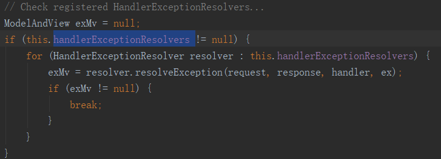

这里返回值为ModelAndView，然后这里遍历的的`this.handlerExceptionResolvers`便是整个可用的`HandlerExceptionResolver`集合

```java
/** List of HandlerExceptionResolvers used by this servlet. */
@Nullable
private List<HandlerExceptionResolver> handlerExceptionResolvers;
```


- ### SpringMVC 异常处理方法

  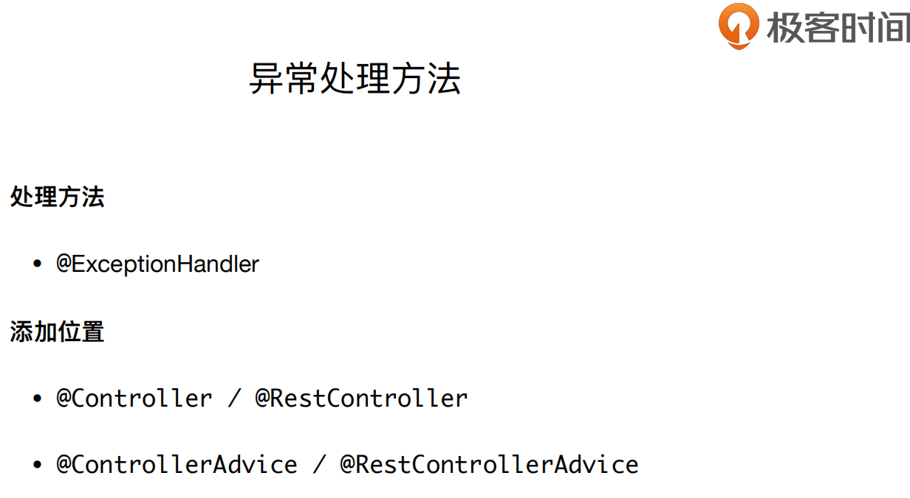

  - 可以在带`@Controller`的类中添加一个带有`@ExceptionHandler`注解的方法来处理异常

  - 也可以做AOP的动作，编写@ControllerAdvice，在@ControllerAdvice编写一个带有`@ExceptionHandler`注解的方法。这个方法优先级低于在`@Controller`中的方法。

> 开发者可以自己定义一个ExceptionHandler类处理所有的异常，在这个类上加上@ControllerAdvice注解，这个类就以AOP的形式注册到SpringMVC的处理链条中了，在应用任何地方抛出Exception，最后都会调用到这个handler中的方法上，在Handler类中，可以和上面一样使用@ExceptionHandler注解来区别对待不同的Exception。


**@ExceptionHandler**`( xxx.class)`可以传入很多类型，实验中是`validationException.class`

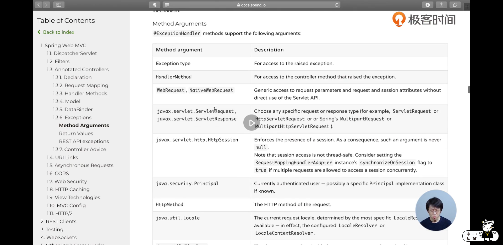

返回值也是给中各种的,实验是返回对象作为ResponseBody


### 实验项目：Exception-demo

#### @ResponseStatus示例

处理带`@ResponseStatus(HttpStatus.BAD_REQUEST)`后，Spring会调用`HandlerExceptionResolver`的`ResponseStatusEcxeptionResolver`来处理这种http异常请求


分别掩饰SpringMVC处理和ControllerAdapter处理；

这里要**演示Controller里方法和ControllerAdapter**，所以抛出的错误类型不一样

- SpringMVC对应错误FormValidationException，

- ControllerAdapter对应默认的ValidationException，由自定义的`@ExceptionHandler`处理


这里没有演示单个异常处理，就是在Controller中加入被@ExceptionHandler修饰的类，那样的话该异常处理方法只在当前的controller中起作用


#### 首先演示SpringMVC处理错误

- `BindingResult`定制错误处理，处理表单的

  ```java
  	@PostMapping(path = "/", consumes = MediaType.APPLICATION_FORM_URLENCODED_VALUE)
      @ResponseBody
      @ResponseStatus(HttpStatus.CREATED)
      public Coffee addCoffee(@Valid NewCoffeeRequest newCoffee,
                              BindingResult result) {
          if (result.hasErrors()) {
              log.warn("Binding Errors: {}", result);
              //throw new ValidationException(result.toString());
              throw new FormValidationException(result);
          }
          return coffeeService.saveCoffee(newCoffee.getName(), newCoffee.getPrice());
      }
  ```

- FormValidationException

  ```java
  @ResponseStatus(HttpStatus.BAD_REQUEST)
  @Getter
  @AllArgsConstructor
  public class FormValidationException extends RuntimeException {
      private BindingResult result;
  }
  ```

测试结果：这里是没有result的输出的

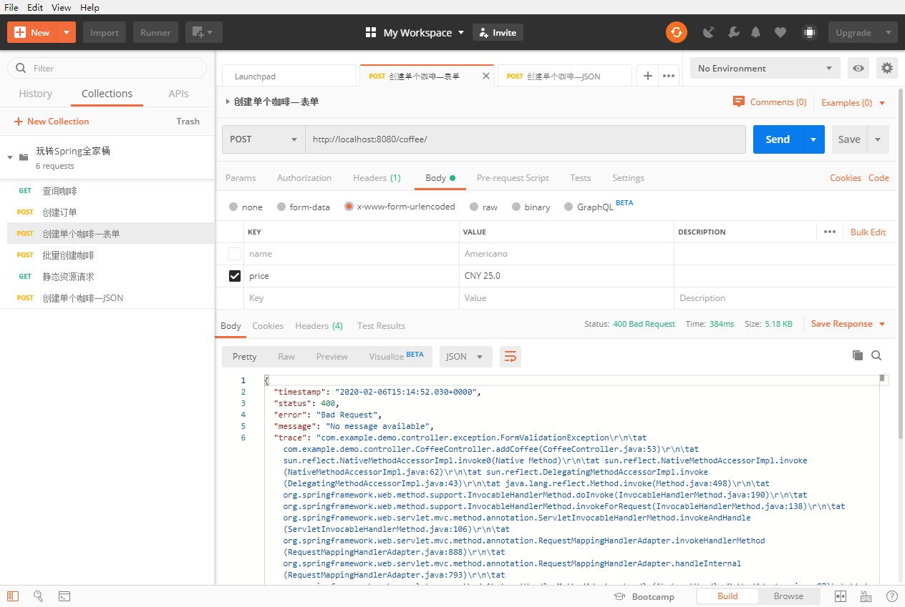


#### 然后是ControllerAdvice处理错误

- CoffeeController

  ```java
  @PostMapping(path = "/", consumes = MediaType.APPLICATION_JSON_UTF8_VALUE)
      @ResponseBody
      @ResponseStatus(HttpStatus.CREATED)
      public Coffee addJsonCoffee(@Valid @RequestBody NewCoffeeRequest newCoffee,
                                  BindingResult result) {
          if (result.hasErrors()) {
              log.warn("Binding Errors: {}", result);
              throw new ValidationException(result.toString());
          }
          return coffeeService.saveCoffee(newCoffee.getName(), newCoffee.getPrice());
      }
  ```

- 自定义异常处理方法,创建  **GlobalControllerAdvice**

  ```java
  @RestControllerAdvice
  public class GlobalControllerAdvice {
      @ExceptionHandler(ValidationException.class)
      @ResponseStatus(HttpStatus.BAD_REQUEST)
      public Map<String, String> validationExceptionHandler(ValidationException exception) {
          Map<String, String> map = new HashMap<>();
          map.put("message", exception.getMessage());
          return map;
      }
  }
  ```

  用于处理`validationException`

  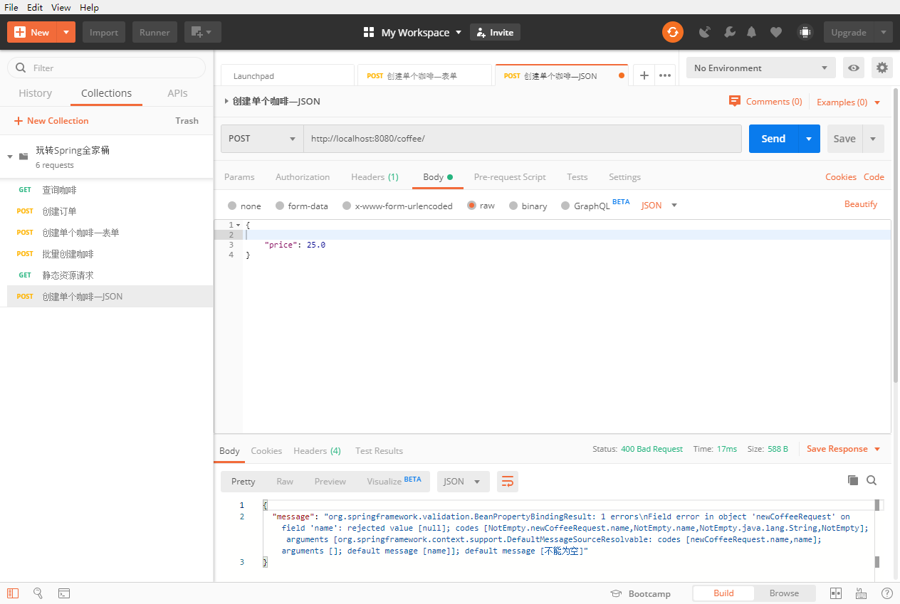


这里好文章：[玩转springboot：自定义异常处理和深入异常处理原理](<https://blog.csdn.net/sihai12345/article/details/81220781>),解释默认返回的error信息


我的问题来了：刚看源码知道错误是由`handlerExceptionResolver`解决的，其中：

- ValidationException，由自定义的`@ExceptionHandler`处理
- 自定义的FormValidationException，由   ···不知道  处理

那么归根结底，这两种错误是由哪个`handlerExceptionResolver`处理的呢？

- ValidationException，由自定义的`@ExceptionHandler`处理

  Debug看看：

  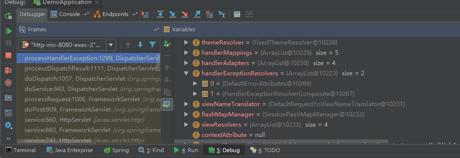

  有两个`handlerExceptionResolvers`可能对应`@ExceptionHandler`

  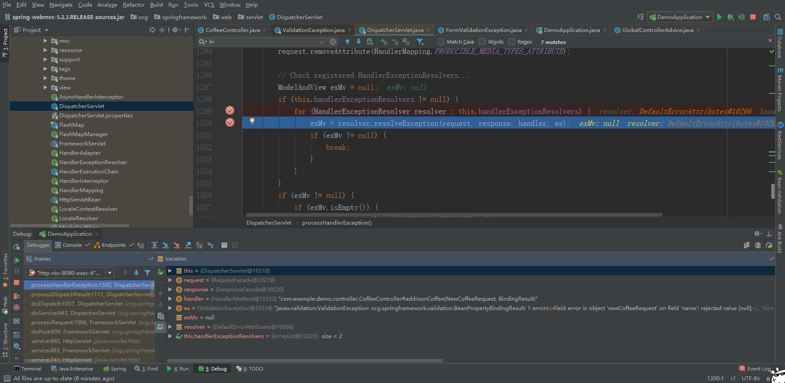

  看来第一个DefaultErrorAttributes不是

  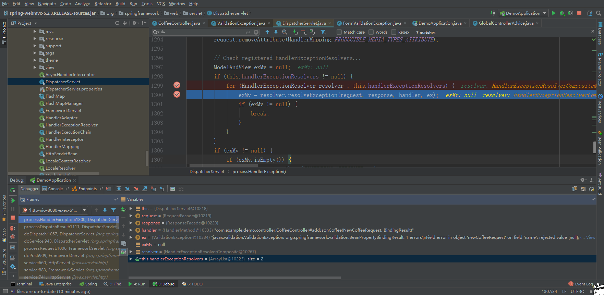

  结论：带@ExceptionHandler的异常处理方法，是通过`ExceptionHandlerExceptionResolver`的resolveException方法处理

  > 在DispatcherServlet初始化的时候，会去容器中找HandlerExceptionResolver类型的类。而刚刚的ExceptionHandlerExceptionResolver类就是继承了HandlerExceptionResolver接口，所以这个地方就将他放入了DispatcherServlet中。所以上面的遍历handlerExceptionResolvers处理异常信息的地方，就是调用了ExceptionHandlerExceptionResolver的resolveException方法。所以我们进入该方法。


- 自定义的FormValidationException

  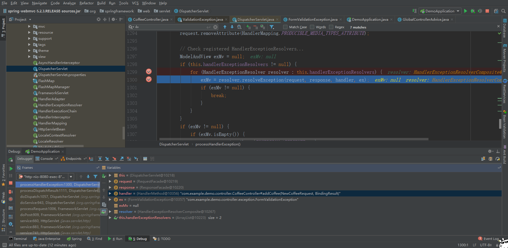

  结论：奥，也是`ExceptionHandlerExceptionResolver`处理的······

- 结论：不管是@RestControllerAdvice对应默认的ValidationException，由自定义的@ExceptionHandler方法处理，还是SpringMVC对应错误FormValidationException，最终都是通过   ExceptionHandlerExceptionResolver  处理错误


现在其实是知道了处理异常的`HandlerExceptionResolver`，

```java
for (HandlerExceptionResolver handlerExceptionResolver : this.resolvers) {
				ModelAndView mav = handlerExceptionResolver.resolveException(request, response, handler, ex);
				if (mav != null) {
					return mav;
				}
			}
```

`handlerExceptionResolver.resolveException(request, response, handler, ex);`这条语句中的**handler原来是要处理的函数**···

```java
//Validation对应的，json访问，@ExceptionHandler注解方法
com.example.demo.controller.CoffeeController#addJsonCoffee(NewCoffeeRequest, BindingResult)
//FormValidation对应的，表单访问，@ExceptionHandler注解方法
com.example.demo.controller.CoffeeController#addCoffee(NewCoffeeRequest, BindingResult)
```


那么`ControllerAdvice和ExceptionHandler注解的作用`，即对`ExceptionHandlerExceptionResolver`的影响呢？

[参考链接](<https://blog.csdn.net/weixin_33901843/article/details/91416688>)


在ExceptionHandlerExceptionResolver类中，该类扫描了所有标注有ExceptionHandler注解的方法，并将他们存入了exceptionHandlerAdviceCache中。


然后再在`ExceptionHandlerExceptionResolver`方法中，

```java
protected ServletInvocableHandlerMethod getExceptionHandlerMethod(
      @Nullable HandlerMethod handlerMethod, Exception exception) 
```

里，

```java
for (Map.Entry<ControllerAdviceBean, ExceptionHandlerMethodResolver> entry : this.exceptionHandlerAdviceCache.entrySet()) {
			ControllerAdviceBean advice = entry.getKey();
			if (advice.isApplicableToBeanType(handlerType)) {
				ExceptionHandlerMethodResolver resolver = entry.getValue();
				Method method = resolver.resolveMethod(exception);
				if (method != null) {
					return new ServletInvocableHandlerMethod(advice.resolveBean(), method);
				}
			}
		}
```

感觉是取出来一个一个试试能不能处理··

这个`ServletInvocableHandlerMethod`，是根据`HandlerMethod`创建，在执行某个Controller中的方法时候调用的···具体源码分析看这篇：<https://blog.csdn.net/qq924862077/article/details/53944721>···我没看完，下次一定


回到这里

```
- ①ValidationException，由自定义的`@ExceptionHandler`方法处理
- ②自定义的FormValidationException，由   ···不知道  处理
```

经过下文的实验，得出：

①结论是`ExceptionHandlerExceptionResolver`以Bean的方式调用自定义的方法`validationExceptionHandler`来处理ValidationException错误

②结论是`ExceptionHandlerExceptionResolver`找不到方法来处理这个自定义的错误，return了个null，然后一路的函数调用返回值都为null，直到DIspatchServlet：

```java
	// We might still need view name translation for a plain error model...
			if (!exMv.hasView()) {
				String defaultViewName = getDefaultViewName(request);
				if (defaultViewName != null) {
					exMv.setViewName(defaultViewName);
				}
			}
```

给了默认模板，结束。


### 实验过程

在DispatchServlet的DoDispatch中的processHandlerException，对结果后处理中，

调用ExceptionHandlerExceptionResolverComposite.resolver方法，在

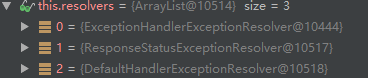

中遍历取出ExceptionHandlerExceptionResolver，调用ExceptionHandlerExceptionResolver的resolveException(request, response, handler, ex)方法


resolveException方法在ExceptionHandlerExceptionResolver的二级父类中实现，核心是

```java
ModelAndView result = doResolveException(request, response, handler, ex);
```

而doResolveException在ExceptionHandlerExceptionResolver的一级父类中实现，核心是

```java
doResolveHandlerMethodException(request, response, (HandlerMethod) handler, ex);
```

而doResolveHandlerMethodException方法在**ExceptionHandlerExceptionResolver**实现，其中

```java
ServletInvocableHandlerMethod exceptionHandlerMethod = getExceptionHandlerMethod(handlerMethod, exception);
```

进入getExceptionHandlerMethod！！！这个方法！就是调用标注有ExceptionHandler注解的地方！

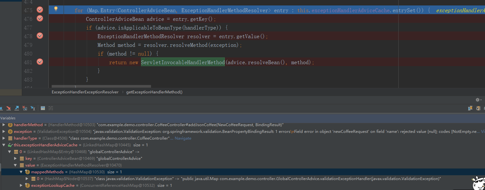

这里看到

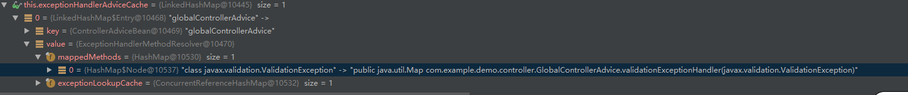

看到啦，在后半部分，**validationExceptionHandler**被调用了

再看一下②的返回：

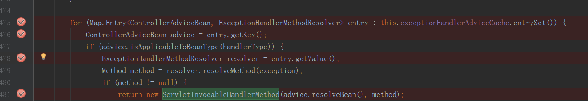

而第四个断点无效，也就是说②没有HandlerMethod能处理····


再返回`doResolveHandlerMethodException`

这整个一系列操作···就是为了**返回ModelAndView**

doResolveHandlerMethodException通过getExceptionHandlerMethod

取得  ServletInvocableHandlerMethod后，调用：

```java
if (cause != null) {
				// Expose cause as provided argument as well
				//根据提供的参数暴露原因
				exceptionHandlerMethod.invokeAndHandle(webRequest, mavContainer, exception, cause, handlerMethod);
			}
			else {
				// Otherwise, just the given exception as-is
                //否则，只保留给定的异常
				exceptionHandlerMethod.invokeAndHandle(webRequest, mavContainer, exception, handlerMethod);
			}
```

在`exceptionHandlerMethod.invokeAndHandle`中，它是最后处理请求的阶段，也就是把请求转换为视图的阶段。它主要应用到ModelAndViewContainer这个类

搜到一篇介绍解析:  <https://blog.csdn.net/weixin_40918067/article/details/90416442>

不看啦不看啦！反正就是设置ModelAndView容器的！下次一定！看


最后贴一下解决完自己疑问后跑过去评论区的回答

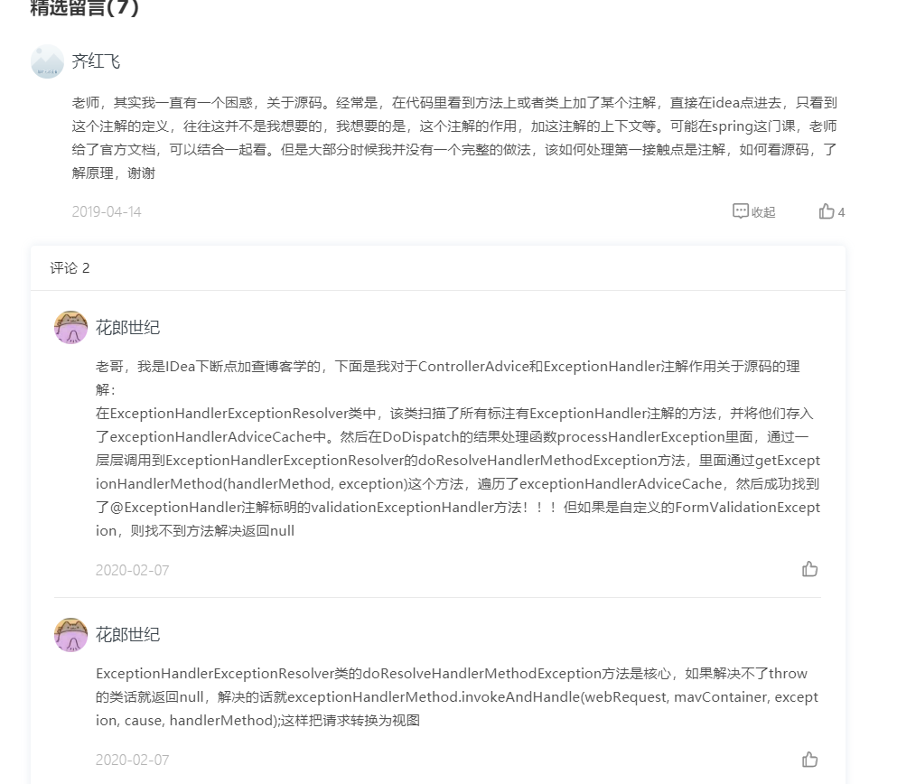