# 0x00 Controller

### 认识Spring MVC

- DispatcherServlet

  - Controller

  - xxxResolver

    - ViewResolver
    - HandlerExceptionResolver
    - MultipartResolver

  - HandlerMapping

    请求映射处理(到`Controller`上)的逻辑

### Spring MVC 中的常用注解

- @Controller

  - @RestController

    是`ResponseBody+Controller`

- @RequestMapping

  - @GetMapping /  @PostMapping
  - @PutMapping /  @DeleteMapping

- @RequestBody  /  @ResponseBody  /  @ResponseStatus

### 知识点

这里**项目SpringBucks**和上次差不多，放Controller：

```java
//CoffeeController
@Controller
@RequestMapping("/coffee")
public class CoffeeController {
    @Autowired
    private CoffeeService coffeeService;

    @GetMapping("/")
    @ResponseBody
    public List<Coffee> getAll() {
        return coffeeService.getAllCoffee();
    }
}

//CoffeeOrderController
@RestController
@RequestMapping("/order")
@Slf4j
public class CoffeeOrderController {
    @Autowired
    private CoffeeOrderService orderService;
    @Autowired
    private CoffeeService coffeeService;

    @PostMapping("/")
    @ResponseStatus(HttpStatus.CREATED)
    public CoffeeOrder create(@RequestBody NewOrderRequest newOrder) {
        log.info("Receive new Order {}", newOrder);
        Coffee[] coffeeList = coffeeService.getCoffeeByName(newOrder.getItems())
                .toArray(new Coffee[] {});
        return orderService.createOrder(newOrder.getCustomer(), coffeeList);
    }
}
```

- #### 嵌套RequestMapping

  ​    比如访问`CoffeeController`的，得先访问第一层`@RequestMapping("/order")`然后加上第二层`@PostMapping("/")`，完整链接为`http://localhost:8080/coffee/`

- #### @RequestBody 绑定，请求参数映射

​	  注意`CoffeeOrderController的create函数`，这里`@RequestBody`使用自定义的类绑定来接受映射参数。

`NewOrderRequest`类

```java
@Getter
@Setter
@ToString
public class NewOrderRequest {
    private String customer;
    private List<String> items;
}
```

发送的**POST请求**的`RequestBody`

```json
{
  "customer": "Shen Kevin",
  "items": [
    "latte", "mocha"
  ]
```

- #### Cache

首先放一个详细的学习链接，基本能懂的，[链接](<https://www.cnblogs.com/yueshutong/p/9381540.html>)

配置方法 

（1）Application上 

```java
@EnableCacheing 
```

（2）Service里

```java
//类上@CacheConfig（指定缓存名称，就是value值）
//方法上@Cacheable，如果不指定Key，则缺省按照方法的所有参数进行组合
//e.g.
//CoffeeService.java
@Service
@Slf4j
@CacheConfig(cacheNames = "CoffeeCache")
public class CoffeeService {
    @Autowired
    private CoffeeRepository coffeeRepository;

    @Cacheable
    public List<Coffee> getAllCoffee() {
        return coffeeRepository.findAll(Sort.by("id"));
    }

    public List<Coffee> getCoffeeByName(List<String> names) {
        return coffeeRepository.findByNameInOrderById(names);
    }
}
```

- #### Springboot 使用JPA对数据进行排序  

  学习链接：<https://blog.csdn.net/john_1023/article/details/90522618>

  e.g.

```java
@Cacheable
public List<Coffee> getAllCoffee() {
    return coffeeRepository.findAll(Sort.by("id"));
}
```

- #### 测试工具

  对于写好的Controller进行测试，可以使用

  - **IDEA的  Restful Toolkits**

    

  - POSTMAN

    


# 0x02 理解Spring应用上下文

- #### 回顾Aop相关知识

  在之前`SpringMVC+Mybatis企业应用实战`学习中，于`Chapter2`时学了关于Aop的一些东西，做一个回顾：

  - Aop定义、原理
  - Spring中使用AOP的两种方式（其实使用了的是**ClassPathXmlApplciation**）
    - 注解方式 (编写增强类`@Aspect`并注明切面，配置增强类`<aop:aspectj-autoproxy />`)
    - xml方式 (编写增强类-手动写方法参数为joinPoint，配置增强类配置切面)

- 

- 

- 

- 

  左边是基于xml的配置，右边是基于注解的配置

  - **基于注解**的配置，可以看到分别配置了RootConfig和ServletConfig的配置。
  - 在**xml配置**方式里，`RootConfig`的配置是通过`ContextLoaderListener`来加载的，而`ServletConfig`的配置是通过`DispatcherServlet`实现的。一般会把应用的`Service，Dao`相关的配置配置在`contextConfigLocation`，让`ContextLoaderListener`来加载

- #### ApplciationContext实现类的使用

  - Spring中使用`AnnotationConfigApplication`类实现

    - 构造Config类

      ```java
      @Configuration
      @EnableAspectJAutoProxy
      public class FooConfig {
          @Bean
          public TestBean testBeanX() {
              return new TestBean("foo");
          }
          @Bean
          public TestBean testBeanY() {
              return new TestBean("foo");
          }
          @Bean
          public FooAspect fooAspect() {
              return new FooAspect();
          }
      }
      ```

    - 传入Application

      ```java
      ApplicationContext fooContext = new AnnotationConfigApplicationContext(FooConfig.class);
      
      TestBean bean = fooContext.getBean("testBeanX", TestBean.class);
      ```

  - **不同于**之前使用 `ClassPathXmlApplciation` 时候的 

    - `<aop:config>` 、`<aop:aspect>`  (xml手动申明)

    - `<aop:aspectj-autoproxy>`(注解使用Aop)

    - 传入Application

      ```java
      //1. 创建 Spring 的 IOC 容器
      ClassPathXmlApplicationContext ctx = new ClassPathXmlApplicationContext("beans.xml");
      
      //2. 从 IOC 容器中获取 bean 的实例
      HelloWorld  helloWorld = (HelloWorld) ctx.getBean("helloWorld");
      ```

      

- #### 实验：Context-hierarchy-demo

  - **起因**：生产环境中，父上下文为`Root WebApplicationContext`，子上下文为`Servlet WebApplicationContext`，一般想通过设置AOP切面来实现记录操作到log。但可能错误的将AOP作用于子上下文`Servlet WebApplicationContext`而导致记录操作失效。

  - **实验目的**：为研究父子上下文的AOP配置对AOP增强的支持的影响

  - TestBean.java

    ```java
    @AllArgsConstructor
    @Slf4j
    public class TestBean {
        private String context;
    
        public void hello() {
            log.info("hello: {}" + context);
        }
    }
    ```

  - FooAspect.java

    ```java
    @Aspect
    @Slf4j
    public class FooAspect {
        @AfterReturning("bean(testBean*)")
        public void printAfter() {
            log.info("after hello()");
        }
    }
    ```

  - FooConfig.java

    ```java
    @Configuration
    @EnableAspectJAutoProxy
    public class FooConfig {
        @Bean
        public TestBean testBeanX() {
            return new TestBean("foo");
        }
        @Bean
        public TestBean testBeanY() {
            return new TestBean("foo");
        }
        @Bean
        public FooAspect fooAspect() {
            return new FooAspect();
        }
    }
    ```

  - applicationContext.xml

    ```xml
    <beans xmlns="http://www.springframework.org/schema/beans"
           xmlns:xsi="http://www.w3.org/2001/XMLSchema-instance"
           xmlns:aop="http://www.springframework.org/schema/aop"
           xsi:schemaLocation="http://www.springframework.org/schema/beans
            http://www.springframework.org/schema/beans/spring-beans.xsd
            http://www.springframework.org/schema/aop
            http://www.springframework.org/schema/aop/spring-aop.xsd">
    
        <aop:aspectj-autoproxy />
    
        <bean id="testBeanX" class="com.example.demo.context.TestBean">
            <constructor-arg name="context" value="Bar" />
        </bean>
    
        <!--<bean id="fooAspect" class="com.example.demo.foo.FooAspect" />-->
    </beans>
    ```

  - ContextHierarchyDemoApplication.java

    ```java
    @SpringBootApplication
    @Slf4j
    public class ContextHierarchyDemoApplication implements ApplicationRunner {
    
    	public static void main(String[] args) {
    		SpringApplication.run(ContextHierarchyDemoApplication.class, args);
    	}
    
    	@Override
    	public void run(ApplicationArguments args) throws Exception {
    		ApplicationContext fooContext = new AnnotationConfigApplicationContext(FooConfig.class);
    		ClassPathXmlApplicationContext barContext = new ClassPathXmlApplicationContext(
    				new String[] {"applicationContext.xml"}, fooContext);
    		TestBean bean = fooContext.getBean("testBeanX", TestBean.class);
    		bean.hello();
    
    		log.info("=============");
    
    		bean = barContext.getBean("testBeanX", TestBean.class);
    		bean.hello();
    
    		bean = barContext.getBean("testBeanY", TestBean.class);
    		bean.hello();
    	}
    }
    ```

  - 实验操作  (采用注解式)

    ```java
    FooConfig.java：父上下文（parent application context）。
    applicationContext.xml：子上下文（child application context）。
    
    FooConfig.java 中定义两个 testBean，分别为 testBeanX(foo) 和 testBeanY(foo)。
    applicationContext.xml 定义了一个 testBeanX(bar)。
    
    委托机制：在自己的 context 中找不到 bean，会委托父 context 查找该 bean。
    
    ----------
    
    代码解释：
    fooContext.getBean("testBeanX")，在父上下文查找 testBeanX，命中直接返回 testBeanX(foo)。
    barContext.getBean("testBeanX")，在子上下文查找 testBeanX，命中直接返回 testBeanX(bar)。
    barContext.getBean("testBeanY")，在子上下文查找 testBeanY，未命中；委托父上下文查找，命中，返回 testBeanY(foo)。
    
    ----------
    
    场景一：
    父上下文开启 @EnableAspectJAutoProxy 的支持
    子上下文未开启 <aop: aspectj-autoproxy />
    切面 fooAspect 在 FooConfig.java 定义（父上下文增强）
    
    输出结果：
    testBeanX(foo) 和 testBeanY(foo) 均被增强。
    testBeanX(bar) 未被增强。
    
    结论：
    在父上下文开启了增强，父的 bean 均被增强，而子的 bean 未被增强。
    
    ----------
     
    场景二：
    父上下文开启 @EnableAspectJAutoProxy 的支持
    子上下文开启 <aop: aspectj-autoproxy />
    切面 fooAspect 在 applicationContext.xml 定义（子上下文增加）
    
    输出结果：
    testBeanX(foo) 和 testBeanY(foo) 未被增强。
    testBeanX(bar) 被增强。
    
    结论：
    在子上下文开启增强，父的 bean 未被增强，子的 bean 被增强。
    
    ----------
    
    根据场景一和场景二的结果，有结论：“各个 context 相互独立，每个 context 的 aop 增强只对本 context 的 bean 生效”。如果想将切面配置成通用的，对父和子上下文的 bean 均支持增强，则：
    1. 切面 fooAspect 定义在父上下文。
    2. 父上下文和子上下文，均要开启 aop 的增加，即 @EnableAspectJAutoProxy 或<aop: aspectj-autoproxy /> 的支持。
    ```

  - 正确的实验结果

    


# 0x03 理解请求处理机制

- Spring MVC请求处理流程

  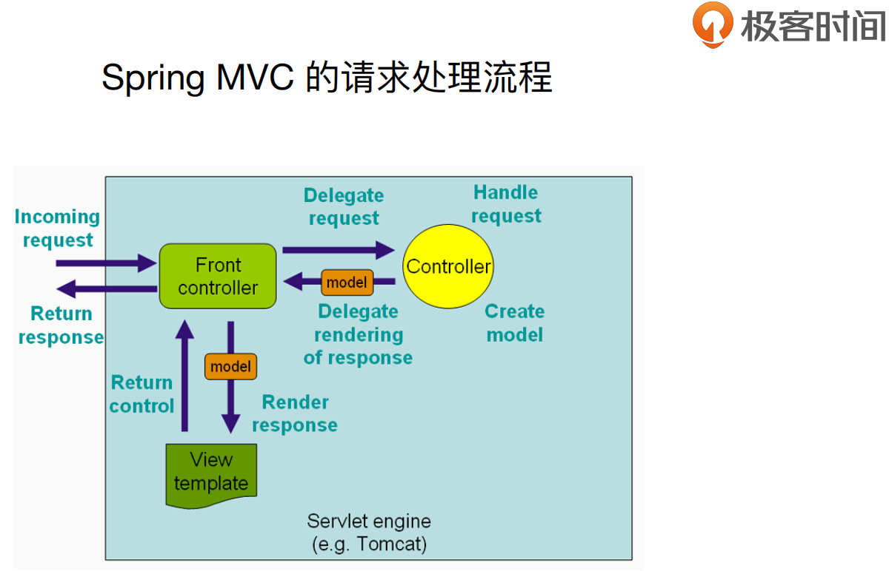

  这里`Front controller`就是`Dispatch Servlet`，收到请求后会把请求代理给`Controller`处理类，处理完后会返回一个`Model`给`DispatchServlet`，`DispatchServlet`再将Model交给视图解析器，处理完后再返回`DispatchServlet`，最后返回请求。

- 一个请求的大致处理流程

  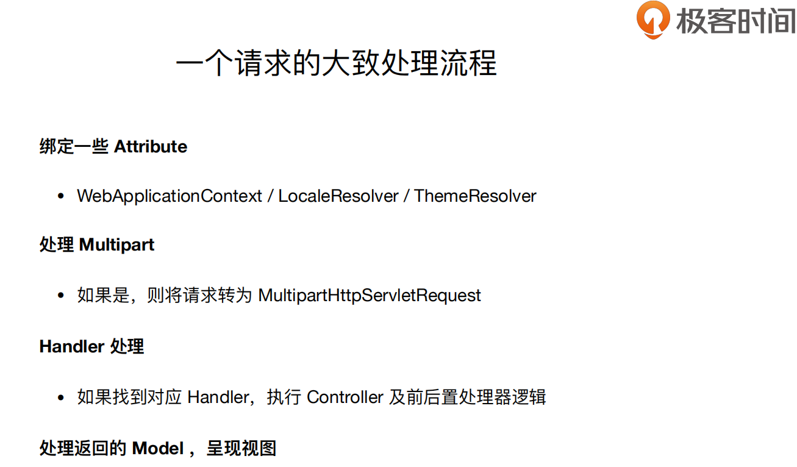

- DispatchServlet类源码

  在`spring-webmvc.jar`包的`org/springframework/web/servlet`下

  - 继承关系：`DispatchServlet` **—extends—>**  `FrameworkServlet` **—extends—>**`HttpServletBean`

  - 核心方法：

    - （函数`doService`内）`void doService(HttpServletRequest request, HttpServletResponse response)`,内部做了request内部的赋值

    - （函数`doService -> doDispatch`内）然后在`doService`内进入到`doDispatch(request, response)`这里传入了`request`和`response`，首先`checkMultipart(request)`检查是否是`Multipart`请求，是的话会调用`this.multipartResolver.resolveMultipart(request)`进行解析，完成后请求变为MultiPart解析后的请求（不是原请求了）。

    - （函数`doService -> doDispatch`内）然后`getHandler`去取`Handler`。调用`mappedHandler.applyPreHandle(processedRequest, response)`对`Handler`做一个预处理，然后在`ha.handle(processedRequest, response, mappedHandler.getHandler())`做对实际`Handler`的调用

      （注：关于前置的Handler预处理和后置的处理，下次课程会讲）

    - （函数`doService -> doDispatch`内）这里Handler对具体方法的各种处理没详细展开，以后学进去了再补了。在网上看到一个对HandlerAdapter的源码深究的好博客：[链接](<https://www.cnblogs.com/wangbenqing/p/7384518.html>)

      > 介绍了为什么用HandlerAdapter将Controller封装起来，再在HandlerAdapter的handle方法里执行Controller的handleRequest方法，
      >
      > 而不是直接DispatcherServlet直接用Controller的handleRequest方法执行具体请求

      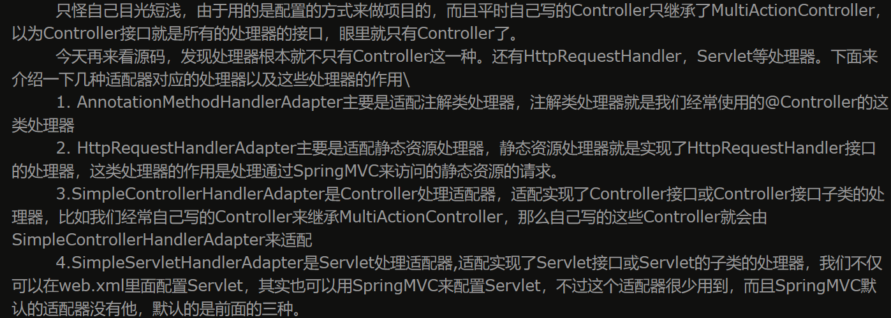

    - （函数`doService -> doDispatch`内）在Handler方法执行后，在`this.applyDefaultViewName(processedRequest, mv);`开始解析返回的`ModelAndView`,找到`View`的名字。如果一切顺利的话，后面就是做视图渲染的动作。

  - 通过**DeBug**的方式来**找到Handler**

    首先得清楚一点。Controller是针对指定的类，Handler是针对指定的类的指定的方法。现在目标为找到某一个Handler。

    - 用**Debug**标记DoDispath方法内的 `this.getHandler(processedRequest)`，并使用**RestfulTools测试**发起请求

      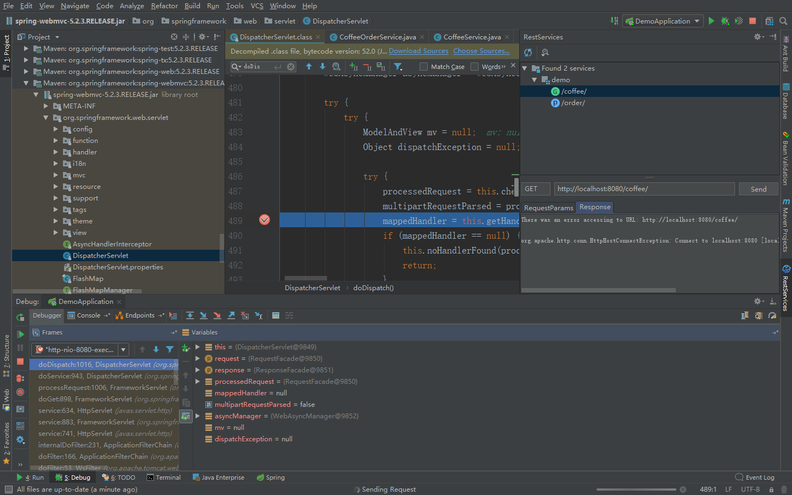

    - 看看是如何寻找Handler的：

      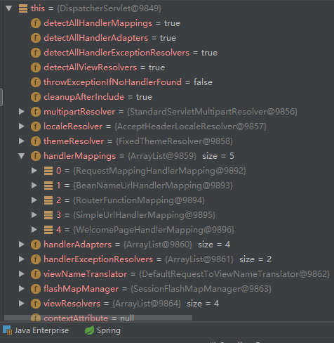

      ​        在Dispatch Servlet中有一些Handler Mapping，其中的序号为0的`RequestMappingHandlerMapping`，就是去处理`RequestMapping`注解所绑定的一些`RequestMapping`的；还有一些其他的HandlerMapping。

      ​       这些handlerMapping会每一个都去找一下这个handler，点击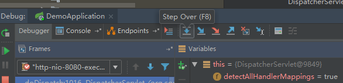

      这个进去

      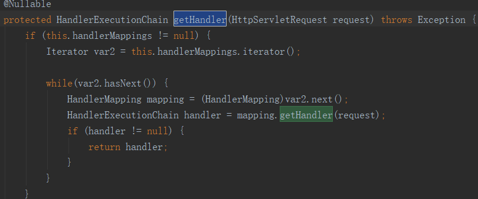

      会对每一个HandlerMappings做一个遍历

      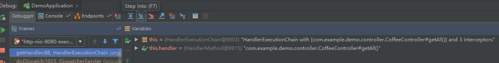

      这里点击按钮，this会遍历HandlerMapping，如果有哪一个找到了**HandlerExecutionChain**,就直接返回；若走遍了没有，返回null

      - 这里演示了一个没有找到的

        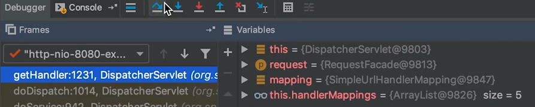

        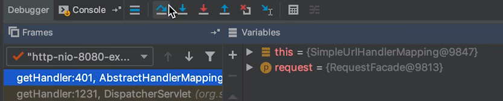

      - 找到正确的

        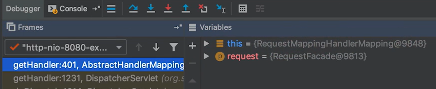

        这里编译完后`.class`里，直接getHandler返回的就是正确的Handler了，而且也直接返回最终的Handler结果（正确Handler、路径、对应方法后）——**HandlerExecutionChain**：

      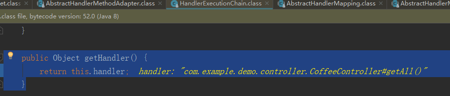

        然后进入`RequestMappingHandler`看一下。在这里会做一个寻找，会找到自己的目标。如图所示是按照路径`“coffee/1”`进行寻找，并做匹配

      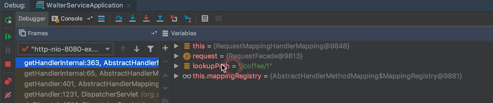

        匹配成功时返回的matchs。图中所示Get请求，请求路径为`“coffee/id”`，产生的是一个`application/json`

      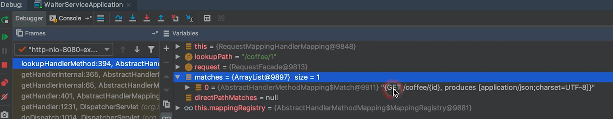

        找到对应的方法

      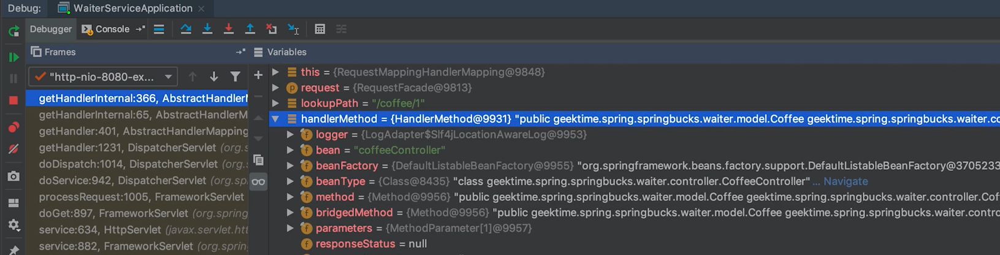

      最后返回的是一个**HandlerExecutionChain**。

- 小插曲1：IDEA无法下载源码

  解决办法：[【已解决】在IDEA中使用Maven下载依赖源码](<https://blog.csdn.net/Chameleons1/article/details/89148000>)

- 小插曲2：[如何在IDEA上查看源码](<https://blog.csdn.net/qq_28666081/article/details/83898684>)

