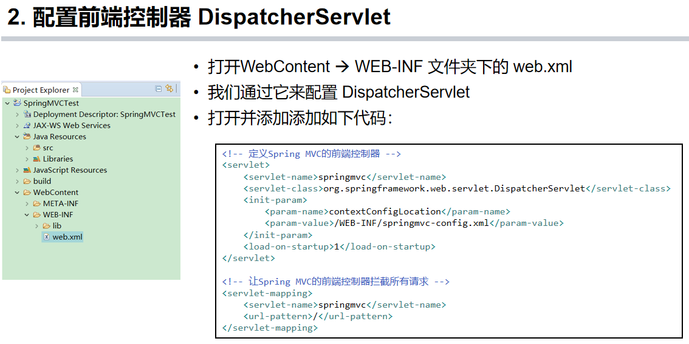
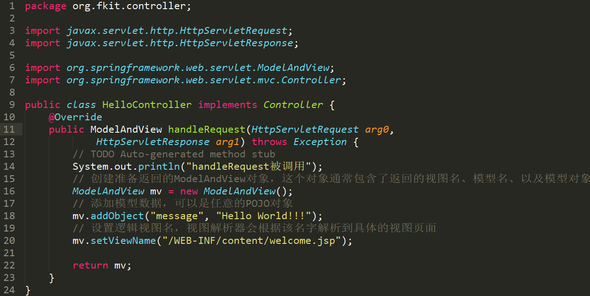
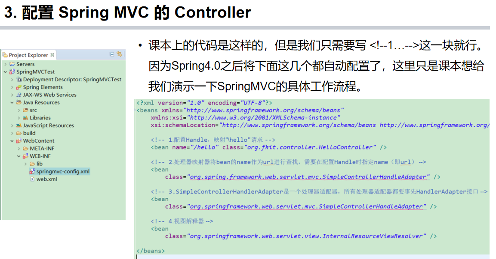
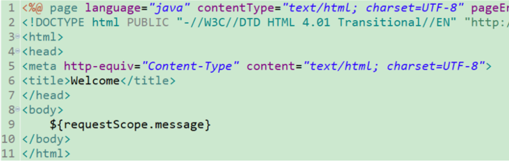

# 基础概念

- MVC**名称**
- MVC**特点**
- **Java web**的`Model1`和`Model2`
- **SpringMVC**中`DIspatchServlet、Handle、JSP`

# 开发流程

拿入门的helloworld举例。

- 在web.xml中配置DispatchServlet，用来拦截用户的请求

  

- 如果是POST方式提交请求，则需要编写JSP文件用来包含表单form;如果是GET方式则随意

- 定义处理用户请求的Handle类

  ​	如下一步骤配置图所示，则需要在`Java Resource/src`里新建包`org.fkit.controller`，然后新建`HelloController`类继承一个`Controller`对象（来自`springframework.web.servlet`的）在这个类里面实现接口的方法`handleRequest()`，处理来自http的请求和响应

  

  

- 在spring-config.xml配置文件中配置Handle

  

- 编写视图资源，即要显示的页面

  

  新建`welcome.jsp`位置如上面配置图所示。其中**body**部分显示**EL表达式**，`${ }`就代表取值